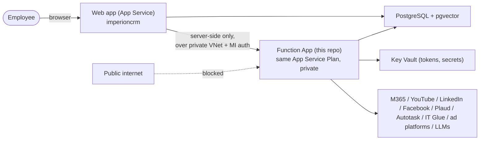

# CLAUDE_BACKEND.md

Guidance for Claude Code working on the **Imperion CRM backend** — the Azure Functions
service that implements the deferred server-side workstreams (ingestion, sends,
enrichment, embeddings, the orchestrator agent). It is a **separate repository** from
the web app, but shares its database, its principles, and its decision records.

> **Setup:** when you create the backend repo, copy this file to its root and **rename
> it to `CLAUDE.md`** so Claude Code loads it automatically. Suggested repo name:
> `ImperionCRM-Backend`.

---

## 0. Relationship to the front end — read this first

The **front-end web app** (repo `ImperionCRM`) is **built, deployed, and live**
(`imperioncrm.azurewebsites.net`, Entra SSO, PostgreSQL + pgvector, migrations
0001–0026 applied). This backend is the *next phase* it was designed around (ADR-0018:
GUI-only frontend, heavy/integration logic in external functions).

**Two repos, one system. The shared sources of truth are:**

- The **database** (one PostgreSQL + pgvector). Its **schema and migrations are OWNED
  by the front-end repo** (`db/migrations`, ADR-0017). This backend is a *consumer* of
  the schema — it reads and writes the same tables but does **not** own migrations.
  Need a schema change? Propose it as a migration in the front-end repo; never fork the
  schema.
- The **decision records** (`/docs/decision-records` in the front-end repo). The ADRs
  there govern both repos. The backend↔frontend boundary is **ADR-0028**.
- This file. Because the two repos have separate Claude memory, **this file is the
  carried knowledge** — keep it authoritative and update it (and the front-end's
  `CLAUDE.md`) whenever the contract between them changes.

**Golden rule:** the backend may never break an invariant the front end relies on —
the consent gate, append-only evidence logs, lawful-basis on every enriched fact, and
"tokens live in Key Vault, never the DB."

---

## 1. What this backend is

The operational-intelligence engine behind the CRM: it connects to external clouds,
pulls data in, enriches it, runs the agents, and sends outbound — everything the web
app stubs today. It **never serves UI** (ADR-0018); the web app is the only caller.

Capabilities to build: per-user OAuth connections + ingestion engines (M365 Graph,
YouTube, LinkedIn, Facebook, Plaud) · lead-capture receivers · consent-gated email/SMS
sends · LLM enrichment + embeddings · semantic (vector) search · the single
**orchestrator agent** runtime and its sub-agents · demand-gen audience evaluation + ad
pushes · workflow execution.

---

## 2. What is already built in the front end (be aware)

Build *to* these — the web app already reads the "gold" the backend must produce.

### Data model (shared PostgreSQL — key tables and who does what)
| Table / view | Role | Backend's job |
| --- | --- | --- |
| `account`, `contact`, `opportunity` | CRM spine | Read; create contacts from captures |
| `interaction` (+ `interaction_embedding`) | Unified multi-channel timeline, bronze→silver→gold (ADR-0011) | **Write** ingested comms; generate embeddings |
| `contact_enrichment` | Per-fact dossier: `confidence`, `source`, `source_connection_id`, `lawful_basis` (ADR-0025) | **Write** enriched facts |
| `contact_social_identity`, `contact_embedding` | Linked profiles; profile vector | **Write** |
| `consent_event` + `current_consent` view | Append-only consent ledger (ADR-0014) | **Read the view to gate every send/ad use**; write events from opt-in flows |
| `connection` (`keyvault_secret_ref`, `sync_cursor`, `status`) | Per-user + company connections (ADR-0024) | **Write/update** on OAuth + sync; read tokens from **Key Vault** |
| `external_identity` | Identity map across systems (ADR-0012) | **Write** |
| `lead_hook`, `lead_capture_event` | Capture hooks + inbox (ADR-0024) | **Receive** captures → resolve to a contact |
| `campaign`, `ad`, `campaign_metric` | Demand gen (ADR-0012/0026) | **Poll** ad platforms → write metrics |
| `audience`, `audience_member` | Audiences over the dossier (ADR-0026) | Evaluate dynamic criteria; push to platforms |
| `workflow`, `workflow_step`, `workflow_enrollment` | Nurture/pre-discovery automation (ADR-0014/0027) | **Execute** the sequences |
| `engagement_answer` (`source`, `confidence`, `status`, `approved_by_user_id`) | Discovery/assessment answers (ADR-0023/0027) | **Write agent drafts** (`source='agent'`, `status='draft'`) for the human to confirm |
| `discovery_call`, `assessment`, `meeting_action_item` | Engagement records | Read; write meeting action items from transcripts |
| `app_user`, `audit_log` | Identity mirror; audit | Read; **write audit entries** |

### Contracts the front end depends on
- **Consent gate:** the UI/sends use `current_consent` (`canSend`, `canUseForAds`).
  Backend sends/ad-targeting **must** read the same view and refuse when not opt-in.
- **Connection tokens:** `connection.keyvault_secret_ref` points at the Key Vault secret
  holding the OAuth token. The token is **never** in the DB — the backend reads it from
  Key Vault via managed identity.
- **Provenance:** every `contact_enrichment` row sets `lawful_basis`, `source`, and
  (where applicable) `source_connection_id`; the dossier UI renders "via LinkedIn · …".
- **Pre-discovery:** the discovery UI lists agent-drafted answers (`status='draft'`) and
  the salesperson confirms them — so the backend writes drafts, never auto-confirms.
- **The call site:** the web app will call this backend from `src/lib/services/
  external-client.ts` (server-side only). The browser never calls the backend.
- **Ingest vs poll (ADR-0012):** M365 email/Teams, Plaud, and social *ingest* into the
  `interaction` timeline; Autotask + IT Glue are *polled* on demand and **never
  duplicated** — only an identity map + short cache.

---

## 3. Architecture & hosting (incl. the network requirement)



- **Hosting:** an Azure **Function App on the SAME App Service Plan** as the web app
  (Dedicated/App-Service-plan hosting). Co-located compute; a separate repo deploys to
  it independently (repo ≠ host).
- **Network isolation (required):** the Function App is **not internet-facing**. Put
  both apps on a shared **VNet** (regional VNet integration). Disable the Function App's
  public access and expose it via a **private endpoint** in the VNet (private IP +
  Private DNS), **or** restrict inbound with **access restrictions** to the web app's
  integration subnet. Either way: **only the front-end App Service can reach it.**
- **Identity gating (defense in depth):** even over the private network, require the
  caller to present the **web app's managed identity** (Function-level Entra / Easy
  Auth, or function keys stored in Key Vault). Network-isolated **and** auth-gated.
- **Calling pattern:** the web app's server actions/route handlers call this backend
  over the private hostname (via `external-client.ts`). Synchronous work over HTTP
  (enrichment-on-demand, agent); high-volume ingestion via a **queue** (Azure Storage
  Queue / Service Bus on the VNet) — the web app enqueues, functions process.
- **Secrets & DB auth:** all secrets in **Azure Key Vault**; the Function App
  authenticates to PostgreSQL with its **own managed identity** (no stored password) —
  the same pattern the web app uses. Functions require a Storage account.

---

## 4. Core principles (inherited from the front-end CLAUDE.md §2–§5)

1. **Augment, don't replace** Microsoft 365 + Kaseya. Poll authoritative systems
   (Autotask/IT Glue); never duplicate them.
2. **Single agent experience.** One orchestrator routes to many internal sub-agents
   (CRM, Sales, Proposal, Onboarding, Documentation, IT Glue, Autotask, M365,
   Reporting). The user only ever talks to the one agent (via the web app).
3. **Microsoft for identity.** Entra ID only. The agent runtime enforces the acting
   user's Entra permission scope on every tool call.
4. **AI is provider-agnostic.** OpenAI / Azure OpenAI / Claude behind a model-routing
   layer that selects on cost/capability/context/task. No hard dependency on one
   provider. (This is the *application's* runtime AI — distinct from Claude Code.)
5. **Security is a product feature.** Zero Trust, least privilege, audit logging, secret
   rotation, secure CI/CD. Bronze raw payloads are PII-adjacent and access-controlled.
6. **Power Automate is for triggers/approvals/notifications only** — never core logic.
   The send/enrichment/agent logic lives in these functions.

---

## 5. The backend task list (everything to build)

Roughly in dependency order. Each becomes one or more functions; record decisions as
ADRs in this repo and reflect any contract change back to the front end.

### A. Connections & OAuth (foundation)
- Per-user OAuth flows for **M365/Graph, Google, YouTube, LinkedIn, Facebook, Plaud**;
  store the token in **Key Vault**, write/refresh the `connection` row + `status` +
  `keyvault_secret_ref` (ADR-0024). Resolve the signed-in employee's `app_user`.
- Company-wide connections (Autotask, IT Glue, org Graph) with their own credentials.
- Token refresh + revoke; per-connection health, backoff, and `status` updates.

### B. Ingestion engines (one per provider)
- **M365 Graph:** email + Teams → `interaction` (bronze→silver→gold), attributed to the
  owning employee (`owner_user_id`) then the contact/account; incremental via
  `sync_cursor`; webhooks where available, timer poll otherwise.
- **Plaud:** call/meeting recordings → `interaction` (kind=meeting) + transcript/summary
  → `meeting_action_item`.
- **YouTube / LinkedIn / Facebook:** posts, comments, DMs, profile data →
  `interaction` (social_*), `contact_social_identity`, `external_identity`.
- **Autotask / IT Glue:** **poll on demand, cache briefly, never duplicate** — write the
  identity map only (ADR-0012). Degrade gracefully with a staleness marker.
- Bronze writes are **append-only**; normalize to silver; distill to gold.

### C. Lead-capture receivers
- Endpoints/handlers for `lead_hook` kinds (web_form, facebook_lead, youtube_comment,
  linkedin_message, inbound_email, qr) → `lead_capture_event` → resolve/create a
  `contact` → kick enrichment (E) + nurture enrollment (I).

### D. Outbound sends (consent-gated)
- Real email/SMS via a provider; **read `current_consent` and refuse unless opt-in**
  (mirror `canSend`). Log every send to `interaction` (outbound). Honor opt-out
  immediately. (Power Automate may fire the notify; the logic is here.)

### E. Enrichment execution (LLM)
- Provider-agnostic enrichment of contacts → `contact_enrichment` facts with
  `confidence`, `source`, `source_connection_id`, and a correct **`lawful_basis`**.
- **Pre-discovery automation:** generate agent-drafted `engagement_answer` rows
  (`source='agent'`, `status='draft'`) so the salesperson confirms them (ADR-0027).
- The bronze→silver→gold pipeline: clean, dedupe, classify, summarize.

### F. Embeddings + vector search
- Generate embeddings into `interaction_embedding` and `contact_embedding` (record the
  `model`); back the front end's Knowledge **semantic search** and audience similarity.

### G. Orchestrator agent runtime + sub-agents
- The single orchestrator behind the web app's server-side entry point: routes
  requests, selects tools, invokes sub-agents, manages context + **agent memory**,
  **enforces the acting user's Entra permissions**, returns one response.
- The model-routing layer (D4 above). Per-agent docs (identity, tools, boundaries).
- Powers the AI Agents + Board pages (still placeholders in the front end).

### H. Demand-gen: audience evaluation + ad pushes
- Evaluate **dynamic `audience` criteria** over `contact_enrichment` (the front end
  already materializes static/criteria audiences; the engine refreshes dynamic ones).
- Push audiences to ad platforms **gated on `ad_targeting` consent**; pull
  `campaign_metric`. Lookalikes via `contact_embedding`. Suppression lists.

### I. Workflow execution engine
- Run `workflow` → `workflow_step` sequences (send_email/sms, chat_prompt, agent_enrich,
  wait, branch) for `workflow_enrollment`s; advance `current_step_ordinal`; consent-gate
  sends. Pre-discovery and nurture both run here.

### J. Observability & ops
- Per-connection health/backoff; structured audit to `audit_log`; metrics/logs to
  Azure Monitor / Sentinel; dead-letter for failed jobs.

### K. Pre-go-live security
- Coordinate the **deferred secret rotation** (the front end's signing cert, AUTH_SECRET,
  break-glass hash) before production — see the front-end project memory.

---

## 6. Repo structure (suggested)

```
ImperionCRM-Backend/
├─ src/
│  ├─ functions/            # one folder per function group (ingest/, sends/, enrich/, agent/, …)
│  ├─ shared/               # db client (managed-identity Postgres), Key Vault, types,
│  │                        #   the consent-gate read, the model router
│  └─ index.ts              # @azure/functions v4 registrations
├─ host.json
├─ docs/decision-records/   # this repo's ADRs (start at the next free number, cross-link the front end's)
└─ CLAUDE.md                # this file, renamed
```

- **@azure/functions v4** (Node 24, TypeScript). Bundle with **esbuild** into a
  self-contained `dist/` (same philosophy as the web app's standalone bundle).
- The `shared/` DB layer mirrors only the tables this backend touches — it does **not**
  import the front-end's `src/lib/data`. Extract a shared npm package later if the
  surface grows.

---

## 7. CI/CD

- **PR gate:** `npm ci` → build `shared` → lint + typecheck + test + esbuild bundle.
- **Deploy on push to `main`:** `azure/login@v2` with **OIDC / federated credentials**
  (no publish-profile secret) → `Azure/functions-action@v1` deploying `dist/` to the
  Function App. The Function App reads its config from App Service settings + **Key Vault
  references**; runtime auth to Postgres + Key Vault via **managed identity**.
- **Migrations are NOT here.** Schema changes are migrations in the **front-end repo**
  (ADR-0017), applied separately with an Entra token. This backend assumes the schema is
  current; if it needs a change, open it there first.

---

## 8. Documentation standards (mirror the front-end §8)

Documentation is a required deliverable and a security control. A feature is not done
until: code committed, tests done, docs updated, **ADR written for significant
decisions** (problem, options, decision, security/cost/ops impact), and the front-end
docs updated if the shared contract changed. Prefer Markdown + Mermaid; keep ADRs in
`/docs/decision-records`. Every agent and integration gets a dedicated doc.

---

## 9. Working agreement

- Never break a front-end invariant: the **consent gate**, append-only evidence logs,
  **lawful_basis** on every enriched fact, **tokens in Key Vault only**, augment-don't-
  duplicate, and the network isolation (front-end-only access).
- Keep the schema single-sourced in the front-end repo; coordinate changes there.
- When the contract between the two repos changes, **update both this file and the
  front-end `CLAUDE.md`**, and record it in an ADR — that is how knowledge survives the
  repo split.
- Surface anything irreversible or touching permissions/billing/deploys/secrets to the
  human before doing it.
