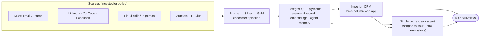
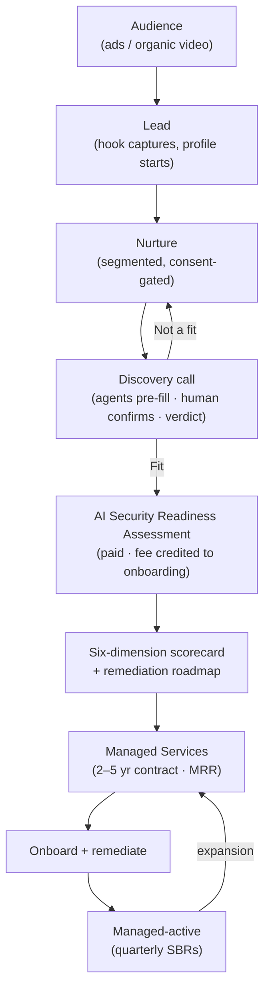

<div align="center">

# Imperion CRM

**The operational brain for a modern Managed Service Provider.**

One interface. One agent. Every customer's whole story — from the first ad they see
to the quarterly business review years later — in one place.

[Documentation library](docs/README.md) ·
[Architecture](docs/architecture/README.md) ·
[Customer lifecycle](docs/architecture/customer-lifecycle.md) ·
[Decision records](docs/decision-records/README.md)

</div>

---

## The problem we're solving

Running an MSP means knowing your customers cold — their people, their risk, their
history, their next move. In practice that knowledge is **scattered and decaying**:

- A prospect's story lives in **ten disconnected places** — email, Teams, a text
  thread, a Plaud recording from a coffee chat, a LinkedIn comment, an Autotask
  ticket, someone's memory — and **no one can see all of it at once**.
- Salespeople walk into discovery calls **cold**, burning hours on manual research
  and data entry that an agent could have done overnight.
- Marketing runs ads in **a silo** — leads aren't attributed, and you can't aim a
  campaign at the profiles you already know best.
- Every text, call recording, and profile you build is a **compliance liability**
  unless you can prove consent — and most CRMs can't.
- The whole team juggles **Microsoft 365 + Kaseya + spreadsheets**, re-keying the
  same facts, with no single source of truth and no AI that understands the business.

The cost is real: slower sales, weaker positioning, missed expansion, and risk that
only shows up when something goes wrong.

## What Imperion CRM does

Imperion CRM is an **AI-enabled operations platform** that sits as an *intelligence
layer above Microsoft 365 and Kaseya* — augmenting them, never replacing them. It
manages the entire lifecycle of a managed-services customer and gives every employee
**one place to work** and **one agent to ask**.



It turns each scattered problem into a capability:

| The problem | How Imperion CRM solves it (when complete) |
| --- | --- |
| Customer knowledge is scattered | **One unified communications timeline** per contact — every email, message, call, meeting transcript, in-person note, and social touch, attributed first to the employee, then the company. |
| Sales walk in cold | A **contact-360 "dossier"** assembled *before* the call (employer, role, interests, tech stack, social presence) plus **pre-discovery automation** that gathers the discovery answers for the rep to simply **confirm and stamp**. |
| Demand-gen is a silo | **Campaigns + audiences built over your aggregated profiles**, with leads attributed back to spend and **lead-capture hooks** that pull a new person in and start a profile automatically. |
| Outreach & profiling are a legal risk | An **append-only consent ledger** with lawful-basis tracking; outbound sends and ad targeting are **blocked unless consent is current** — defensible under TCPA / CAN-SPAM / GDPR. |
| Tool sprawl, no single pane | **One web app** above M365 + Kaseya, and **one orchestrator agent** that routes to specialized sub-agents — the user never juggles tools. |
| The assessment-led motion isn't operationalized | The **paid AI Security Readiness Assessment** is a first-class entity: six scored dimensions, remediation roadmap, conversion to managed services, and recurring **Strategic Business Reviews**. |

## How a customer moves through it

The defining motion is **assessment-led**: a *paid* AI Security Readiness Assessment
is the wedge that earns the access and evidence to win a multi-year managed-services
contract. (Full detail: [customer-lifecycle](docs/architecture/customer-lifecycle.md).)



## Where it is today

The app is **live on Azure App Service** (`imperioncrm.azurewebsites.net`, Entra SSO
required). This repository is the **web app** (the authoritative interface, ADR-0018):
it renders the UI, reads/writes PostgreSQL through a typed data-access layer, and calls
external functions for heavy/integration work.

| Area | Status |
| --- | --- |
| Entra ID SSO (certificate client auth), middleware gate, break-glass | ✅ Live |
| PostgreSQL 18 + pgvector on Azure (managed-identity auth, no stored password) | ✅ Live |
| Full schema — CRM core, engagements, **comms / contact-360 / connections / demand-gen / automation / per-source bronze + devices / security ingestion** | ✅ Applied (`db/migrations` 0001–0043) |
| Dashboard, accounts, pipeline (interactive), proposals, onboarding, assessments, discovery, SBRs, reporting | ✅ Built |
| **Contact-360 + unified comms, integrations/consent, campaigns/audiences (+ builders), workflows (+ builder), lead hooks** | ✅ Built (UI + data layer) |
| Knowledge search, Security posture, Settings, Feedback, global search | ✅ Built (UI + data layer) |
| Live OAuth pulls (Graph/YouTube/LinkedIn/Facebook), real sends, agent enrichment execution, embeddings/vector search | 🟡 Stubbed — next phase |
| Single orchestrator agent runtime + AI Board / AI Agents pages | 🟡 Deferred — next phase |

> **Built (UI + data layer)** means the screens are real and the data layer reads and
> writes PostgreSQL through typed repositories. The *live* integrations (real OAuth,
> real provider sends, agent/LLM execution) are deliberately deferred to a later phase;
> until a source is wired, those flows are stubbed (e.g. a "send" logs to the timeline)
> and never fail the page.

## Architecture at a glance

- **Frontend:** Next.js (App Router) · React · TypeScript (strict) · Tailwind CSS.
- **Data:** PostgreSQL 18 + `pgvector` (Azure Flexible Server) — a single unified
  store for system-of-record, embeddings, and agent memory, fed by a
  **bronze → silver → gold** enrichment pipeline.
- **Identity:** Microsoft **Entra ID** is the sole identity provider (certificate
  client auth). Personal-account *data* connections (M365/LinkedIn/YouTube/…) are
  OAuth links whose tokens live only in **Azure Key Vault** — never in the database.
- **AI:** the settled stack — **Claude** for generation, **Voyage** for embeddings
  (ADR-0043 / backend ADR-0034) — behind a **single orchestrator agent**; many
  specialized sub-agents exist internally but the user only ever talks to one.
- **Principles:** UX first · single agent experience · Microsoft for identity ·
  open web over Power Platform · security as a product feature.

See [`CLAUDE.md`](CLAUDE.md) for the full principles and
[`docs/architecture/application-boundary.md`](docs/architecture/application-boundary.md)
for what lives here vs. in external functions.

## Develop

```bash
npm install
npm run dev        # http://localhost:3000
npm run typecheck
npm run lint
npm run build
```

On Windows, exclude the repo + npm cache from Defender if `npm install` fails with
`EACCES` (real-time scanning locks `node_modules`). Copy `.env.example` to
`.env.local` for local development. **Never commit secrets.**

Runtime: Node 24, **Next.js 15.1.12** (patched for CVE-2025-66478; kept on the 15.1
line to preserve the version-sensitive Entra `customFetch` hook, ADR-0009).

## Database & deploy

- **Migrations:** raw SQL in [`db/migrations`](db/migrations) (ADR-0017), applied in
  order with an Entra token — see [`db/README.md`](db/README.md). Update the ERD in
  [`docs/database/data-model.md`](docs/database/data-model.md) on every schema change.
- **Deploy:** Azure App Service (Linux, Node 24) via GitHub Actions on merge to
  `main` — a Next.js standalone bundle (ADR-0006). Config lives in App Service
  settings; secrets in Key Vault.

## Documentation

Everything — architecture, security, agents, integrations, data model, runbooks, and
every decision we've made and why — lives in the **[documentation library](docs/README.md)**.
Documentation is a required deliverable and a security control: code without docs is
considered incomplete (CLAUDE.md §8).
