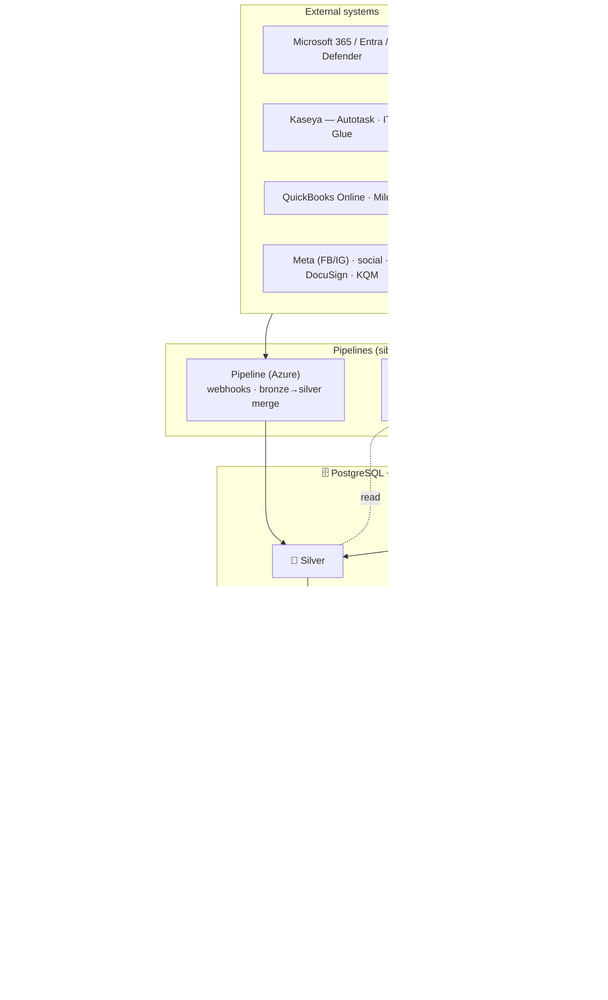

<div align="center">

# Imperion OS

**The agentic operating system for a modern Managed Service Provider.**

One surface. One agent. The whole business — every customer from the first ad they
see to the quarterly business review years later, and every internal process from a
won quote to a paid expense report — runs on one data substrate built for AI agents
to reason and act on safely.

> Product name: **Imperion OS** (ADR-0110; formerly "Imperion Business Manager").
> Identity names — the repo slug `ImperionCRM`, the `imperion-crm` package, the Entra
> apps, the databases, and the `*.azurewebsites.net` URLs — are unchanged (ADR-0016).

[Documentation library](docs/README.md) ·
[Capability overview](docs/product/imperion-os-overview.md) ·
[System of systems](docs/architecture/system-of-systems.md) ·
[Architecture](docs/architecture/README.md) ·
[Customer lifecycle](docs/architecture/customer-lifecycle.md) ·
[Decision records](docs/decision-records/README.md)

</div>

---

## What this is

**Imperion OS** is the single operational platform an MSP runs its business on — and,
underneath, **an operating system for AI agents over the company's knowledge and
actions**. An OS schedules processes over shared resources under governed access;
Imperion OS does that for agents, with the data platform as the kernel and a tiered,
identity-scoped knowledge layer as the agent's second brain. It is **not just a CRM** —
it spans the full operating surface:

- **CRM** — leads, contacts, accounts, the unified communications timeline, the
  sales pipeline, opportunities, segments, marketing campaigns + journeys, events,
  and the assessment-led customer lifecycle.
- **ERP** — the operational and finance backbone: sale → delivery orchestration,
  projects/tasks with full PM-tool parity, time & expense tracking, the unified
  Monthly Close, AR collections, the CMDB and device/asset register, and read-only
  QuickBooks Online + Autotask mirrors.
- **Extras** — the reporting / BI hub, the connector marketplace, security posture,
  and the consent + data-governance surface that makes outreach defensible.
- **A full AI suite** — a single orchestrator agent the user talks to, an internal
  fleet of specialized sub-agents, the ICM business-process framework with a tiered
  autonomy dial, the self-hosted Managed Agents runtime, an orchestration &
  observability matrix, agent rooms over a curated semantic layer, and a
  vectorized RAG knowledge layer over everything the business knows.

It sits as an **intelligence layer above Microsoft 365 and Kaseya** — augmenting
them, never replacing them — and gives every employee **one place to work** and
**one agent to ask**.

### What it is NOT

- **NOT just a CRM.** CRM is one quadrant of a CRM + ERP + extras + AI platform.
- **NOT a Power Platform / Dataverse / Copilot Studio application.** It is a modern
  web app on open web technology (CLAUDE.md §1).
- **NOT a replacement** for Microsoft 365, Kaseya/Autotask, IT Glue, or QuickBooks
  Online — it augments and orchestrates them, and treats those systems as the
  source of record where they own the fact.
- **NOT a multi-tenant SaaS.** It is the internal operations platform for one MSP.
- **NOT the place AI keys or integration secrets live.** The front end holds no
  provider key and no OAuth token (ADR-0042 / ADR-0043); those live with the
  backend and the on-prem pipeline behind Azure Key Vault.

## What problem it solves

Running an MSP means knowing your customers cold **and** running every internal
process cleanly — sales, delivery, finance, support. In practice that knowledge and
that work are **scattered across a dozen tools** (M365, Kaseya, QuickBooks,
spreadsheets, someone's memory), re-keyed by hand, with no single source of truth
and no AI that understands the business. Imperion OS turns that sprawl into one
operating surface with one agent on top of it.

## The OS in one diagram

The OS metaphor is the design constraint, not a slogan — **data-as-kernel +
second-brain-as-OS**. Every layer maps to a real artifact:

| OS concept | Imperion OS |
| --- | --- |
| **Kernel** (filesystem · type system · long-term memory · ring model) | Medallion bronze→silver→gold · OKF semantic layer (grounding cortex) · gold + Voyage `voyage-3-large` @1024d vectors · two-axis RLS access spine |
| **Memory** (the second brain) | Tiered knowledge: canon · company · personal ×6, identity-scoped in the DB |
| **Scheduler / syscalls** | Backend orchestrator + sub-agents · ICM · 1–5 autonomy dial · `agent_run` ledger · eval plane · deny-by-default action/tool-grant · event/trigger substrate |
| **Processes** | The agent roster (triage → dispatch → execute → observe → spine) |
| **I/O** | Pipeline (sensory ingest) + LocalPipeline (memory consolidation / vectorization) |
| **Protected mode** | Autonomy dial + approval cockpit + Mark-gates |

> One refinement DNA at three altitudes: medallion refines **data**, OKF/IKF refines
> **meaning**, ICM refines **action**. The full case — and why this beats an LLM + RAG
> bolted onto a human-form CRM schema — is the canonical
> **[data design for agents](docs/architecture/data-design-for-agents.md)** (siblings
> link it rather than restate it).

## Architecture at a glance

This repository is the **GUI** — the authoritative web interface (ADR-0018 /
ADR-0042). It renders the UI, reads PostgreSQL directly through a typed data-access
layer for display, and routes **every process** (sends, enrichment, write-backs,
orchestration) to the backend. It is one of **four repositories** that make up the
product; see [system-of-systems](docs/architecture/system-of-systems.md) for the
whole estate.



- **Frontend:** Next.js (App Router) · React · TypeScript (strict) · Tailwind CSS ·
  shadcn/ui.
- **Data:** PostgreSQL 18 + `pgvector` (Azure Flexible Server) — one unified store
  for system-of-record, embeddings, and agent memory, fed by a **bronze → silver →
  gold** medallion pipeline (ADR-0092).
- **Identity:** Microsoft **Entra ID** is the sole identity provider (certificate
  client auth; ADR-0002 / ADR-0095). Personal-account data connections are OAuth
  links whose tokens live only in **Azure Key Vault** — never in the database.
- **AI:** the settled stack — **Claude** for generation, **Voyage `voyage-3-large`
  @ 1024 dims** for embeddings (ADR-0092 / ADR-0043) — behind a **single
  orchestrator agent** (ADR-0091); many specialized sub-agents exist internally but
  the user only ever talks to one.

See [`CLAUDE.md`](CLAUDE.md) for the full principles and
[`docs/architecture/application-boundary.md`](docs/architecture/application-boundary.md)
for what lives here vs. in the external functions.

## Develop

```bash
npm install
npm run dev        # http://localhost:3000
npm run typecheck
npm run lint
npm run build
```

On Windows, exclude the repo + npm cache from Defender if `npm install` fails with
`EACCES` (real-time scanning locks `node_modules`). Copy `.env.example` to
`.env.local` for local development. **Never commit secrets.**

Runtime: Node 24, **Next.js 15.1.12** (patched for CVE-2025-66478; kept on the 15.1
line to preserve the version-sensitive Entra `customFetch` hook, ADR-0009).

> When running several Claude Code sessions at once, each works in its **own git
> worktree** on its own port (system-level `CLAUDE.md` §10) — never share a working
> tree with another session.

## Database & deploy

- **Migrations:** raw SQL in [`db/migrations`](db/migrations) (ADR-0017), applied in
  order with an Entra token — see [`db/README.md`](db/README.md). **This repo is the
  single source of truth for the schema**; the three sibling repos consume it
  (ADR-0042). Update the ERD in
  [`docs/database/data-model.md`](docs/database/data-model.md) on every schema change.
- **Deploy:** Azure App Service (Linux, Node 24) via GitHub Actions on merge to
  `main` — a Next.js standalone bundle (ADR-0006). Config lives in App Service
  settings; secrets in Key Vault. The app is **live** at
  `imperioncrm.azurewebsites.net` (Entra SSO required).

## The four-repo system

Imperion OS is one product built from four repositories with a settled
division of labor (ADR-0042). Full map:
[system-of-systems](docs/architecture/system-of-systems.md).

| Repo | Role |
| --- | --- |
| **`ImperionCRM`** (this repo) | **GUI.** Next.js front end; owns the DB schema, the OKF semantic layer, the skills canon, and the unified security standard. |
| [`ImperionCRM_Backend`](https://github.com/markdconnelly/ImperionCRM_Backend) | **All processes.** Azure Functions, identity-gated; orchestrator runtime + OAuth/AI-key custody. |
| [`ImperionCRM_Pipeline`](https://github.com/markdconnelly/ImperionCRM_Pipeline) | **Live data.** Webhooks, bronze→silver merge, on-demand refresh. |
| [`ImperionCRM_LocalPipelineEnrichment`](https://github.com/markdconnelly/ImperionCRM_LocalPipelineEnrichment) | **Heavy lifting.** On-prem PowerShell: bulk ingestion, IT Glue hub, ALL vectorization. |

## Documentation

Everything — the full capability overview, architecture, security, the AI suite,
integrations, the data model, runbooks, and every decision we've made and why —
lives in the **[documentation library](docs/README.md)**. Documentation is a required
deliverable and a security control: code without docs is considered incomplete
(CLAUDE.md §8). The shared cross-repo security baseline is
[`docs/security/unified-security-standard.md`](docs/security/unified-security-standard.md).
