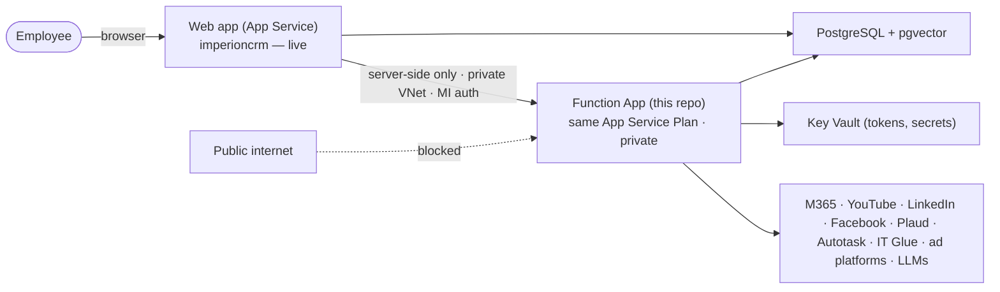

<div align="center">

# Imperion CRM — Backend

**The operational engine behind the CRM.** Connects to external clouds, pulls data in,
enriches it, runs the agents, and sends outbound — everything the web app stubs today.

Azure Functions · private to the front end · one shared PostgreSQL.

</div>

> **Setup for the new repo:** this file is the deliverable — rename it to `README.md`,
> and rename the companion `CLAUDE_BACKEND.md` to **`CLAUDE.md`** (so Claude Code loads
> it automatically). Then start a fresh chat here and it will know the whole plan.

---

## What this is

The front-end web app (`ImperionCRM`) is **built and live** (`imperioncrm.azurewebsites.net`,
Entra SSO, PostgreSQL + pgvector, migrations 0001–0026 applied). It deliberately stubs
the heavy, integration-heavy work behind an external-functions boundary (ADR-0018).

**This repo is that backend** — the next phase. It is Azure Functions that:

- run **per-user OAuth connections + ingestion** (M365 Graph, YouTube, LinkedIn,
  Facebook, Plaud) into the shared timeline and contact dossier,
- send **consent-gated email/SMS**,
- execute **LLM enrichment** and generate **embeddings + semantic search**,
- run the single **orchestrator agent** and its sub-agents,
- evaluate **ad audiences** and run **workflow** automation.

The full, ordered task list lives in **[`CLAUDE.md`](CLAUDE.md)** §5.

## How it fits with the front end



- **One system, two repos, one database.** The **schema and migrations are owned by the
  front-end repo** (`db/migrations`, ADR-0017). This backend reads/writes the same
  tables but never owns migrations — propose schema changes there.
- The web app already produces and consumes the "gold" this backend must populate (the
  unified `interaction` timeline, the `contact_enrichment` dossier with lawful basis +
  provenance, the `current_consent` gate, the `connection`→Key Vault token model). See
  `CLAUDE.md` §2 for the table-by-table contract.

## Network model (front-end-only access)

- The Function App runs on the **same App Service Plan** as the web app.
- It is **not internet-facing**: both apps integrate a shared **VNet**, and the Function
  App is exposed via a **private endpoint** (or inbound access restricted to the web
  app's subnet). **Only the front-end App Service can call it.**
- **Defense in depth:** even over the private network the caller presents the web app's
  **managed identity** (Function-level Entra auth). The **browser never calls the
  backend** — only the web app's server actions/route handlers do (via
  `src/lib/services/external-client.ts` on the front end).

## Tech stack

- **Azure Functions v4** (Node 24, TypeScript), bundled self-contained with **esbuild**.
- **PostgreSQL 18 + pgvector** (shared) — authenticated with the Function App's
  **managed identity** (no stored password), same pattern as the web app.
- **Azure Key Vault** for all secrets; per-user OAuth **tokens are referenced from Key
  Vault, never stored in the DB**.
- **Queues** (Azure Storage Queue / Service Bus) for high-volume ingestion; HTTP for
  on-demand (enrichment, agent).
- **Provider-agnostic AI** behind a model-routing layer (OpenAI / Azure OpenAI / Claude).

## Develop

```bash
npm install
npm run build            # esbuild → dist/
func start               # local Functions host (with Azurite for storage)
npm run lint && npm run typecheck
```

Copy `.env.example` → `local.settings.json` for local dev (DB host/user for
managed-identity auth, Key Vault name, queue connection). **Never commit secrets.**

## Deploy

- **CI (PRs):** lint + typecheck + build + test.
- **CD (push to `main`):** `azure/login@v2` with **OIDC / federated credentials** (no
  publish-profile secret) → `Azure/functions-action@v1` deploys `dist/` to the Function
  App. Runtime config comes from App Service settings + **Key Vault references**.
- **Migrations are not deployed from here** — they live in the front-end repo and are
  applied separately with an Entra token (ADR-0017).

## Documentation & decisions

- **Read [`CLAUDE.md`](CLAUDE.md) first** — it mirrors what's built in the front end,
  lists every backend task, and states the invariants you must not break.
- ADRs live in `docs/decision-records/`. The backend↔frontend boundary decision is
  **ADR-0028** in the front-end repo; cross-link it. The front-end repo's
  `docs/database/data-model.md` is the shared ERD.

---

**Starting a new chat?** Open this repo, make sure `CLAUDE.md` is in place, and point the
session at `CLAUDE.md §5` (the task list) and ADR-0028. Everything it needs to continue
is in these two files plus the shared database.
