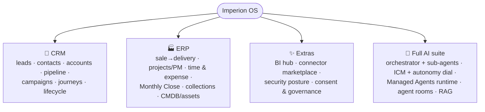
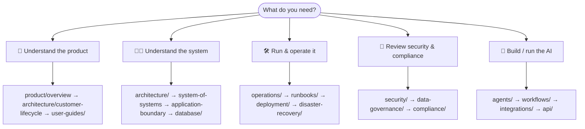
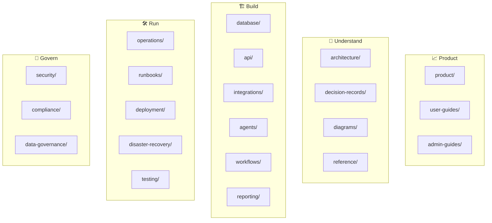

# 📚 Imperion OS — Documentation Library

**Everything about what the platform does, how it works, why it's built this way, and
how to run it.**

[← Back to the project](../README.md) ·
[Capability overview](product/imperion-os-overview.md) ·
[System of systems](architecture/system-of-systems.md) ·
[Architecture](architecture/README.md) ·
[Decision records](decision-records/README.md)

---

## Start here — what the product is

**Imperion OS** is the single operational platform a Managed Service
Provider runs its whole business on — **not just a CRM**, but **CRM + ERP + extras +
a full AI suite** on one surface, sitting as an intelligence layer above Microsoft
365 and Kaseya. For the complete, onboarding-grade tour of every capability, read the
**[capability overview](product/imperion-os-overview.md)** — it is the
companion to this navigational hub.

> Documentation here is **a deliverable and a security control** — code without docs is
> considered incomplete (CLAUDE.md §8). It is *documentation-as-code*: version-controlled,
> stored beside the source, written in open formats (Markdown, **Mermaid**, OpenAPI, ADRs)
> so the diagrams render right here in GitHub.

## Pick your path

| If you are… | Read, in order |
| --- | --- |
| 📈 **New to the product** | [capability overview](product/README.md) → [customer-lifecycle](architecture/customer-lifecycle.md) → [user-guides](user-guides/README.md) |
| 🧑‍💻 **A new engineer** | [`../CLAUDE.md`](../CLAUDE.md) → [architecture](architecture/README.md) → [system-of-systems](architecture/system-of-systems.md) → [application-boundary](architecture/application-boundary.md) → [data model](database/README.md) → [decision records](decision-records/README.md) |
| 🛠️ **An operator / on-call** | [operations](operations/README.md) → [runbooks](runbooks/README.md) → [deployment](deployment/README.md) → [disaster-recovery](disaster-recovery/README.md) |
| 🔐 **A security reviewer** | [security](security/README.md) → [data-governance](data-governance/README.md) → [compliance](compliance/README.md) |
| 🤖 **Building / running an agent** | [agents](agents/README.md) → [workflows](workflows/README.md) → [api](api/README.md) → [integrations](integrations/README.md) |
| 🔑 **An admin** | [admin-guides](admin-guides/README.md) → [reporting](reporting/README.md) → [integrations](integrations/README.md) |

## The library, mapped

## Every area — the complete table of contents

This table links **every** docs area. It is the navigational spine of the whole
library: each per-area unit of the documentation rewrite edits only inside its own
subdirectory, so this hub stays the single, stable index.

### 📈 Product & people

| Area | What's inside |
| --- | --- |
| 📈 [product](product/README.md) | The full **[capability overview](product/imperion-os-overview.md)** (CRM + ERP + extras + AI) and the product/feature requirements. |
| 📖 [user-guides](user-guides/README.md) | How employees use each module, screen by screen. |
| 🔑 [admin-guides](admin-guides/README.md) | Admin-only configuration: roles, connectors, templates, finance & comp setup. |

### 🧭 Understand the system

| Area | What's inside |
| --- | --- |
| 🧭 [architecture](architecture/README.md) | System overview, the **[four-repo system-of-systems](architecture/system-of-systems.md)**, the application boundary, the customer lifecycle, the required diagrams. |
| 🗂️ [decision-records](decision-records/README.md) | Every significant decision (ADR-0001…) — incl. the consolidated dossiers ADR-0091–0096 — problem, options, decision, security/cost/ops impact. |
| 🖼️ [diagrams](diagrams/README.md) | Source for shared diagrams (Mermaid/PlantUML/D2) — never binary exports. |
| 📎 [reference](reference/README.md) | Canonical GTM source assets (discovery script, assessment, nurture, voice guide). |

### 🏗️ Build over the platform

| Area | What's inside |
| --- | --- |
| 🗄️ [database](database/README.md) | The ERD (updated on every schema change), entity docs, vector-data design, the bronze/silver/gold medallion, and the **OKF semantic layer** (governed — navigation only). |
| 🧩 [api](api/README.md) | OpenAPI spec + endpoint catalog; per-endpoint inputs/outputs/validation/security. |
| 🔌 [integrations](integrations/README.md) | M365/Graph, Autotask, IT Glue, QuickBooks Online, MileIQ, Meta, DocuSign, KQM; per-user connections, the connector marketplace, the identity map, ingest-vs-poll. |
| 🤖 [agents](agents/README.md) | The full AI suite: the single orchestrator + sub-agents, ICM, the autonomy dial, the orchestration matrix, the Managed Agents runtime, skills canon. |
| ⚙️ [workflows](workflows/README.md) | Nurture & pre-discovery automation; the lead → onboarding → success process maps; ICM workspaces. |
| 📊 [reporting](reporting/README.md) | The reporting / BI hub: dashboards, the report builder, and the semantic model. |

### 🛠️ Run & operate

| Area | What's inside |
| --- | --- |
| 🛠️ [operations](operations/README.md) | Day-2 ops, monitoring, health, the live-app access path, credential wiring. |
| 📓 [runbooks](runbooks/README.md) | Step-by-step procedures for specific incidents and tasks. |
| 🚀 [deployment](deployment/README.md) | CI/CD, hosting, environments, configuration & secrets. |
| 🌪️ [disaster-recovery](disaster-recovery/README.md) | Backup validation, RPO/RTO, recovery procedures. |
| ✅ [testing](testing/README.md) | Test strategy, coverage, and the CI gates. |

### 🔐 Govern

| Area | What's inside |
| --- | --- |
| 🔐 [security](security/README.md) | Threat models, trust boundaries, identity architecture, secrets, logging/monitoring, RBAC (ADR-0095), and the **[unified security standard](security/unified-security-standard.md)** (the cross-repo baseline — referenced, never restated). |
| 📋 [compliance](compliance/README.md) | Regulatory posture, audit, standards. |
| 🧾 [data-governance](data-governance/README.md) | Classification, retention, **lawful basis & consent gating**. |

## Beyond this repo — the four-repo estate

This is the **flagship repo and the cross-repo documentation hub**. Imperion Business
Manager is one product built from four repositories; the
**[system-of-systems](architecture/system-of-systems.md)** doc is the single map of
the whole estate and links each sibling's own README:

- [`ImperionCRM_Backend`](https://github.com/markdconnelly/ImperionCRM_Backend) — all processes: orchestrator runtime, executors, OAuth/AI-key custody.
- [`ImperionCRM_Pipeline`](https://github.com/markdconnelly/ImperionCRM_Pipeline) — live data: webhooks, bronze→silver merge, on-demand refresh.
- [`ImperionCRM_LocalPipelineEnrichment`](https://github.com/markdconnelly/ImperionCRM_LocalPipelineEnrichment) — heavy lifting: bulk ingestion, IT Glue hub, ALL vectorization.

## Conventions

- **Diagrams** are Mermaid/PlantUML/D2 **generated from source in this repo** — never
  binary exports. Assume visual learners; prefer a diagram to a wall of text.
- **Decisions** are ADRs in [decision-records](decision-records/README.md), one file
  each, following [`_template.md`](decision-records/_template.md).
- **The ERD** in [database](database/README.md) is updated on **every** schema change.
- **The OKF semantic layer** (`database/semantic-layer/`, ADR-0086) is governed canon —
  link to it; never rewrite a concept file outside its own change workflow.
- **Cross-link liberally.** Each area's `README.md` is its landing page and points to
  the deeper docs and the ADRs that govern it.
