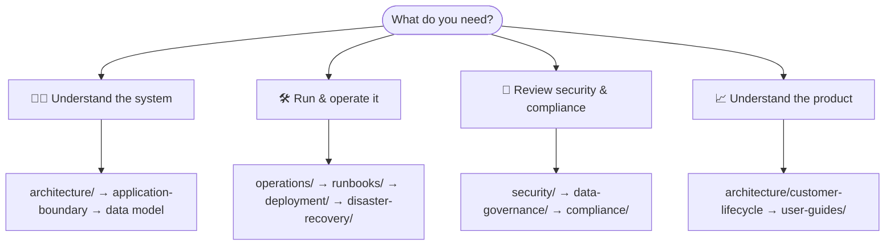
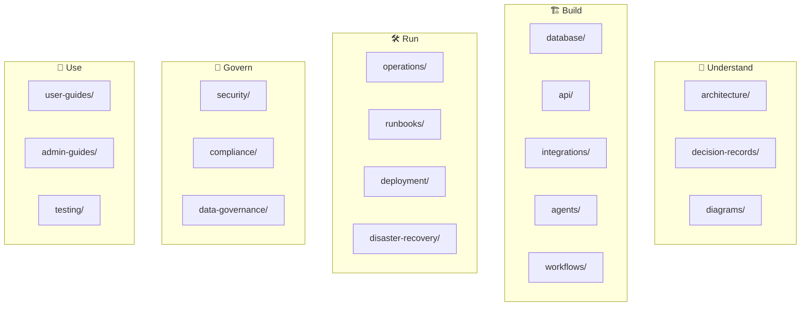

# 📚 Imperion CRM — Documentation Library

**Everything about how the platform works, why it's built this way, and how to run it.**

[← Back to the project](../README.md) · [Architecture](architecture/README.md) ·
[Decision records](decision-records/README.md) · [Data model](database/data-model.md)

---

Documentation here is **a deliverable and a security control** — code without docs is
considered incomplete (CLAUDE.md §8). It is *documentation-as-code*: version-controlled,
stored beside the source, and written in open formats (Markdown, **Mermaid**, OpenAPI,
ADRs) so the diagrams render right here in GitHub.

## Start here — pick your path

| If you are… | Read, in order |
| --- | --- |
| 🧑‍💻 **A new engineer** | [`../CLAUDE.md`](../CLAUDE.md) → [architecture](architecture/README.md) → [application-boundary](architecture/application-boundary.md) → [data model](database/data-model.md) → [decision records](decision-records/README.md) |
| 🛠️ **An operator / on-call** | [operations](operations/README.md) → [runbooks](runbooks/README.md) → [deployment](deployment/README.md) → [disaster-recovery](disaster-recovery/README.md) |
| 🔐 **A security reviewer** | [security](security/README.md) → [data-governance](data-governance/README.md) → [compliance](compliance/README.md) |
| 📈 **Product / GTM** | [customer-lifecycle](architecture/customer-lifecycle.md) → [user-guides](user-guides/README.md) |
| 🤖 **Building an agent** | [agents](agents/README.md) → [api](api/README.md) → [integrations](integrations/README.md) |

## The library, mapped

## Every area

| Area | What's inside |
| --- | --- |
| 🧭 [architecture](architecture/README.md) | System overview, the application boundary, the customer lifecycle, the eight required diagrams. |
| 🗂️ [decision-records](decision-records/README.md) | Every significant decision (ADR-0001…) — problem, options, decision, and security/cost/ops impact. |
| 🗄️ [database](database/data-model.md) | The ERD (updated on every schema change), entity docs, vector-data design, bronze/silver/gold. |
| 🔌 [integrations](integrations/README.md) | M365/Graph, Autotask, IT Glue, per-user connections, the identity map, ingest-vs-poll. |
| 🤖 [agents](agents/README.md) | The single orchestrator + sub-agents: identity, tools, security boundaries, failure handling. |
| 🧩 [api](api/README.md) | OpenAPI spec + endpoint catalog; per-endpoint inputs/outputs/validation/security. |
| ⚙️ [workflows](workflows/README.md) | Nurture & pre-discovery automation; the lead → onboarding → success process maps. |
| 🔐 [security](security/README.md) | Threat models, trust boundaries, identity architecture, secrets, logging/monitoring. |
| 📋 [compliance](compliance/README.md) | Regulatory posture, audit, standards. |
| 🧾 [data-governance](data-governance/README.md) | Classification, retention, **lawful basis & consent gating**. |
| 🛠️ [operations](operations/README.md) | Day-2 ops, monitoring, health, the live-app access path. |
| 📓 [runbooks](runbooks/README.md) | Step-by-step procedures for specific incidents and tasks. |
| 🚀 [deployment](deployment/README.md) | CI/CD, hosting, environments, configuration & secrets. |
| 🌪️ [disaster-recovery](disaster-recovery/README.md) | Backup validation, RPO/RTO, recovery procedures. |
| 📖 [user-guides](user-guides/README.md) | How employees use each module. |
| 🔑 [admin-guides](admin-guides/README.md) | Admin-only configuration and management. |
| ✅ [testing](testing/README.md) | Test strategy, coverage, and the CI gates. |
| 🖼️ [diagrams](diagrams/README.md) | Source for shared diagrams (Mermaid/PlantUML/D2). |
| 📎 [reference](reference/README.md) | Canonical GTM source assets (discovery script, assessment, nurture, voice guide). |

## Conventions

- **Diagrams** are Mermaid/PlantUML/D2 **generated from source in this repo** — never
  binary exports. Assume visual learners; prefer a diagram to a wall of text.
- **Decisions** are ADRs in [decision-records](decision-records/README.md), one file
  each, following [`_template.md`](decision-records/_template.md).
- **The ERD** in [data-model](database/data-model.md) is updated on **every** schema
  change.
- **Cross-link liberally.** Each area's `README.md` is its landing page and points to
  the deeper docs and the ADRs that govern it.
