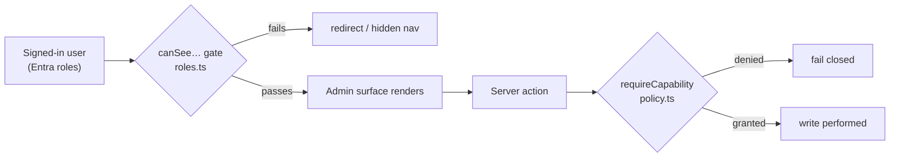

# 🔑 Admin guides

> **Audience:** internal administrators and finance staff who **configure and
> support Imperion OS** — the controls *behind* the day-to-day UI.
> End users belong in [user-guides](../user-guides/README.md); operators on call
> belong in [operations](../operations/README.md).

[← Documentation library](../README.md) ·
[Architecture](../architecture/README.md) ·
[System of systems](../architecture/system-of-systems.md) ·
[Security standard](../security/unified-security-standard.md)

---

Imperion OS is an internal, AI-enabled platform an MSP runs its
**whole business** on — CRM + ERP + extras + a full AI suite on one surface
([capability tour](../product/imperion-os-overview.md)). Most of it
is open to every signed-in employee, with money redacted from support-only users. A
smaller set of **administrative surfaces** — identity, integrations, configuration,
and the time/expense finance lifecycle — are gated to **admin** and (for finance
work) **finance** roles. This section documents those surfaces: what each one does,
who can reach it, how to operate it, and where the hard security boundaries are.

These guides describe behaviour **verified against the application source**
(`src/lib/auth`, `src/app/(app)/settings`, and the per-surface routes). They
**reference, never restate**, the shared
[unified security standard](../security/unified-security-standard.md); when a
control is described here, the standard is the binding version.

## How access works (read this first)

Roles come from **Microsoft Entra ID** group / app-role claims and are normalised
into five application roles (`src/lib/auth/roles.ts`). The default — for a user with
no recognised claim — is the most restricted, `support`.

| Role | Who | Admin reach |
| --- | --- | --- |
| `admin` | Platform administrators | **Everything** — holds every capability implicitly. |
| `finance` | Finance / CFO | The money lifecycle: payroll approval, expense finance approval, Monthly Close, mileage rate, collections. |
| `project_manager` | Delivery management | Project / capacity configuration (delivery, not covered as an "admin surface" here). |
| `sales` | Sales & marketing | No admin surfaces. |
| `support` | Default / least-privileged | No admin surfaces; money is redacted. |

Two enforcement layers protect every admin surface (defence in depth):

1. **Navigation + route gate** — a `canSee…` predicate in `roles.ts` hides the nav
   entry *and* redirects the route for anyone who fails it.
2. **Capability check on every mutation** — server actions call
   `requireCapability(...)` (`src/lib/auth/guard.ts`) against the capability matrix
   in `src/lib/auth/policy.ts`, so a write **fails closed** even if a request
   reaches the action directly. `admin` holds every capability implicitly.

> **Comp data is special.** Pay rate, expected pay, and the mileage rate are
> **compensation data**. They are read only by the backend and shown only on
> finance/admin-gated surfaces — never on the broadly-visible admin tables. Every
> guide below that touches money calls this out explicitly.

## The guides

| Guide | Surface | Who | What it does |
| --- | --- | --- | --- |
| [Settings & configuration](settings.md) | `/settings` | admin | Profile, AI budget, your connections, **company credentials**, tenant mapping, and configuration tools. |
| [Connectors](connectors.md) | `/connectors` | admin | The integration marketplace — enable, tune, and disable org-wide data connectors. |
| [Status administration](status-administration.md) | `/settings/statuses` | admin | Admin-definable task/project status sets per project type; reporting rolls up by **category**, not label. |
| [CMDB CI register](cmdb-ci-register.md) | `/cmdb` | admin | Read-only Configuration Item view over the client managed estate. |
| [Time administration](timesheet-administration.md) | `/timesheets/admin` | admin ∨ finance | The unified all-users timesheet lifecycle table. |
| ↳ [Time approvals](timesheet-approvals.md) | (inside Time admin) | admin | The correctness gate — review & approve a submitted week. |
| ↳ [Payroll approval](payroll-approval.md) | (inside Time admin) | finance ∨ admin | The CFO sign-off → QuickBooks-matched **Paid**. |
| [Employee mapping](employee-mapping.md) | `/timesheets/mappings` | admin | One-time mapping of each employee to Autotask / QuickBooks / MileIQ ids. |
| [Expense administration](expense-administration.md) | `/expenses/admin` | admin ∨ finance | The unified expense lifecycle table, **Monthly Close**, **expense categories**, and the comp-gated **mileage rate**. |

## Related admin surfaces (documented elsewhere)

A few admin-only surfaces live in other sections because they fit a different
audience. They are gated the same way:

- **Security posture** (`/security`, admin) — [security](../security/README.md).
- **AI Agents & Board of Directors** (`/agents`, `/board`, admin) —
  [AI / agents](../agents/README.md).
- **Consent ledger & data governance** (`/consent`) —
  [data governance](../data-governance/README.md).
- **Custom fields, questions, workflows** — configuration tools linked from
  Settings → Tools & configuration; see [user-guides](../user-guides/README.md) for
  day-to-day use.

## The wider platform

Imperion OS is the **GUI repository** in a four-repository system
(ADR-0042). Processes, live data, and heavy enrichment live in the three sibling
repos. For the whole picture see
[System of systems](../architecture/system-of-systems.md):

- **`ImperionCRM_Backend`** — all processes (Azure Functions, OAuth token custody in
  Key Vault, the orchestrator runtime). Every credential an admin enters here is
  custodied by the backend, never stored as a secret in this repo.
- **`ImperionCRM_Pipeline`** — live data (webhooks, bronze→silver merge, on-demand
  refresh, poll cadence).
- **`ImperionCRM_LocalPipelineEnrichment`** — on-prem heavy lifting (scheduled bulk
  ingestion, the IT Glue hub, all vectorization).
