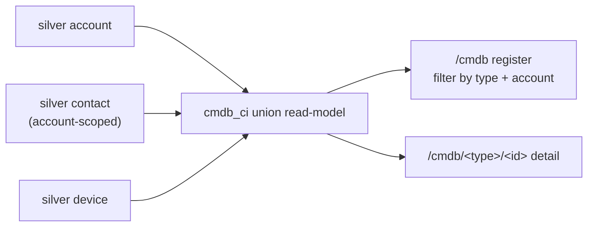

# CMDB Configuration Item register — admin guide

> **Audience:** platform administrators. **Surface:** **CMDB** (`/cmdb`).
> **Access:** **admin-only** — `canSeeCmdb` (ADR-0030). Epic: **#372** (CMDB
> relationships + impact + asset lifecycle). Decision record: **ADR-0078**. Issue:
> **#645** (the foundation slice; later slices #647–653 ride on this read-model).
>
> [← Admin guides](README.md) · [Account 360](../user-guides/README.md) ·
> [Security standard](../security/unified-security-standard.md)

## What this is

The CMDB register is a **read-only Configuration Item (CI) view** projected over the
**existing silver inventory** Imperion Business Manager already holds. It is the
foundation of the CMDB cluster: a clean `cmdb_ci` union read-model that later slices
(relationships, impact, asset lifecycle) extend.

There is **no new ingest, no new bronze, and no schema change** — every CI is a
projection over a silver entity the pipeline already populates. That is why this is a
*read* surface with no write path.

## The CI model (v1)

| CI type | Projected over | Notes |
| --- | --- | --- |
| **Account** | silver `account` | The managed client itself. |
| **End-user** | silver `contact` (account-scoped) | A managed-estate end-user identity. |
| **Device** | silver `device` | A managed device / asset. |

Every CI is tagged with its `ci_type`, a stable `ci_id`, and its **owning
`account_id`** (plus the resolved account name). Because `ci_id` is unique only
*within* a type, the cross-union key is the `${ci_type}:${ci_id}` pair — that is what
the detail route (`/cmdb/<type>/<id>`) keys on.

### Staff / internal exclusion (a privacy boundary)

The register is the **client managed estate only**. Imperion staff and admin
identities are **excluded** — by design, with two independent guards:

- The `end-user` CI is silver `contact` (client identities). Imperion employees are
  modelled as `app_user`, a *different* table the union never touches.
- Every CI additionally requires a non-null owning `account_id`, so an account-less
  or unlinked row can never enter the set (`isClientCi` / `account_id IS NOT NULL`).

This is conservative on purpose: an identity that cannot be attributed to a client
account is **dropped rather than shown**.

## Using the register

- The list shows every CI with its type, owning account, and key attributes.
- **Filter** by CI type (chips) and by account (dropdown); both filters compose.
- Click any CI to open its **detail view** — the owning account (links to the
  Account 360) plus the CI's key attributes.

## Relationships (the CMDB edge layer, #647)

Each CI detail view carries a **Relationships** panel and a **dependency-graph** view of
the CI's neighbourhood — the relationship layer of the CMDB (epic **#372**, **ADR-0078**;
the CMDB authority ADR is authored in parallel under **#646**). Unlike the register, this
layer **is persisted** — it is curated knowledge (derived *and* manually authored) that has
nowhere in silver to live (`ci_relationship` table, migration `0131`).

An edge is **directional and typed**: `from -[relation_type]-> to`, where each endpoint is a
CI `(type, id)` pair (e.g. a **device** `belongs-to` an **account**). The panel lists every
edge touching the CI in **both** directions and resolves each neighbour to its name + drill
link; the graph renders the same neighbourhood radially.

Edges come from two sources:

- **derived** — auto-seeded from the silver foreign keys the inventory already carries
  (`device belongs-to account`, `user belongs-to account`). The **Re-derive** button
  recomputes them from current silver on demand (the same seed the migration runs).
  *(The issue also names `device assigned-to user`; silver `device` carries no assigned-user
  FK today, so that derivation is omitted until such a link is added to silver.)*
- **manual** — authored, edited, and removed by an admin (**Add edge** / inline edit / remove).

**Manual edges survive re-derivation** — the derivation only ever replaces `derived` rows.

The working copy is **app-native**: pushing edges out to **IT Glue is a separate, gated
round-trip slice**, not this surface.

## Criticality / business impact (#648)

Every CI carries a **criticality** rating — its business impact, and the weighting input for
impact analysis (#650). It shows as a **badge** on the register (a column) and on the CI
detail (header + a dedicated **Criticality** panel), stored on the app-native
`cmdb_ci_overlay` table (migration `0132`).

Criticality is **derived + override**:

- **Derived default** — computed from the silver attributes the CI already carries (no new
  ingest):
  - **Account** → relationship × lifecycle: a live managed customer (`customer` &
    `managed_active`) → **High**; a customer mid-lifecycle or a `partner` → **Medium**; a
    `prospect`/unknown → **Low**.
  - **Device** → device role: `server`/`network` infrastructure → **High**;
    `workstation`/`mobile` endpoint → **Medium**; untyped → **Low**.
  - **End-user** → **Medium** baseline (silver carries no seniority/role signal today; an
    override is the escape hatch).
  The derived rule **never** assigns **Critical** — that level is reserved for an explicit
  admin override (a machine shouldn't silently declare a CI business-critical). The
  **Re-derive** button recomputes the defaults from current silver on demand.
- **Override** — an admin (`cmdb:write`) sets an explicit level on the CI detail, or chooses
  *Inherit derived default* to clear it. **The effective criticality = override ?? derived
  default**, and **an override survives re-derivation** (the derivation only ever rewrites the
  derived default). A badge with a ring + "·set" marks a CI whose criticality is an override.

The working copy is **app-native**: pushing criticality out to **IT Glue is a separate, gated
slice**, not this surface.

## Asset lifecycle (#649)

Every asset CI also carries a **lifecycle state** — where the asset sits in its service
life. It shows as a **badge** on the register (a column) and on the CI detail (header). Unlike
criticality, lifecycle is **derived and read-only — never hand-edited and never persisted**
(the grilled decision: lifecycle is an *observation* of source systems, not a human assertion,
so there is no override twin and nothing to store on an overlay). It is **recomputed from
current source signals on every read**.

The states (highest-confidence signal first):

| State | Meaning | Tone |
| --- | --- | --- |
| **In use** | Deployed / in service. | green |
| **In stock** | Held, not yet deployed (spare, available, unassigned). | accent |
| **Retired** | Decommissioned / out of service, or aged out (seen long ago, not enrolled). | amber |
| **Disposed** | Scrapped / disposed / written off. | dim |
| **Unknown** | Signals can't place it, or the CI is not a physical asset — **badge suppressed**. | — |

**The derived rule (v1), device CIs only** — `account`/`user` CIs are not physical assets so
they are always **Unknown** (the badge is hidden for them):

1. **Autotask config-item / asset `status` wins** when it names a terminal/known state —
   *disposed/scrapped* → **Disposed**; *retired/decommissioned/inactive* → **Retired**;
   *in stock/spare/available/unassigned* → **In stock**; *active/deployed/in service* →
   **In use**.
2. Otherwise the **activity signal**: a live **Intune enrollment** (`management_state` or an
   enrolled date) → **In use**; else a device **seen within 90 days** (silver `last_seen_at`)
   → **In use**; a device **last seen longer ago** with no enrollment → **Retired** (aged out).
3. **Missing / ambiguous signals → Unknown** — never a crash, never a guessed state. A device
   with no status, never seen, and not enrolled reads **Unknown**.

The register adds a **Lifecycle** filter (dropdown) alongside the type + account filters; all
three compose. There is **no edit UI** — to change an asset's lifecycle, change it in the
**source system** (Autotask / Intune) and it re-derives on the next read.

Lifecycle joins cleanly from the signals the CI read already projects (device `status`,
`last_seen_at`, and the latest Intune managed-device row by serial), so it is derived
**entirely in code** (`src/lib/cmdb/lifecycle.ts`) — **no migration / no DB view** was added.

## Impact analysis (#650)

The CI detail answers **"what's affected?"** — if this CI changes or is removed, which other
CIs are in the blast radius. The **Impact analysis panel** (below criticality, above the
relationships panel) shows a weighted summary (affected count · blast weight · peak criticality)
and then the affected CIs **grouped by type**, each row with its **hop distance** + criticality
badge. Most-weighted group first; nearest-first within a group.

**How it traverses.** Starting from the CI, it walks the `ci_relationship` graph **n hops**
(default **3**, bounded — never runs away on a dense graph) and enumerates every reachable CI.
The walk is **cycle-safe** (a visited-set; each CI is counted once, at its shortest hop, so
cycles + diamonds terminate) and treats the graph as **undirected by default** — the
conservative blast radius, since the curated relation vocabulary mixes orientations (a device
`belongs-to` an account; an account `depends-on` a service). Each affected CI is **criticality-
weighted** (`override ?? derived_default` → `critical 4 / high 3 / medium 2 / low 1`); the
panel's **blast weight** is the sum over the affected set.

**Reusable read-model.** The computation is a pure read-model (`analyzeImpact` →
`CiImpact`) — not pre-rendered markup — so the later **change-risk (#373)** and
**incident-triage (#320)** surfaces consume the SAME blast-radius (a change's risk ≈ its
impact weight; an incident fans out to its affected CIs). A caller wanting a strict
directional walk (downstream dependents only / upstream dependencies only) passes
`direction`. Missing-edge endpoints (an edge to a CI not in the register) are skipped
gracefully and never surface. **No migration** — the traversal is entirely app-layer over the
existing `ci_relationship` reads.

## Access

The **register and device inventory are read-only** for admin∨support (`canSeeCmdb`,
ADR-0030) — the nav entry is hidden and the route redirects for others; manage each item in
its **source system**. The **relationship layer** adds the CMDB's first write path: authoring
manual edges and running the derivation is gated by **`cmdb:write`** (ADR-0045, **admin-only**
— curation is an admin act, the conservative posture matching the read surface) and re-asserted
server-side in every action (`requireCapability`), so the server never trusts the hidden-control
UI. App-native only — there is **no IT Glue write path** here.

## Implementation (for the curious)

- Union read-model: `crm.listConfigurationItems()` — a SQL `UNION ALL` over
  `account`, `contact`, and `device` in `postgres-repositories.ts`. The **mock
  returns `[]`** so the page renders empty (never crashes) when silver is empty.
- Pure helpers + the staff-exclusion rule: `src/lib/cmdb/ci.ts` (unit-tested).
- Surface: `src/app/(app)/cmdb/` (register + `[type]/[id]` detail),
  `src/components/cmdb/ci-register.tsx`.
- Relationship layer (#647): `ci_relationship` table (migration `0131`); read/derive/write
  accessors `crm.listCiRelationships` / `deriveCiRelationships` / `createCiRelationship` /
  `updateCiRelationship` / `deleteCiRelationship`; server actions in
  `src/app/(app)/cmdb/actions.ts` (all `cmdb:write`-gated); pure helpers in
  `src/lib/cmdb/relationship.ts`; UI in `src/components/cmdb/ci-relationships.tsx`
  (panel + SVG dependency graph).
- Criticality overlay (#648): `cmdb_ci_overlay` table (migration `0132`); the derived default
  + effective resolution live in pure helpers `src/lib/cmdb/criticality.ts` (unit-tested,
  the same rule the migration seed encodes); read folded into `crm.listConfigurationItems()`
  (with an in-code derived fallback pre-apply); writes `crm.setCiCriticalityOverride` /
  `crm.deriveCiCriticality` via `cmdb:write`-gated server actions; UI in
  `src/components/cmdb/criticality-badge.tsx` (badge) + `ci-criticality.tsx` (detail panel).
- Asset lifecycle (#649): **no migration / no persisted table** — derived entirely in code from
  the source signals the CI read already projects. The rule + labels/tones live in pure helpers
  `src/lib/cmdb/lifecycle.ts` (unit-tested, `lifecycle.test.ts`); the read folds it into
  `crm.listConfigurationItems()` (the device arm projects `status`, `last_seen_at`, and the
  latest Intune `management_state`/`enrolled_date_time` by serial); UI in
  `src/components/cmdb/lifecycle-badge.tsx` (badge, suppressed on `unknown`) + the register's
  Lifecycle filter. **`unknown` is the graceful fallback** for any missing signal.
- Impact analysis (#650): **no migration** — an app-layer n-hop traversal in pure helpers
  `src/lib/cmdb/impact.ts` (`analyzeImpact` → `CiImpact`; cycle-safe visited-set, depth-bounded
  default 3, criticality-weighted, grouped-by-type; unit-tested `impact.test.ts`). Fed the whole
  edge set by a new un-scoped read `crm.listAllCiRelationships()` (mock `[]`); the detail page
  computes the read-model server-side. UI in `src/components/cmdb/impact-panel.tsx`. The
  `CiImpact` read-model is the reusable surface #373 (change-risk) + #320 (incident-triage) read.

## Security notes

- **Read-only, no write path** — there is nothing to mis-authorize on write.
- **Client estate only** — staff/internal identities are structurally excluded
  (different table + the non-null `account_id` requirement), a deliberate privacy
  boundary; see the
  [unified security standard](../security/unified-security-standard.md).
- Admin-gated at the nav and route, the same class as Settings.
