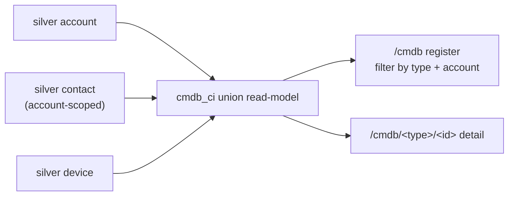

# CMDB Configuration Item register — admin guide

> **Audience:** platform administrators. **Surface:** **CMDB** (`/cmdb`).
> **Access:** **admin-only** — `canSeeCmdb` (ADR-0030). Epic: **#372** (CMDB
> relationships + impact + asset lifecycle). Decision record: **ADR-0078**. Issue:
> **#645** (the foundation slice; later slices #647–653 ride on this read-model).
>
> [← Admin guides](README.md) · [Account 360](../user-guides/README.md) ·
> [Security standard](../security/unified-security-standard.md)

## What this is

The CMDB register is a **read-only Configuration Item (CI) view** projected over the
**existing silver inventory** Imperion Business Manager already holds. It is the
foundation of the CMDB cluster: a clean `cmdb_ci` union read-model that later slices
(relationships, impact, asset lifecycle) extend.

There is **no new ingest, no new bronze, and no schema change** — every CI is a
projection over a silver entity the pipeline already populates. That is why this is a
*read* surface with no write path.

## The CI model (v1)

| CI type | Projected over | Notes |
| --- | --- | --- |
| **Account** | silver `account` | The managed client itself. |
| **End-user** | silver `contact` (account-scoped) | A managed-estate end-user identity. |
| **Device** | silver `device` | A managed device / asset. |

Every CI is tagged with its `ci_type`, a stable `ci_id`, and its **owning
`account_id`** (plus the resolved account name). Because `ci_id` is unique only
*within* a type, the cross-union key is the `${ci_type}:${ci_id}` pair — that is what
the detail route (`/cmdb/<type>/<id>`) keys on.

### Staff / internal exclusion (a privacy boundary)

The register is the **client managed estate only**. Imperion staff and admin
identities are **excluded** — by design, with two independent guards:

- The `end-user` CI is silver `contact` (client identities). Imperion employees are
  modelled as `app_user`, a *different* table the union never touches.
- Every CI additionally requires a non-null owning `account_id`, so an account-less
  or unlinked row can never enter the set (`isClientCi` / `account_id IS NOT NULL`).

This is conservative on purpose: an identity that cannot be attributed to a client
account is **dropped rather than shown**.

## Using the register

- The list shows every CI with its type, owning account, and key attributes.
- **Filter** by CI type (chips) and by account (dropdown); both filters compose.
- Click any CI to open its **detail view** — the owning account (links to the
  Account 360) plus the CI's key attributes.

## Relationships (the CMDB edge layer, #647)

Each CI detail view carries a **Relationships** panel and a **dependency-graph** view of
the CI's neighbourhood — the relationship layer of the CMDB (epic **#372**, **ADR-0078**;
the CMDB authority ADR is authored in parallel under **#646**). Unlike the register, this
layer **is persisted** — it is curated knowledge (derived *and* manually authored) that has
nowhere in silver to live (`ci_relationship` table, migration `0131`).

An edge is **directional and typed**: `from -[relation_type]-> to`, where each endpoint is a
CI `(type, id)` pair (e.g. a **device** `belongs-to` an **account**). The panel lists every
edge touching the CI in **both** directions and resolves each neighbour to its name + drill
link; the graph renders the same neighbourhood radially.

Edges come from two sources:

- **derived** — auto-seeded from the silver foreign keys the inventory already carries
  (`device belongs-to account`, `user belongs-to account`). The **Re-derive** button
  recomputes them from current silver on demand (the same seed the migration runs).
  *(The issue also names `device assigned-to user`; silver `device` carries no assigned-user
  FK today, so that derivation is omitted until such a link is added to silver.)*
- **manual** — authored, edited, and removed by an admin (**Add edge** / inline edit / remove).

**Manual edges survive re-derivation** — the derivation only ever replaces `derived` rows.

The working copy is **app-native**: pushing edges out to **IT Glue is a separate, gated
round-trip slice**, not this surface.

## Access

The **register and device inventory are read-only** for admin∨support (`canSeeCmdb`,
ADR-0030) — the nav entry is hidden and the route redirects for others; manage each item in
its **source system**. The **relationship layer** adds the CMDB's first write path: authoring
manual edges and running the derivation is gated by **`cmdb:write`** (ADR-0045, **admin-only**
— curation is an admin act, the conservative posture matching the read surface) and re-asserted
server-side in every action (`requireCapability`), so the server never trusts the hidden-control
UI. App-native only — there is **no IT Glue write path** here.

## Implementation (for the curious)

- Union read-model: `crm.listConfigurationItems()` — a SQL `UNION ALL` over
  `account`, `contact`, and `device` in `postgres-repositories.ts`. The **mock
  returns `[]`** so the page renders empty (never crashes) when silver is empty.
- Pure helpers + the staff-exclusion rule: `src/lib/cmdb/ci.ts` (unit-tested).
- Surface: `src/app/(app)/cmdb/` (register + `[type]/[id]` detail),
  `src/components/cmdb/ci-register.tsx`.
- Relationship layer (#647): `ci_relationship` table (migration `0131`); read/derive/write
  accessors `crm.listCiRelationships` / `deriveCiRelationships` / `createCiRelationship` /
  `updateCiRelationship` / `deleteCiRelationship`; server actions in
  `src/app/(app)/cmdb/actions.ts` (all `cmdb:write`-gated); pure helpers in
  `src/lib/cmdb/relationship.ts`; UI in `src/components/cmdb/ci-relationships.tsx`
  (panel + SVG dependency graph).

## Security notes

- **Read-only, no write path** — there is nothing to mis-authorize on write.
- **Client estate only** — staff/internal identities are structurally excluded
  (different table + the non-null `account_id` requirement), a deliberate privacy
  boundary; see the
  [unified security standard](../security/unified-security-standard.md).
- Admin-gated at the nav and route, the same class as Settings.
