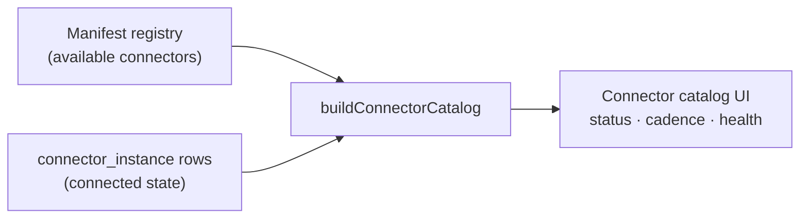

# Connections — admin guide

> **Audience:** platform administrators. **Surface:** **Connections**
> (`/settings/connections`). **Access:** **admin-only** — `canSeeSettings`
> (ADR-0030, ADR-0076 §4). Mutations are additionally enforced by
> **`settings:write`**. Issues: **#416**, **#864**.
>
> [← Admin guides](README.md) · [Settings & configuration](settings.md) ·
> [Integrations](../integrations/README.md)

**Connections** is the single admin surface for every **company-global** integration
(#864). It consolidates what used to be three overlapping pages — the old
`/connectors` marketplace, the old "Global connections" view, and the `/settings`
**Company credentials** tab — into one interactive page with two sections:

1. **Company systems** — the interactive credential cards (`COMPANY_PROVIDERS`,
   ADR-0036): enter / rotate secrets, **grant admin consent** (DocuSign / QuickBooks /
   GDAP), tune poll cadence, refresh on demand. Secrets are written to **Key Vault** by
   the backend; only a reference lands on the company `connection` row — never the secret.
2. **Connector catalog** — the marketplace grid (`buildConnectorCatalog`): status,
   enable / disable, effective poll cadence for the global-scope connector instances.

It is the **company tier** of the three-tier integration model: per-employee
integrations live on the **Profile** page (individual approval); per-client
integrations live under **Account → Integrations**.

## What the catalog section shows

The catalog joins two things (`buildConnectorCatalog` over
`listConnectorManifests()` + persisted `connector_instance` rows):

- **The available catalog** — every connector defined in the in-code **manifest
  registry** (`src/lib/integrations/connector-manifest.ts`). Verified entries include
  Microsoft 365 (`m365`), Autotask, IT Glue, Meta, Dark Web ID, and Apollo.
- **The connected state** — for each connector that has been enabled, its persisted
  instance: status, capabilities, scopes, **effective poll cadence**, last sync, and
  health.

The header shows a live "N connected" count.

## The client-mapping chain (per-client connectors)

Connectors that map onto a **client** (account) — `m365`, `autotask`, `itglue`, `pax8`,
`myitprocess`, `quotemanager`, `televy`, `darkwebid`, `unifi` (`CLIENT_SCOPED_CONNECTORS`
in `src/lib/integrations/connector-chain.ts`) — carry a small **4-step pipeline chain** on
their card, plus an **Edit client mappings** button. System/company-scope connectors (qbo,
meta, docusign, apollo) show neither — one credential serves the whole org, there is nothing
per-client to map.

The chain (`connectorChainSteps`, ADR-0112) shows how far that connector has progressed:

| Step | Icon | Done when |
| --- | --- | --- |
| **Credential** | key | A credential is custodied (Company-systems ref, or the instance is enabled). |
| **Ingestion** | download | The collector has pulled the source into bronze at least once. |
| **Discovery** | scan | Distinct client units (companies / tenants / sites) are visible to map. |
| **Mapping** | link | Every discovered unit is linked to an Imperion account. |

Tone: green = done · amber = in progress · grey = pending · red = errored. The derivation is
deliberately honest — a connector whose bronze isn't wired yet shows discovery/mapping as
**pending**, never a false green. (Step 5, the bronze→silver merge, lives in the Pipeline /
LocalPipeline planes and is not shown here.)

**Edit client mappings** opens `/settings/client-mapping/<connector>` (the reusable mapping
surface, epic #1141 unit E). The button appears only when that connector has a mapping
adapter wired (`autotask` and `m365` today; the rest light up as unit F lands), so it
never links to a missing page. For `m365`, Tenant Mapping **is** this surface — the old
`/settings/tenant-mapping` route now redirects here (ADR-0112, E3 #1147).

## What an admin does here

- **Enter / rotate a credential** (Company systems) — write-only secret fields,
  POSTed to the backend → **Key Vault**; only a reference lands on the connection row.
- **Grant admin consent** (Company systems) — for DocuSign / QuickBooks.
- **Enable** a connector (catalog) — records the lifecycle *intent* to run it.
- **Tune** its poll cadence — how often the pipeline scrapes it (ADR-0038, `pollDue()`).
- **Disable** a connector (catalog) — stops it.

## Company systems — credentials & consent (ADR-0036)

The interactive section, rendered from `COMPANY_PROVIDERS`
(`src/lib/integrations/company-providers.ts`). **Secrets are write-only** — password
inputs that are never pre-filled or echoed back; what you type is POSTed to the
backend, which writes it to **Key Vault**, and only a *reference* lands on the
connection row — never the secret itself (CLAUDE.md §5). Three collection styles:

- **`credential`** — a field form (API key / username / secret / region, etc.).
- **`consent`** — an admin-consent connect button, no key to paste (QuickBooks).
- **`credential` + `adminConsent`** — DocuSign needs BOTH: a secret form **and** a
  one-time admin grant. The card renders the form *and* a **Grant admin consent**
  button (`connectDocusignAction` → backend `/connections/docusign/consent`).

Poll cadence + Refresh now appear only for *pollable* providers (`providerIsPollable`
— `kind: "credential"`, not send-capable, not `adminConsent`).

| Provider (key) | Kind | Purpose |
| --- | --- | --- |
| Autotask PSA (`autotask`) | credential | Kaseya Autotask REST — tickets, contracts, company records. |
| IT Glue (`itglue`) | credential | IT Glue API key + region (US/EU/AU). |
| My IT Process (`myitprocess`) | credential | My IT Process API key. |
| Kaseya Quote Manager (`quotemanager`) | credential | Quote Manager API key + tenant/account id. |
| Televy (`televy`) | credential | Assessment-report ingestion API key. |
| QuickBooks Online (`qbo`) | consent | QuickBooks company connect (OAuth) — read-only financial facts. |
| Dark Web ID (`darkwebid`) | credential | Compromised-credential exposure API key. |
| Meta — Facebook / Instagram (`meta`) | credential, **send-capable** | Page access token + Page id. |
| DocuSign (`docusign`) | credential, **adminConsent** | Integration key + RSA private key (PEM) + impersonated user → 3 named Key Vault secrets; then Grant admin consent. Account id + environment are ops App Settings. |

> **Meta** is `sendCapable` (outbound DM replies) — entering it is a Mark-approved
> security event. **QuickBooks** uses a consent connect action; the QBO outcome
> renders a notice on `/settings/connections?qbo=<result>`. **DocuSign** enters its
> three secrets via the form (backend #192), then **Grant admin consent** redirects to
> DocuSign for one-time JWT impersonation consent per environment; its secrets rotate
> one-at-a-time (each is its own Key Vault secret).

## The boundary: the catalog section never touches secrets

Within the page the two sections keep a clean split — credentials are collected only in
**Company systems**, and the **Connector catalog** records lifecycle intent only:

> **In the catalog, enabling records intent only. Credentials are never entered there.**

So a secret lives in exactly one place (Key Vault, via the Company-systems cards), and
the broadly-scoped catalog grid never touches it (#149).

## Access & enforcement

- **Nav + route gate:** `canSeeSettings` (admin-only) hides the nav entry and
  redirects the route for non-admins — the page now collects credentials, so it
  carries the full Settings gate (#864).
- **Mutations:** completing a connect and writing custody is the **backend's** job
  (#149); the front-end mutations that record enable/disable/cadence intent are
  enforced by `settings:write` (admin-only), fail-closed.
- The page is `force-dynamic` — it always reflects live instance state and is never
  prerendered.

## Where the data goes

A connector is the front of the staged-enrichment pipeline (CLAUDE.md §4): raw
payloads land in **bronze**, the pipeline merges them to **silver**, and enrichment
produces **gold**. Enabling and tuning connectors here controls the *intake* end of
that flow. For the cross-repo picture see
[System of systems](../architecture/system-of-systems.md).

## Troubleshooting: OAuth connect lands on `0.0.0.0:8080`

The OAuth callback routes (`/api/qbo/callback`, `/api/connections/[provider]/callback`)
build their "back to the app" redirect from the **public** origin via `requestOrigin()`
(`src/lib/integrations/request-origin.ts`, #931). Behind the App Service reverse proxy,
the raw `req.nextUrl.origin` is the internal bind host (`https://0.0.0.0:8080`), so a
connect that *succeeds* would otherwise strand the browser there. `requestOrigin()`
resolves the host from `x-forwarded-host`/`x-forwarded-proto` (the same source NextAuth
trusts via `trustHost: true`), falling back to `nextUrl.origin` for local dev.

If a callback still lands on a wrong host, set the **`APP_PUBLIC_ORIGIN`** app setting
(e.g. `https://imperioncrm.azurewebsites.net`) — it overrides header detection.

## Security notes

- **Secrets are write-only and never persisted in the app.** The Company-systems
  cards POST secrets to the backend, which holds them in **Key Vault**; only a
  reference lands on the connection row. The **catalog** section exposes no secret
  material at all.
- Admin-only at both the nav/route gate and (for mutations) the capability check.
- See the [unified security standard](../security/unified-security-standard.md) for
  the binding controls on credential custody and integration security.
