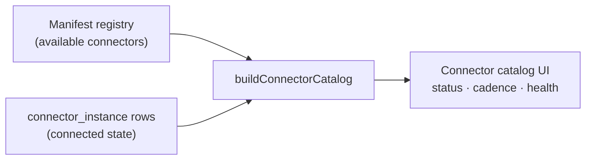

# Connectors — admin guide

> **Audience:** platform administrators. **Surface:** **Connectors** (`/connectors`).
> **Access:** **admin-only** — `canSeeConnectors` (ADR-0030, ADR-0076 §4). Mutations
> are additionally enforced by **`settings:write`**. Issue: **#416**.
>
> [← Admin guides](README.md) · [Settings & configuration](settings.md) ·
> [Integrations](../integrations/README.md)

The Connectors page is the **integration marketplace** for Imperion Business
Manager: a single place to browse every data connector the platform knows how to
run, see which are connected and healthy, and enable / tune / disable them
org-wide. It is the admin twin of the per-user
[Integrations](../integrations/README.md) page (which manages an individual's own
accounts).

## What it shows

The catalog joins two things (`buildConnectorCatalog` over
`listConnectorManifests()` + persisted `connector_instance` rows):

- **The available catalog** — every connector defined in the in-code **manifest
  registry** (`src/lib/integrations/connector-manifest.ts`). Verified entries include
  Microsoft 365 (`m365`), Autotask, IT Glue, Meta, Dark Web ID, and Apollo.
- **The connected state** — for each connector that has been enabled, its persisted
  instance: status, capabilities, scopes, **effective poll cadence**, last sync, and
  health.

The header shows a live "N connected" count.

## What an admin does here

- **Enable** a connector — records the lifecycle *intent* to run it.
- **Tune** its poll cadence — how often the pipeline scrapes it (ADR-0038,
  `pollDue()`).
- **Disable** a connector — stops it.

## The hard boundary: credentials never flow through here

This is the most important rule on the page, enforced in the code and stated in the
page description:

> **Enabling records intent only. Credentials are never entered or stored here.**

The split is deliberate:

1. **Connectors** (`/connectors`) — *which* connectors run, on what cadence, and
   their health.
2. **Settings → Company credentials** (`/settings`) — *the credential itself*,
   collected as a write-only secret and custodied in **Key Vault** by the backend
   (#149). See [Settings & configuration](settings.md).

So the secret lives in exactly one place (Key Vault, via Settings), and the
marketplace surface never touches it. This keeps the blast radius of the
broadly-browsable marketplace minimal — no secret material is reachable from it.

## Access & enforcement

- **Nav + route gate:** `canSeeConnectors` (admin-only) hides the nav entry and
  redirects the route for non-admins — the same gate as Settings and the CMDB
  register.
- **Mutations:** completing a connect and writing custody is the **backend's** job
  (#149); the front-end mutations that record enable/disable/cadence intent are
  enforced by `settings:write` (admin-only), fail-closed.
- The page is `force-dynamic` — it always reflects live instance state and is never
  prerendered.

## Where the data goes

A connector is the front of the staged-enrichment pipeline (CLAUDE.md §4): raw
payloads land in **bronze**, the pipeline merges them to **silver**, and enrichment
produces **gold**. Enabling and tuning connectors here controls the *intake* end of
that flow. For the cross-repo picture see
[System of systems](../architecture/system-of-systems.md).

## Security notes

- **No credential ever enters this surface.** Browsing the marketplace exposes no
  secret material; secrets are collected under Settings and held in Key Vault by the
  backend.
- Admin-only at both the nav/route gate and (for mutations) the capability check.
- See the [unified security standard](../security/unified-security-standard.md) for
  the binding controls on credential custody and integration security.
