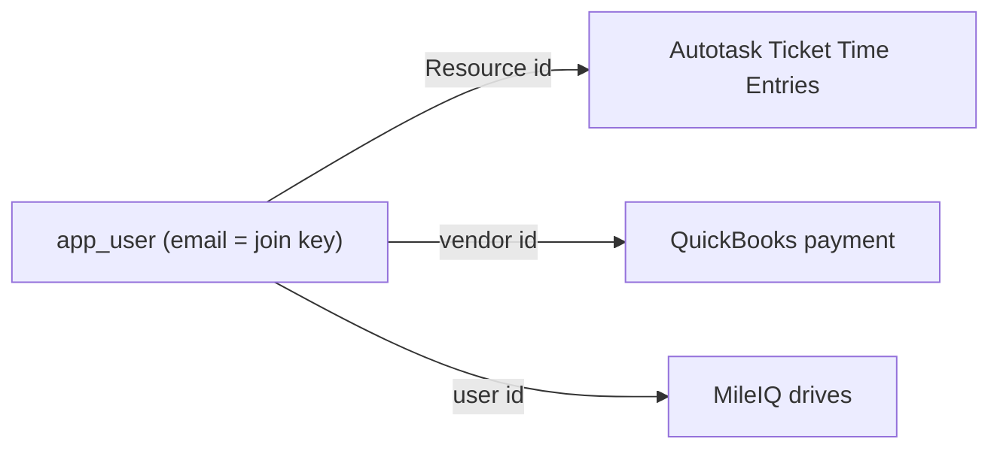

# Employee mapping — admin guide

> **Audience:** platform administrators. **Surface:** **Employee Mapping**
> (`/timesheets/mappings`). **Access:** **admin-only** — `canManageEmployeeMappings`
> (nav + route) and the **`time:map`** capability on the confirm action. Decision
> records: **ADR-0082** (time) / **ADR-0083** (expense/MileIQ). Issues: **#468** /
> **#490**.
>
> [← Admin guides](README.md) · [Time administration](timesheet-administration.md) ·
> [Expense administration](expense-administration.md)

## Why it exists

The time and expense lifecycle in Imperion OS reconciles several
external systems per employee. To join them, each employee (`app_user`) must be
linked to their identity in each system. This one-time admin setup captures those
ids.

The systems and their join ids:

| System | Id captured | What it attributes |
| --- | --- | --- |
| **Autotask** | Autotask **Resource id** (numeric) | The employee's Autotask Ticket Time Entries (corroborating attendance). |
| **QuickBooks Online** | QuickBooks **vendor id** | The employee's payroll / reimbursement payment. |
| **MileIQ** | MileIQ **user id** | The employee's mileage drives (for expense). |

The employee's **email is the consistent join key** across all of these
(`app_user ↔ Autotask Resource ↔ QuickBooks vendor ↔ MileIQ user`) and is shown
read-only on each row.

## Mapping an employee

Every employee appears as a row after their **first Entra sign-in** (a row per
`app_user`). For each:

1. Enter the **Resource id** (numeric), **Vendor id**, and **MileIQ user id**.
2. Click **Confirm**.

Confirming **stamps who confirmed it and when** (audit) and flips the row to
**Mapped**. A blank field **clears** that mapping. **Re-confirming overwrites** the
stored ids.

## The comp boundary (important)

This surface touches the **mapping columns only** on `employee_profile`. It is the
sibling of the rate-driven comp surfaces but is **not** one of them:

- **No compensation data** — classification, Pay Rate, or mileage rate — is read or
  written here (ADR-0082 §Security). The mileage *rate* lives on its own
  payroll-gated [Mileage rate](expense-administration.md#mileage-rate-payroll-gated-comp-admin)
  surface.
- The MileIQ **user id** is a *mapping* column, beside the other ids, and is the only
  MileIQ field the pipelines may read. It identifies *whose* drives are whose — it is
  not comp data.

## Notes

- **Automatic email-based resolution** — pulling the Autotask Resource list,
  QuickBooks vendor list, and MileIQ user list and auto-matching by email — is a
  **backend** enhancement. Until it lands, the admin enters the resolved ids here.
  Either way the resolved ids are **stored for stability and audit**.
- See the [unified security standard](../security/unified-security-standard.md) for
  the comp-data handling rules this surface stays clear of.
