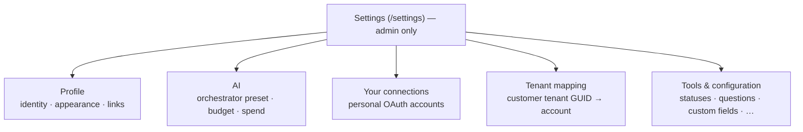

# Settings & configuration — admin guide

> **Audience:** platform administrators. **Surface:** **Settings** (`/settings`).
> **Access:** **admin-only** — `canSeeSettings` (ADR-0030/0016). Middleware
> redirects non-admins and the page re-checks the gate; every mutating action on
> the page additionally enforces the **`settings:write`** capability server-side
> (`requireCapability`, `src/lib/auth/guard.ts`).
>
> [← Admin guides](README.md) · [Connectors](connectors.md) ·
> [Security standard](../security/unified-security-standard.md)

Settings is the administrator's control panel for Imperion OS. It is
where the org's **integration credentials**, the **AI budget**, per-employee
**connected accounts**, the **customer tenant map**, and the **configuration tools**
live. It is one of the small set of fully admin-gated surfaces (the same class as
Security, AI Agents, the CMDB register, and the connector catalog).

## Why it is admin-only

`settings:write` is granted to **no role except `admin`** in the capability matrix
(`CAPABILITY_ROLES["settings:write"] = []`, and `admin` holds every capability
implicitly — `src/lib/auth/policy.ts`). So:

- The nav entry is hidden and the route redirects for anyone who is not an admin.
- Even if a non-admin reached a Settings server action directly, the action calls
  `requireCapability("settings:write")` and **fails closed**.

This matters because Settings governs **org-wide** integration credentials and the
AI spend cap — controls that affect every user, not just the actor.

## The tabs

Settings is a tabbed surface (`SettingsTabs`). Each tab is described below.

### Profile

Read-only identity, plus two settings and two links:

- **Identity** — name, email, roles, and identity provider, all sourced from Entra
  on sign-in (ADR-0002/0016). To change a name or role you change the Entra account;
  it syncs at next sign-in. Nothing about identity is editable in the app.
- **Appearance** — local UI preferences.
- **Security** — a link to the [security posture](../security/README.md) dashboard
  (also admin-only).
- **Platform** — a note that AI runs on Claude (generation) and Voyage (embeddings)
  via the backend's model router; keys live in Key Vault and configuration is in App
  Service settings, **not here**. Plus a link to this documentation library.

### AI

The orchestrator's **model-tier preset**, **hard monthly budget cap**, and
**month-to-date spend** (the same card shown on the [AI Agents](../agents/README.md)
page, ADR-0048). Saving goes through the backend (backend ADR-0037); the card is
editable but the **Save** is enabled only when the backend settings service is
reachable (`source === "backend"`) — otherwise it shows the read-only stub with a
source note. The full agent surface lives on the AI Agents page.

> The front end holds **no AI provider key** (ADR-0043). This tab sets the *budget
> and tier preset*; the actual keys and model routing live in the backend.

### Your connected accounts (personal)

Per-user OAuth connections (ADR-0024, backend ADR-0038): each employee connects
**their own** Microsoft 365 / social accounts so their communications flow into the
timeline (attributed first to the person, then to the company).

- **Connect** runs the backend's real authorization-code flow
  (`connectionsService` → `/connections/{provider}/{start,callback,disconnect}`);
  the callback lands on `/settings?tab=connections&connect=<result>` and a one-shot
  notice renders the outcome.
- **Tokens live in Key Vault**, custodied by the backend — never in this repo.
  **Disconnect** revokes custody first.
- Unconfigured providers degrade to a recorded stub with an honest notice rather
  than failing.
- A link to the [consent ledger](../data-governance/README.md) sits at the bottom.

> This tab is *personal* even though it lives under the admin-only Settings page —
> it is the same connection model as the standalone
> [Integrations](../integrations/README.md) page, surfaced here for convenience.

### Company credentials → moved to Connections (#864)

Org-wide integration credentials are **no longer a Settings tab**. They moved to the
consolidated **Connections** page (`/settings/connections`), which now holds the
interactive credential / consent cards **and** the connector catalog in one place. See
the [Connections admin guide](connectors.md) for the provider list, collection styles
(`credential` / `consent` / `credential` + `adminConsent`), and the DocuSign flow.

### Tenant mapping

Maps a **customer's Microsoft tenant GUID → an Imperion account** so posture and
security data reach the right account page (ADR-0051). The mapping is **explicit and
never inferred from domains**.

- The panel lists existing mappings, lets you add/delete them, and shows an
  **unmapped-tenants** list.
- **Watch the unmapped list.** Posture data for an unmapped tenant is **invisible**
  on account pages — it has nowhere to land. Mapping the GUID to an account fixes it.

### Tools & configuration

A launcher for configuration surfaces that moved out of the main navigation:

| Tool | Route | What it configures |
| --- | --- | --- |
| Workflows | `/workflows` | Automation builder & step editor. |
| Knowledge | `/knowledge` | Search the gold layer (comms, summaries, dossiers). |
| Discovery & assessment questions | `/questions` | The question catalog (`catalog:write`). |
| Custom fields | `/custom-fields` | Admin-definable task/project fields (ADR-0065 B4). |
| **Statuses** | `/settings/statuses` | Admin-definable status sets — see [Status administration](status-administration.md). |

## Security notes

- **Secrets never enter the repo.** Company credentials are write-only inputs whose
  values are custodied in Key Vault by the backend; the connection row stores only a
  reference. Never paste a secret anywhere else, and never commit one. See the
  [unified security standard](../security/unified-security-standard.md).
- **Every write re-checks `settings:write`** server-side — defence in depth behind
  the route gate.
- **Send-capable credentials** (Meta) are an outbound-action grant; treat entering
  one as a deliberate, approved security event.
- The AI budget is the **only** AI control here; provider keys and model routing
  live in the backend, not the front end (ADR-0043).
