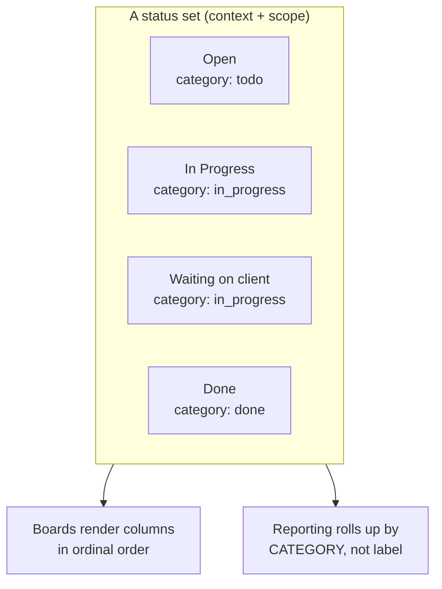

# Status administration — admin guide

> **Audience:** platform administrators. **Surface:** **Settings → Tools &
> configuration → Statuses** (`/settings/statuses`). **Access:** admin (the
> `catalog:write` capability). Decision record: **ADR-0065 B5**. Issue: **#616**.
>
> [← Admin guides](README.md) · [Settings & configuration](settings.md) ·
> [Project board](../user-guides/project-board.md) ·
> [Task board](../user-guides/task-board.md)

## What this is

In Imperion Business Manager, task and project statuses are **configurable data**,
not hard-coded enums. The `status_def` table (migration 0104) holds admin-definable
status sets, and this surface is the CRUD UI over it. Adding a status like *"Waiting
on client"* to one project type is a **row insert** — no schema change, no deploy.

This is the kind of self-service configuration the platform is built around: an
admin tailors the workflow vocabulary to how the business actually works, and the
boards and reports adapt automatically.

## The model

A status set is identified by three dimensions:

| Dimension | Values | Meaning |
| --- | --- | --- |
| **context** | `task` \| `project` | A project type carries an independent task set and project set. |
| **scope** | `global` \| `project_type` | A `global` set is the default for every type; a `project_type` set overrides it for one type. |
| **project type** | (only when scope = `project_type`) | Which type the set belongs to. |

Each status row carries: a stable machine **key** (e.g. `waiting_on_client`), a
display **label** and **colour**, a **category**, and an **ordinal** (column order).

### Category is what reporting rolls up — never the label

`category` is one of `todo` · `in_progress` · `done`. **Reporting and rollups key
off category, never the label** (the deliberate ADR-0065 tradeoff). So renaming *"In
Progress"*, or adding *"Waiting on client"* with category `in_progress`, keeps every
report stable — the new status still counts as in-progress work. **Choose the
category deliberately**; it, not the label, is the load-bearing field.

The seeded global defaults reproduce the legacy enums exactly, so existing reports
are unchanged until you add custom statuses:

- **task:** Open (todo) · In Progress (in_progress) · Done (done)
- **project:** Not Started (todo) · In Progress (in_progress) · Blocked (in_progress) · Complete (done)

## How to use it

1. **Choose a set** — pick a context (task/project) and either *Global default* or a
   project type. A type with no set of its own inherits the global default; add a
   status to give it an independent set.
2. **Add a status** — label, key, category, colour, order.
3. **Edit** — expand a row's *Edit* to change its label / key / category / colour /
   order.
4. **Reorder** — *Reorder this set* stamps a new ordinal on every row atomically.
5. **Delete** — removes the status. **The last status in a set cannot be deleted** (a
   set is never left empty). Deleting a status that work rows point at is **safe**:
   the `task` / `project` FK is `ON DELETE SET NULL`, so those rows keep their legacy
   string status and simply lose the FK.

## Where these statuses show up

The task, project, and sprint **kanban boards read these sets** (#613, ADR-0065 B5):
columns render from `status_def` in your configured order and colour, and a custom
per-type status (e.g. *Onboarding → "Waiting on client"*) appears as its own board
column. A drag **dual-stamps** the new `status_def_id` FK alongside the legacy status
column, so the boards adopt configurable statuses without breaking the legacy string
path. See the [project board](../user-guides/project-board.md) and
[task board](../user-guides/task-board.md) guides.

## Security

Configuration is gated by the **`catalog:write`** capability — the same admin
capability that owns the custom-field, question, and template catalogs. Non-admins
see a set **read-only**; every create / edit / reorder / delete server action
re-checks the capability and **fails closed**. The least-privilege
INSERT/UPDATE/DELETE grant on `status_def` for the web role ships in migration 0104.
See the [unified security standard](../security/unified-security-standard.md).

## Not in this surface (deferred)

- **Per-status WIP limits** and the **over-limit board-column highlight** (ADR-0066
  C1) are part 2 of #616. The board already honours a per-column WIP nudge stored in
  the browser; surfacing the seeded `wip_limit` as the board default and editing it
  here is the remaining work — now **unblocked** by the board-columns re-key (#613).
  The `wip_limit` column is shown read-only here so admins can see seeded values.
- **Reporting re-keying off `category`** (instead of labels) is the remaining broader
  consumer re-key tracked under epic #326 (#615) — additive on top of this admin
  surface and the board re-key.
