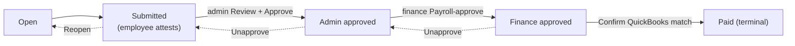

# Time administration — admin & finance guide

> **Audience:** administrators and finance staff. **Surface:** **Time Admin**
> (`/timesheets/admin`). **Access:** **admin ∨ finance** — `canAdministerTimesheets`
> (nav + route). Individual row actions are gated further (see below). Decision
> record: **ADR-0082**. Issue: **#539**.
>
> [← Admin guides](README.md) · [Time approvals](timesheet-approvals.md) ·
> [Payroll approval](payroll-approval.md) ·
> [Employee mapping](employee-mapping.md)

## What this is

Time Admin is the **unified timesheet lifecycle surface** in Imperion Business
Manager — the single, all-users table that absorbs the former *Time Approvals* and
*Payroll Approval* queues into one filterable, sortable view. From here you follow
**every employee's** timesheet across its **whole lifecycle** in one place.

This is the ERP side of the platform: employees track their own time (website
attendance is authoritative; Autotask corroborates), and this surface is where that
time is reviewed, approved, payroll-signed-off, and matched to QuickBooks.

## The table

One row per timesheet, **all employees, all states**:

| Column | Meaning |
| --- | --- |
| Employee · Week | Who, and which Mon–Sun week. |
| Attended | Logged attendance for the week. |
| Approved | Approved hours (blank until the week is admin-approved). |
| State | Open → Submitted → Admin approved → Finance approved → Paid. |

**Filter** by employee name, state, and week range (from / to). **Sort** by clicking
the Employee, Week, Attended, or State header (click again to flip direction). The
header line summarises the queue — how many are awaiting review and awaiting payment.

## Acting on a row (role-gated)

Each row shows only the control valid for its state **and** your role — the two
gates compose:

| State | Action | Who (capability) | Effect |
| --- | --- | --- | --- |
| **Submitted** | **Review** → Approve / Reopen | admin (`time:approve`) | Day-by-day review; correct in place; **Approve** writes the weekly Autotask Time Ticket, or **Reopen** sends it back to re-attest. |
| **Admin approved** | **Payroll-approve** | finance (`time:payroll-approve`) | Authorizes payment. **The app never pays.** |
| **Finance approved** | **Confirm payment** / **Unapprove** | finance (`time:payroll-approve`) | Confirm the QuickBooks-matched payment id → **Paid**, or revert. |
| **Paid** | (read-only) | — | Shows the matched QuickBooks payment id. |

The detailed mechanics of each step are unchanged and live in the two sub-guides —
both now open **inside** this surface:

- [Time approvals](timesheet-approvals.md) — the admin correctness gate (review,
  correct, approve).
- [Payroll approval](payroll-approval.md) — the CFO payroll sign-off and the
  QuickBooks-matched Paid step.

The standalone `/timesheets/approvals` and `/timesheets/payroll` routes **redirect**
here.

## Why one table

Before #539 there were two separate queues. Folding them into one all-states table
means an admin and a finance user looking at the same employee see the same row at
the same point in its life, with each person's valid action surfaced in context. It
removes the "where did this timesheet go?" gap between correctness and payroll.

## Security & privacy

- **No compensation data appears here.** Pay rate and expected pay live in a
  separate payroll-role-gated store and **never cross this surface** (ADR-0082
  §Security). The unified table itself is **comp-free** — it shows attended /
  approved hours, never money.
- **Two composed gates:** the surface is visible to admin ∨ finance, but each *row
  action* re-checks its own capability (`time:approve` for correctness,
  `time:payroll-approve` for payroll) — so finance cannot run the correctness gate
  and a non-finance admin cannot run payroll, even though both can see the table.
- See the [unified security standard](../security/unified-security-standard.md).
