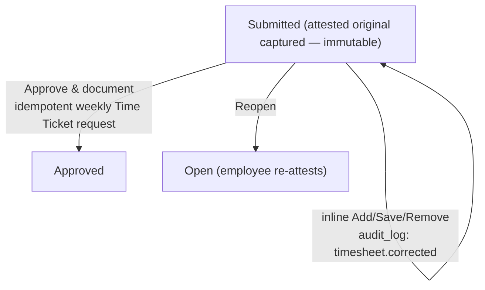

# Time approvals — admin guide

> **Audience:** administrators. **Surface:** the **correctness gate inside**
> [Time administration](timesheet-administration.md) (`/timesheets/admin`); the
> standalone `/timesheets/approvals` route redirects there. **Access:**
> **admin-only** — `canApproveTimesheets` / the **`time:approve`** capability (the
> row actions are hidden from non-admins). Decision record: **ADR-0082**. Issues:
> **#465 / #477**.
>
> [← Admin guides](README.md) · [Time administration](timesheet-administration.md) ·
> [Payroll approval](payroll-approval.md)

## What this is

This is the **admin correctness gate** — the step that checks an employee's attested
week is right *before* it goes to payroll. It is the first of the two
[Time administration](timesheet-administration.md) gates; the second is
[payroll approval](payroll-approval.md). Approving here does **not** pay anything.

## The queue

Every timesheet an employee has **attested** (Submitted) appears here, oldest first,
with the employee, week, attended hours, entry count, and attest date. Click
**Review** to open it.

## Reviewing a week

The review panel shows the entries day by day alongside the **Reconciliation** —
attended vs same-day Autotask allocation, with the daily verdict (**Balanced /
Under-logged / Over-logged**). A residual **Hard deviation** warning appears if one
slipped through. While the week is **Submitted** the entries are editable in place
(see *Correcting time*); once it leaves Submitted they render read-only.

Two actions:

- **Approve & document** — moves the week to **Approved** and **requests** the single
  weekly **Time Ticket** write to Autotask (Imperion's house company, Timesheets
  queue). The request is **idempotent** (one ticket per employee per week); the
  actual Autotask write is performed by the **backend Time Ticket writer**, so
  re-approval **updates the same ticket** rather than duplicating it. Approval does
  **not** pay — payroll approval is a separate, finance-gated step.
- **Reopen** — sends the week back to the employee (→ Open): the attest/approve
  stamps clear and the employee must re-enter and re-attest. The attested original is
  preserved for audit, and any Time Ticket row is kept so a later re-approval
  re-writes the same ticket.

## Correcting time

You have two paths for a week that needs changes (ADR-0082, #477):

- **Inline correction** (no reopen) — on a **Submitted** sheet you can **Add**,
  **Save** (edit), or **Remove** any time entry directly on the review panel. Use
  this for small admin fixes (a mistyped end time, a wrong category) where sending
  the week back would be overkill. The sheet **stays Submitted** — you can correct
  and then **Approve & document** in the same sitting.
- **Reopen** — for anything substantive the employee should redo. The sheet goes back
  to Open and the employee must re-enter and re-attest.

### How corrections are audited

The employee's **attested original** is captured the moment they attest and is
**never modified** by a correction — it is the immutable baseline. Every inline edit
is recorded as an `audit_log` entry (`timesheet.corrected`) carrying who made it,
when, and the before→after of the entry. The panel surfaces the diff live:

- a banner appears once the week differs from the attested original;
- each changed entry is tagged **Added** or **Edited**;
- entries you removed are listed struck-through and tagged **Removed**.

A **Hard deviation** that the employee somehow attested through can be cleared here by
correcting the offending entry, then approving — no reopen required.

## Notes

- The Autotask Time Ticket **write** and the QuickBooks payment **reconciliation**
  live in the **backend**; this surface only documents the approval *intent*.
- **No compensation data appears here** (ADR-0082 §Security) — see the
  [unified security standard](../security/unified-security-standard.md).
