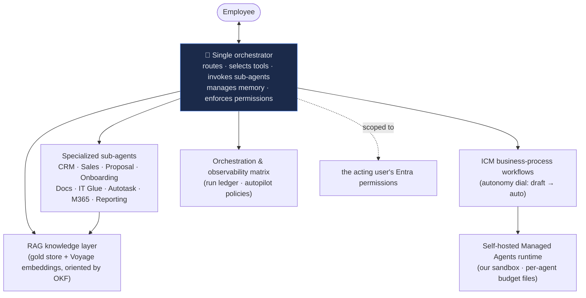

# 🤖 The AI suite — agents, ICM & the knowledge layer

The definitive onboarding guide to **every AI capability in Imperion Business
Manager**. The AI is not a bolt-on feature — it runs through the whole platform.
A new engineer (or a new agent) should be able to read this folder top-to-bottom
and understand *what the AI does, how it is built, what is live today, and where
the safety rails are.*

[← Documentation library](../README.md) ·
[Product capability overview → §5 The full AI suite](../product/imperion-os-overview.md)

> **Governing decision: [ADR-0091](../decision-records/ADR-0091-agent-icm-platform-consolidated.md)**
> — the *Agent & ICM platform consolidated dossier*. It folds eleven member
> decisions (ADR-0004 · 0015 · 0029 · 0048 · 0049 · 0054 · 0055 · 0061 · 0087 ·
> 0088 · 0089) into one record. Everywhere below cites ADR-0091; the member ADRs
> are retained on disk for history. Cross-repo runtime decisions (backend
> ADR-0035/0036/0037/0039) are **referenced, never restated** — the backend owns
> the runtime (system [CLAUDE.md §1](../../CLAUDE.md)).

---

## 1. The one-sentence model

**The user talks to a single orchestrator agent; everything else is internal.**
The orchestrator routes requests, selects tools, invokes specialized sub-agents,
manages context and memory, **enforces the acting user's Entra-scoped
permissions**, and returns one response (ADR-0091 §1, from ADR-0004). Sub-agents
never address the user directly. This single choke point is what makes permission
enforcement and audit tractable.

The **AI stack is settled** (ADR-0091, from ADR-0043 / ADR-0041; mirrored in the
medallion dossier ADR-0092): **Claude** for generation (a cheap tier + a premium
tier, pinned per preset) and **Voyage `voyage-3-large` @ 1024 dimensions** for
embeddings. The front end holds **no AI provider key** — the backend and the
on-prem pipeline call the providers. Re-adding a provider requires a new ADR.

---

## 2. The guides in this folder

Read them in this order for a full picture; each is self-contained and links back
here.

| # | Guide | What it covers |
|---|---|---|
| 1 | **[The agent platform & surfaces](agent-platform.md)** | The orchestrator, the persisted agent core (`agent` / `agent_run` / `agent_memory`), the sub-agent fleet, the `/agents` operations page, and the in-app agent panel + AI-assisted surfaces. **Start here.** |
| 2 | **[ICM — business-process automation](icm.md)** | The Interpreted Context Methodology: the `icm/` factory, the domain → workspace → stage tree, the autonomy dial (draft → auto), and the live `lead-response` reference workspace. |
| 3 | **[`agent.yaml` — the workspace manifest](agent-yaml-schema.md)** | The declarative CMA agent-object manifest, field-by-field; how prose and structure are split; the `workflow ⊆ domain ⊆ Constitution` least-privilege invariant; the conformance gate. |
| 4 | **[The CMA runtime](cma-runtime.md)** | The self-hosted Managed Agents runtime: the managed-agent loop, ephemeral run-scoped workers, the self-hosted sandbox, the budget-file convention, and how session events mirror into the `agent_run` ledger. |
| 5 | **[Orchestration & observability matrix](orchestration-matrix.md)** | The single map of *every* agent — the five-tier taxonomy (Triage · Dispatch · Execute · Observe/Govern · Spine), the run ledger, and the OKF-room-per-agent model. |
| 6 | **[The AI Board of Directors](board-of-directors.md)** | The convened panel of influence personas, the board packet, the deputy-CISO model, and the deliberation → synthesis → review flow. |
| 7 | **[The knowledge & RAG layer](knowledge-and-rag.md)** | The gold `knowledge_object` / `knowledge_embedding` store, the vectorization pipeline, the pinned Voyage vector contract, citations, and `search_knowledge`. |
| 8 | **[Agent rooms — the OKF semantic layer](agent-rooms-okf.md)** | How the curated OKF semantic layer over the silver tier becomes per-agent "rooms," consumed at the section level. |
| 9 | **[Autonomy — the tiered dial](autonomy-dial.md)** | The one autonomy dial stored as data (`autopilot_policies`), the L0→L3 rungs, the T0–T3 action policy, and the single Mark-gate. |
| 10 | **[The eval & quality plane](eval-quality-plane.md)** | The scoring twin of the run ledger: golden sets (`agent_eval_case`), scored runs (`agent_eval_run`/`agent_eval_result`), the LLM-judge + deterministic assertions, and the CI quality gate that makes raising autonomy safe (ADR-0106). |

> The repo also carries small **operating-convention** notes used by the build
> crew (not part of the runtime AI suite): how Claude Code consumes
> [domain docs](domain.md), where [agent skills](skills.md) live, the
> [issue tracker](issue-tracker.md) contract, and the
> [triage labels](triage-labels.md) map. They are kept here for the engineering
> agents that work *on* this repo.

---

## 3. What is live vs. proposed (read this before you trust a feature)

This guide documents **what is built**, and clearly flags **what is accepted but
not yet running**. The honest current state, verified against source on
2026-06-16:

| Capability | State | Evidence |
|---|---|---|
| Single orchestrator runtime (Claude tool-use loop, deterministic-triage fallback, per-turn `audit_log` as `agent.turn` with cost metering) | **Live (backend)** | backend ADR-0036; `askAgentAction` panel wiring (`src/lib/agent/ask-action.ts`) |
| Registered sub-agents: **Reporting** (read-only) + **Sales/Outreach** (approval-gated drafts) | **Live** | `src/app/(app)/agents/page.tsx` `SUB_AGENTS` (kept in lockstep with backend registrations) |
| `search_knowledge` tool over the gold store | **Live (tool registered)** | `src/app/(app)/agents/page.tsx` `TOOLS` |
| `/agents` operations page (preset · budget · spend · cost rollups · activity) | **Live** | `src/app/(app)/agents/` |
| `/board` page + Board runtime (two-round deliberation + synthesis) | **Live** | `src/app/(app)/board/`; backend ADR-0039 |
| Agent core schema (`agent`, `agent_tool_grant`, `agent_run`, `agent_message`, `agent_memory`) | **Live (migration 0056)** | `db/migrations/0056_agent_core_and_board.sql` |
| Gold knowledge store schema (`knowledge_object`, `knowledge_embedding`) | **Live (migration 0045)** | `db/migrations/0045_gold_knowledge_vectors.sql` |
| ICM factory + the `lead-response` reference workspace | **Live (definitions)** | `icm/domains/sales/lead-response/` |
| `agent.yaml` schema + conformance gate (CI `icm-conformance`) | **Live** | `icm/agent.schema.json`, `scripts/agent-yaml-gate.mjs` |
| ICM Constitution + sales-domain budget files | **Live** | `icm/CONSTITUTION.{md,yaml}`, `icm/domains/sales/room.{md,yaml}` |
| **Embedding generation / semantic search** (the vectors that fill the gold store) | **Dormant** — schema is live, the on-prem pipeline produces vectors; semantic search "arrives with vectorization" | overview §4 *Knowledge search*; ADR-0041 |
| **CMA self-hosted Managed Agents loop** (loader composes `system`, mirrors to ledger) | **Accepted, in build** — backend loader/mirror is Backend #162 / #163 | ADR-0091 §3/§9 (ADR-0088) |
| **T2 per-step autonomy whitelist** (a workflow step ramps to auto on a track record) | **Proposed for v3** — grant enforcement wired by v3 | ADR-0091 §6 (ADR-0055) |
| **Deputy-CISO pause** (`awaiting_ciso` resume flow) | **Partly live** — the status is wired in the convene action; full resumable v2 ships with its own migration | `src/app/(app)/board/actions.ts`; ADR-0054 §4 |
| **AR / invoice entity** (unblocks Collections + Controller close-gate) | **Missing** — own-vs-mirror is a Mark-gated decision | matrix `#668` |

Whenever a guide describes a dormant/proposed piece, it says so in line. **No
invented features.**

---

## 4. Cross-repo: who runs the AI

The front end is **GUI-only** — it renders the surfaces and reads PostgreSQL for
display, but **every AI *process* runs in a sibling repo** (system
[CLAUDE.md §1](../../CLAUDE.md), ADR-0042). When a guide says "the orchestrator
does X," the executing code lives in the backend, not here.

| Repo | AI role |
|---|---|
| **ImperionCRM** (this repo) | The GUI surfaces (`/agents`, `/board`, the agent panel), the ICM **factory** (`icm/`), the agent/knowledge **schema** (it owns migrations), and these docs. |
| **ImperionCRM_Backend** | The orchestrator + sub-agent **runtime**, the CMA loader + worker host, agent settings, board sessions, the `agent_run` ledger mirror, OAuth token custody. |
| **ImperionCRM_Pipeline** | Live bronze→silver merge that feeds the gold knowledge store. |
| **ImperionCRM_LocalPipelineEnrichment** | **All vectorization** — the on-prem pipeline that produces `knowledge_embedding` rows. |

The whole-estate map is
[architecture/system-of-systems](../architecture/system-of-systems.md).

---

## 5. Security posture (the rails, in one place)

Security is a property of the design, not an add-on. Every AI control here
conforms to — and never restates — the cross-repo
[unified security standard](../security/unified-security-standard.md).

- **One permission choke point.** Agent actions inherit the **acting user's**
  permission scope (ADR-0091, from ADR-0004/0016); a worker can never exceed the
  invoking user.
- **Admin-only AI surfaces.** `/agents` and `/board` are admin-gated
  (`canSeeAgentPages`); convening is gated `agents:operate` (ADR-0050 amending
  ADR-0048/0049).
- **Sends are approval-gated.** Every outbound message exits through the single
  ADR-0058 send path, with consent re-asserted at execution — there is no other
  route to an external party.
- **Autonomy is a mechanical control,** not a prompt instruction — it lives in
  data (`autopilot_policies`) and in the `agent_tool_grant` table (ADR-0091, from
  ADR-0055/0087). See [autonomy-dial.md](autonomy-dial.md).
- **Least privilege is structural.** ICM workers carry allow-lists bounded by the
  `workflow ⊆ domain ⊆ Constitution` invariant (ADR-0091, from ADR-0088/0089).
- **Never commit secrets.** No secrets, tokens, or client PII appear in `icm/`
  files, `agent.yaml` manifests, skills, or these docs — they replicate to every
  agent machine (ADR-0060). Credentials are referenced by `vault_secret_ref`,
  never by value.

---

## 6. Governing decisions

[ADR-0091 agent & ICM platform (consolidated)](../decision-records/ADR-0091-agent-icm-platform-consolidated.md)
— and, retained for history, its members:
[ADR-0004](../decision-records/ADR-0004-single-orchestrator-agent-model.md) ·
[ADR-0015](../decision-records/ADR-0015-agent-platform-and-board.md) ·
[ADR-0029](../decision-records/ADR-0029-agent-layer-runtime.md) ·
[ADR-0048](../decision-records/ADR-0048-ai-agents-operations-page.md) ·
[ADR-0049](../decision-records/ADR-0049-board-runtime-persistence.md) ·
[ADR-0054](../decision-records/ADR-0054-board-influence-personas-and-governance.md) ·
[ADR-0055](../decision-records/ADR-0055-tiered-agent-autonomy-policy.md) ·
[ADR-0061](../decision-records/ADR-0061-icm-business-process-automation.md) ·
[ADR-0087](../decision-records/ADR-0087-agent-orchestration-and-observability-layer.md) ·
[ADR-0088](../decision-records/ADR-0088-icm-self-hosted-managed-agents-runtime.md) ·
[ADR-0089](../decision-records/ADR-0089-icm-budget-file-convention.md).
Knowledge/vector contract: ADR-0041 / ADR-0043 (settled stack), consolidated in
[ADR-0092 medallion data platform](../decision-records/ADR-0092-medallion-data-platform-consolidated.md).
OKF rooms: [ADR-0086](../decision-records/ADR-0086-okf-semantic-layer-over-silver.md).
