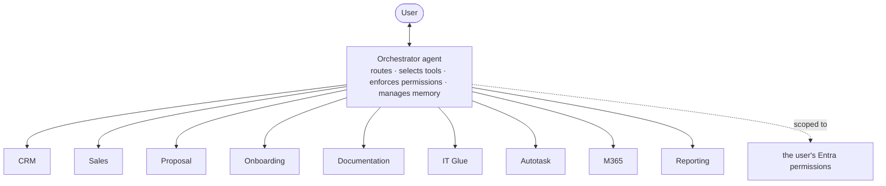

# 🤖 Agents

**One agent experience.** The user talks to a single orchestrator; many specialized
sub-agents exist internally but never address the user directly (CLAUDE.md §2, ADR-0004).

[← Documentation library](../README.md)

## The model

The orchestrator routes requests, selects tools, invokes sub-agents, manages context
and memory, **enforces permissions**, and returns one response. The AI stack is
**settled** (ADR-0043 / backend ADR-0034): **Claude** for generation (Haiku cheap tier,
Sonnet premium tier) + **Voyage `voyage-3-large` @ 1024** for embeddings.

## What belongs here

Every agent gets a dedicated doc: **identity · responsibilities · inputs · outputs ·
tool access · security boundaries · failure handling · a workflow diagram**. Start each
from this template and link it back here.

> Status: the orchestrator runtime is **live in the backend** (backend ADR-0036 — a
> Claude tool-use loop over the registered sub-agents, deterministic-triage fallback,
> every turn audited to `audit_log` as `agent.turn` with cost metering). Registered
> today: **Reporting** (read-only snapshot Q&A) and **Sales/Outreach** (approval-gated,
> consent-checked drafts), plus the `search_knowledge` tool over the gold store.
> The Board page is still a placeholder.

## The AI Agents page (ADR-0048)

`/agents` is the operations surface for the agent layer:

- **Orchestrator card** — model-tier preset (economy / balanced / premium, each
  pinning the cheap+premium Claude pair) and the HARD monthly USD budget (blank =
  no cap) with month-to-date spend. Reads through the backend
  `GET /agent/settings`, falls back to a direct `agent_settings` read, then mock;
  saves only via the backend `PUT` behind the `settings:write` capability
  (admin-only, ADR-0045).
- **Registered sub-agents** — the static-from-contract catalog of what the
  orchestrator can route to today (keep in lockstep with the backend's
  `registerSubAgent` calls).
- **Recent agent activity** — the last 20 `agent.turn` audit rows (time, actor,
  routed-to, routing reason, model turns, cost).

Governing decisions:
[ADR-0004 single orchestrator](../decision-records/ADR-0004-single-orchestrator-agent-model.md) ·
[ADR-0015 agent platform & board](../decision-records/ADR-0015-agent-platform-and-board.md) ·
[ADR-0048 AI Agents operations page](../decision-records/ADR-0048-ai-agents-operations-page.md)
