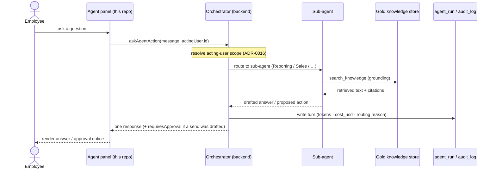
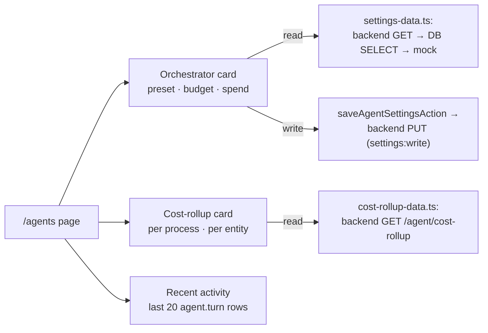

# The agent platform & surfaces

How the orchestrator is shaped, persisted, and surfaced in Imperion Business
Manager. This is the **start-here** guide: the single orchestrator, its persisted
core, the sub-agent fleet, the operations page, and the in-app agent panel.

[← The AI suite](README.md) · Governing decision:
[ADR-0091](../decision-records/ADR-0091-agent-icm-platform-consolidated.md)
(from ADR-0004 / 0015 / 0029 / 0048 / 0049).

> **Cross-repo note.** This repo is the **GUI**. The orchestrator *runtime* lives
> in **ImperionCRM_Backend** (backend ADR-0036). The front end renders the
> surfaces, reads PostgreSQL for display, and routes every turn to the backend.
> Backend ADRs are referenced, never restated (system
> [CLAUDE.md §1](../../CLAUDE.md)).

---

## 1. The single-orchestrator model (ADR-0091 §1)

Users interact with **one orchestrator**. Sub-agents never interact with users
directly. The orchestrator:

- **routes** each request to the right sub-agent or tool,
- **selects tools** from the registered catalog,
- **invokes sub-agents** and composes their output,
- **manages context and memory** (the persisted `agent_memory` store),
- **enforces Entra-scoped permissions** — every action inherits the *acting
  user's* permission scope (ADR-0016), and
- **returns one response.**

This is the **single choke point for permission enforcement and audit**:
sub-agent tool access is gated centrally, so there is exactly one place to reason
about "what can the AI do as this user."

---

## 2. The persisted agent core (ADR-0091 §2, migration 0056)

The agent layer is **persisted in PostgreSQL** — materialized by
`db/migrations/0056_agent_core_and_board.sql`. This is the schema the whole suite
sits on:

| Table | Purpose |
|---|---|
| `agent` | One row per agent (instructions, `model_routing`, tool scope, `module` tag). Board personas are `module='board'` rows. |
| `agent_tool_grant` | The mechanical autonomy control — every tool a sub-agent can call carries a tier in its grant `scope`; the loop refuses calls above the grant (ADR-0055). |
| `agent_run` | **Append-only run ledger** — one row per run, the canonical record of *what · why · state · cost*. The one ledger across both planes (ADR-0087). |
| `agent_message` | Append-only per-turn messages: tokens, `cost_usd`, `acting_user_id`, `permission_scope`. |
| `agent_memory` | Agent memory in `pgvector` — `embedding vector(1024)` under the pinned vector contract (ADR-0041), HNSW cosine index, same provenance columns as `knowledge_embedding`. |

Two facts that trip people up:

- **`agent.model_routing` is a *tier hint***, not a hard-coded model. It carries
  `{"tier":"cheap"|"premium"}`; the concrete Claude models resolve through the
  `agent_settings` preset at runtime (ADR-0049). Re-pointing a tier is a settings
  change, not a code change.
- **Orchestrator audit lives in `audit_log` for now** (`agent.turn` rows). The
  *Board* runtime writes `agent_run` rows from day one; moving the CRM
  orchestrator's per-turn audit into `agent_run`/`agent_message` is a separate
  later change (ADR-0049 §6). Don't assume every CRM turn is in `agent_run` yet.

### 2.1 Sub-agent rows + seeded tool grants (migration 0156, ADR-0107)

Until migration 0156 the `agent` table held **only** `module='board'` personas —
the CRM sub-agents (`crm`, `autotask`, …) were pure code registrations, so
`agent_tool_grant` had nothing to reference and a grant check was impossible.
Migration 0156 (#993, the 2B-0 foundation of the governed action/tool-grant plane
#990) seeds the **9 registered sub-agents as `module='crm'` rows** (`name` =
SubAgentName) and their per-agent tool allowlist:

| Sub-agent (`agent.name`, module `crm`) | Granted tools (`agent_tool_grant.tool`) |
|---|---|
| `crm` | `crm_search_accounts`, `crm_search_contacts`, `crm_get_contact`, `crm_search_opportunities`, `crm_create_task`, `crm_add_note` |
| `autotask` | `autotask_search_tickets`, `autotask_get_ticket`, `autotask_add_triage_note` |
| `documentation` | `docs_search_knowledge`, `docs_draft_article` |
| `itglue` | `itglue_list_organizations`, `itglue_search_configurations`, `itglue_get_configuration`, `itglue_search_docs` |
| `m365` | `m365_recent_comms`, `m365_search_comms`, `m365_upcoming_meetings` |
| `plaud` | `plaud_list_recordings`, `plaud_get_note`, `plaud_get_transcript` |
| `advisor` | `advisor_list`, `advisor_consult` |
| `reporting` | `agent_reporting` *(generic delegate — no narrow tools)* |
| `sales` | `agent_sales` *(generic delegate — no narrow tools)* |

- **`search_knowledge` is exempt** — it is an orchestrator-global tool, not
  sub-agent-scoped, so it carries no grant row.
- **This is the shared foundation for two planes.** The grants feed the
  deny-by-default egress check (#990); the same rows give the native 1–5 autonomy
  dial (#996 / ADR-0107 D4) a per-sub-agent row to hang a level on.
- **Enforced at dispatch (BE #244, 2B-1).** The backend loop refuses any tool a
  sub-agent has no grant for (`is_error` + `agent.tool.denied` audit); deploys only
  after the seed is prod-applied (fail-closed).
- **Scope predicates (BE #248 / FE #1005, 2D — ADR-0107 D3).** Each grant's `scope`
  jsonb is a per-input-field allow-list (`{ field: string[] }`; `{}` = unconstrained).
  At dispatch, after the grant check, an out-of-scope call is refused + audited
  (`out_of_scope`). Admins manage grants + scope at **`/agents/grants`** (the admin UI),
  which writes through the backend `GET/POST/DELETE /api/agent/grants` (ADR-0042 — the web
  role only reads `agent_tool_grant`; revoke needs the backend MI's DELETE grant,
  migration 0157).

### 2.2 Technician autonomous-path action grants (migration 0171, ADR-0081)

§2.1 grants cover the sub-agents' **narrow named tools** (read/triage). The
**autonomous** Technician path is governed by a *separate* grant set, keyed under a
distinct **`agent_key='technician'`** (the "Felix" autonomous-loop identity — not the
`autotask` read/triage sub-agent, which merely carries the `display_name`
"Autotask Technician", 0163). Per **ADR-0081 §tool-grant rule**: a *human*-approved
catalog action needs no grant (the human is the gate), but the **autonomous** path turns
a catalog action into a loop tool that — like every sub-agent tool — requires an
`agent_tool_grant` row. The gauntlet's gate 3 (BE #285) enforces this deny-by-default.

Migration 0171 (#1193) materializes the **`module='crm'` `name='technician'` anchor row**
(so a grant has something to reference — `loadToolGrants()` resolves by `agent.name`) and
models the action-grant **posture**, the FE twin of the backend `AUTONOMOUS_ACTION_GRANTS`
mirror (BE #257):

| Catalog action | v1 posture | Why withheld |
|---|---|---|
| `autotask_update_ticket` | **withheld** | operational; held until the actuation dial (0158) + grounding re-check are wired (first in line for a future ramp) |
| `autotask_post_reply` | **withheld** | client_pii, customer-facing → always-gate |
| `autotask_log_time` | **withheld** | financial → always-gate |
| `send_email`, `send_sms` | **withheld** | comms sends — human-approved only, never a Technician action |

- **v1 seeds zero grant rows — fully fail-closed.** Every posture is `withheld`, so the
  autonomous loop has no write grant; deny-by-default already refuses every action. The
  `agent_key='technician'` modeling lands now so a **future ramp is a data change** (a new
  migration inserting one grant row), never a schema change.
- **Keep in lockstep with the backend mirror.** The FE seed and
  `AUTONOMOUS_ACTION_GRANTS` (BE #257) are two copies of one fact — change both together,
  exactly like 0156 ↔ `SEEDED_TOOL_GRANTS`. A future ramp grants `autotask_update_ticket`
  here **and** in the mirror, in the same lockstep change set.

---

## 3. The sub-agent fleet

Sub-agents are internal specialists the orchestrator invokes. The front end
mirrors the backend's *actual* registrations on the `/agents` page —
`SUB_AGENTS` in `src/app/(app)/agents/page.tsx` is kept **in lockstep** with the
backend's `registerSubAgent(...)` calls, so the page shows only what is really
routable.

**Registered and live today:**

| Sub-agent | Tier | Badge | What it does |
|---|---|---|---|
| **Reporting** | Premium-tier synthesis | `read-only` | Answers questions over the live reporting snapshot (active/recurring revenue, open pipeline by stage, win rate, assessment→managed conversion, delivery time). Grounds every figure in the same aggregations the Reporting page shows; **never invents numbers.** |
| **Sales / Outreach** | Premium-tier drafting | `approval-gated` | Drafts consent-gated outbound email/SMS for a contact, grounded in their gold-layer history. It only ever **proposes** — the draft is queued for human approval, consent checked up front and re-asserted at execution. Nothing sends autonomously. |

**Registered tool:**

| Tool | What it does |
|---|---|
| `search_knowledge` | Semantic search over the gold knowledge store (accounts, contacts, contracts, tickets) — Voyage embeddings @ 1024 dims (ADR-0041/0043). The loop uses it to ground answers in company facts. See [knowledge-and-rag.md](knowledge-and-rag.md). |

The broader **target** fleet named in the architecture (CRM · Sales · Proposal ·
Onboarding · Documentation · IT Glue · Autotask · M365 · Reporting, system
[CLAUDE.md §2](../../CLAUDE.md)) is the design surface; the table above is what is
**registered and routable now**. New registrations appear here as the backend
lands them.

---

## 4. The AI Agents operations page — `/agents` (ADR-0091 §4)

`/agents` is the operator surface for the agent layer. It is **admin-only**
(`canSeeAgentPages`, ADR-0050).

**Orchestrator card.** The model-tier preset and the hard monthly USD budget
(blank = no cap), with month-to-date spend (progress bar, green/amber/red tone).

- **Read tiers** (`src/lib/agent/settings-data.ts`): backend
  `GET /agent/settings` → a direct `agent_settings` SELECT + `agent.turn` spend
  sum → mock defaults. The page never throws when the backend is unset.
- **Write path** (`saveAgentSettingsAction` in
  `src/app/(app)/agents/actions.ts`): guarded by
  `requireCapability("settings:write")` (admin-only, ADR-0045), calling the
  backend `PUT` with the acting user's `app_user.id` for the audit trail. There
  is **no DB fallback write, by design** — settings change in one place.

The **preset catalog** (`src/lib/agent/settings.ts`, mirroring the backend's
`PRESET_MODELS`; the live GET carries the authoritative map):

| Preset | Cheap tier | Premium tier | Tagline |
|---|---|---|---|
| **Economy** | Haiku | Haiku | Everything on Haiku — cheapest possible operation. |
| **Balanced** *(default)* | Haiku | Sonnet | Haiku for routing and sub-agents, Sonnet for synthesis. |
| **Premium** | Sonnet | Opus | Sonnet for routing and sub-agents, Opus for synthesis. |

> The exact model ids live in `PRESET_MODELS` and the live backend response — the
> doc names the families (Haiku / Sonnet / Opus) so it never drifts on a point
> release.

**Cost-telemetry rollups.** Spend per metered process and per entity (per board
session, per conversation), via the backend `GET /agent/cost-rollup?month=YYYY-MM`
through the `#190` call-guard seam. No DB fallback (the rollup SQL lives in one
place); degrades to a notice when the backend isn't configured. `?month=` browses
past months.

**Recent agent activity.** The last 20 `agent.turn` audit rows: time, actor,
routed-to, routing reason, model turns, cost.

The Settings **AI tab** reuses the same Orchestrator card + backend PUT.

---

## 5. The in-app agent panel & AI-assisted surfaces

The orchestrator is not only on `/agents` — it is woven into the app.

- **The right-hand agent panel.** The collapsible third column of the app shell
  is the orchestrator chat. One turn = `askAgentAction(message, conversationId)`
  (`src/lib/agent/ask-action.ts`): it resolves the signed-in employee to their
  `app_user.id` via the shared resolver (so the **backend enforces the acting
  user's scope on every tool call**, `#190`), forwards through the call-guard
  seam, and renders the response. When the agent drafts an approval-gated action,
  the result carries `requiresApproval` and the panel shows a notice rather than
  sending. It **degrades to a clear message** when `AGENT_SERVICE_URL` isn't
  configured and **never throws to the client.**
- **Agent-prefilled discovery.** Discovery answers can be agent-pre-filled, and a
  **human confirms** before they count (the assessment-led motion; overview §2).
- **AI summaries across modules** — gold-layer-grounded summaries surface
  throughout the app.

These surfaces all share the same guarantees: acting-user scope, approval-gated
sends, graceful degradation, and audited cost.

---

## 6. Failure handling & degradation

The agent surfaces are built **stubbed-not-broken**:

| Condition | Behavior |
|---|---|
| Backend (`AGENT_SERVICE_URL`) unset | Panel + settings degrade to a notice; reads fall back DB → mock; the page renders. |
| DB unset | Settings fall back to mock defaults; activity lists render sample data. |
| Acting user can't be resolved | A clear "sign in again" / "provision your account" notice, never a crash. |
| Budget ceiling reached | New spend is refused **before** any provider call (a paused state), never a silent overrun. |
| Model unavailable | A persisted failed run, never a crash. |

---

## 7. Where to go next

- The **autonomy controls** that gate every action: [autonomy-dial.md](autonomy-dial.md).
- The **full agent roster** (every tier, not just the two registered sub-agents):
  [orchestration-matrix.md](orchestration-matrix.md).
- The **knowledge** the agents reason over: [knowledge-and-rag.md](knowledge-and-rag.md).
- The **business-process workflows** the orchestrator drives: [icm.md](icm.md).
