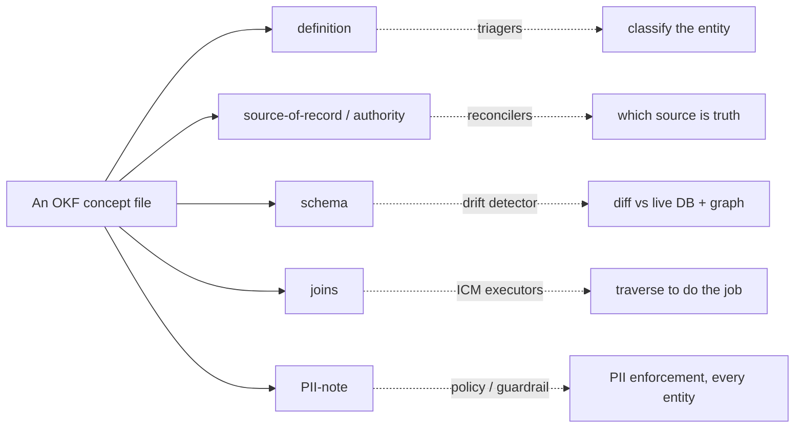

# Agent rooms — the OKF semantic layer

Every agent needs to know *what an entity means, which source wins, and how it
joins* — without being handed raw client data. That curated **meaning** is the
**OKF (Open Knowledge Format) semantic layer** over the silver tier, and each
concept file is an agent's **"room."**

[← The AI suite](README.md) · Governing decision:
[ADR-0086](../decision-records/ADR-0086-okf-semantic-layer-over-silver.md)
(governed canon — **navigation/links only here, never concept rewrites**, per epic
#769). The bundle itself: [database/semantic-layer](../database/README.md). How
rooms are wired per agent: [orchestration-matrix.md](orchestration-matrix.md).

> **Distinction.** OKF is the *meaning* layer (PII-free docs). The
> [knowledge & RAG layer](knowledge-and-rag.md) is the *data* layer (gold tables
> with client PII). OKF **orients** retrieval; it does not hold the rows.

---

## 1. What an OKF room is

The OKF bundle (`docs/database/semantic-layer/`) is **one markdown+frontmatter
concept file per silver entity**, plus `coverage-matrix.md` (every object →
implementation archetype → IKF status → acting ICM workflow) and `index.md`. The
framing doctrine (the eight archetypes, the medallion → IKF → ICM loop) is
[`data-and-automation-doctrine.md`](../architecture/data-and-automation-doctrine.md).

Each concept file has **five sections** — and this structure is what makes rooms
composable:

| Section | Answers |
|---|---|
| **definition** | what this entity *is* |
| **source-of-record / authority** | which source wins on conflict |
| **schema** | the shape (table/columns), kept in sync with the live DB |
| **joins** | how it connects to other entities |
| **PII-note** | what personal data it carries, and the handling rule |

**Boundaries (ADR-0086):** frontmatter is `type/title/description/resource/tags/
timestamp`; the body is the five sections. **No row-level data, no PII, no client
identifiers, no secrets** — personal/volatile answers resolve against the live
read-only DB, not the docs. **No code knowledge** — that stays in CLAUDE.md /
ADRs / Graphify.

---

## 2. Rooms are consumed at the *section* level

The key idea (ADR-0091, from ADR-0087): an agent doesn't load a whole concept file
— it loads the **sections its role needs.** Roles are **section-stable**, which is
exactly what lets the generic Observe/Govern roles wire across *every* entity at
once:

| Role kind | Sections consumed | Scope |
|---|---|---|
| Triagers | definition + coverage-matrix archetype | the entity being triaged |
| ICM executors | source-of-record + joins | their owned entity |
| Reconciler | source-of-record/authority + joins | the reconciled entity |
| Controller | IKF-status + source-of-record | coverage-matrix + financial concepts |
| Drift detector | **schema** (diff vs live DB + graph) | **every** concept file |
| Policy / guardrail | **PII-note only** | **every** concept file |
| Schema steward | all five (**authors** the file) | the changed entity |
| Canon steward | all five (**owns** the bundle) | whole bundle |

A worker's `okf_rooms` allow-list in its `agent.yaml`
([agent-yaml-schema.md](agent-yaml-schema.md)) names which entities it may read —
each entry **resolves to a coverage-matrix row** — and the
`workflow ⊆ domain ⊆ Constitution` invariant bounds it.

---

## 3. The room → `agent.yaml` wiring

The sales `lead-response` workflow declares
`okf_rooms: [contact, account, interaction, consent_event, lead_score, campaign]`
— a subset of the sales domain's rooms (`icm/domains/sales/room.yaml`), which is a
subset of the Constitution's rooms (`icm/CONSTITUTION.yaml`). So "which meaning a
worker may load" is the *same* allow-list that bounds "which data it may read" —
meaning and access are one structural contract.

> **Room vs workspace (#1065).** A **room** is a *grounding atom* — the per-entity OKF
> meaning, one concept file. A **workspace** is the department-scoped *bundle* of rooms +
> RAG scope + policy + roster — i.e. an ICM **domain** (`icm/domains/<domain>/`). A
> **workflow**'s `okf_rooms` is its subset of its workspace's (domain's) rooms, which is a
> subset of the Constitution's. Three nested allow-lists, one structural contract.

---

## 4. Coverage & gaps (2026-06-15)

The bundle is well past the original 3-entity pilot — **~40 concept files exist**,
so most agents' rooms are already authored (`account`, `ticket`, `contract`,
`task`, `project`, `opportunity`, `conversation`, `time_record`, `expense_item`, …).
The genuine gaps blocking roles in the [matrix](orchestration-matrix.md) are
narrow:

- **`expense_reconciliation`** (archetype F, planned #536) — the
  Reconciler/Controller room.
- **`pay_rate` / `employee_profile`** (planned, comp-gated, admin-tier only) — the
  Time/payroll room.
- **AR / invoice** — **no entity exists at all** (#668); blocks Collections and the
  Controller's close-gate. Own-vs-mirror is a Mark-gated decision.

---

## 5. The sync rule (governed canon — don't fork it)

OKF is **one canon, owned by the front end** (it owns the schema, system
[CLAUDE.md §11](../../CLAUDE.md)). Siblings *consume* it; never fork concept files
into a sibling repo.

- Any work that changes a silver entity's **shape, source-of-record/authority, or
  join paths** must update the matching concept file (at least its `timestamp`)
  **and** the `coverage-matrix.md` row — in the same change set when the work is in
  this repo, or via an immediately-filed front-end issue when it's in a sibling.
- A new silver entity gets a new concept file + a matrix row.
- Front-end migration PRs are **gated** on this (the `semantic-layer` docs-gate CI,
  #535).

This guide **links** the bundle; it does not restate concept content. To read or
change a concept, go to [database/semantic-layer](../database/README.md) and follow
ADR-0086.
