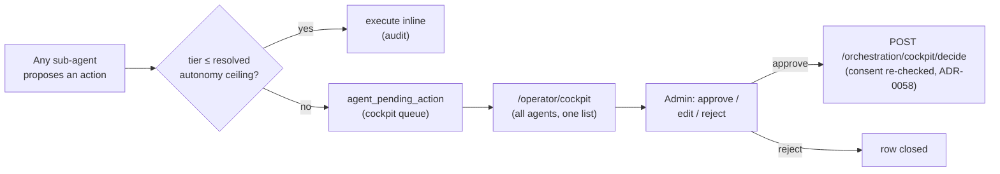

# The native approval cockpit

The cross-agent supervision surface (issue
[#1014](https://github.com/markdconnelly/ImperionCRM/issues/1014), parent
[#996](https://github.com/markdconnelly/ImperionCRM/issues/996) / 2E): ONE page listing
**every** sub-agent's pending actions — the actions any agent proposed that sit **above**
its resolved autonomy ceiling and are therefore parked for a human. An admin reviews the
proposing agent, the proposed action + tier, the dial decision that routed it, the
rationale and target, then approves / edits / rejects before anything executes.

[← The AI suite](README.md) ·
[The AI-Technician operator cockpit](technician-cockpit.md) ·
[Autonomy — the tiered dial](autonomy-dial.md) ·
[The agent roster](agent-roster.md)

> **Governing decisions:** [ADR-0109](../decision-records/ADR-0109-actuation-autonomy-dial.md)
> (the 1–5 actuation dial + the pending-action cockpit, ADR-0107 D5) · ADR-0055 (action
> tiers T0–T3) · ADR-0058 (consent re-asserted at execute) · ADR-0050 (`agents:operate`
> admin gate). The runtime that *proposes*, *routes*, and *executes* lives in the backend
> (`ImperionCRM_Backend`, system [CLAUDE.md §1](../../CLAUDE.md)) — this repo renders the
> surface and reads PostgreSQL.

---

## 1. What it is

Route: **`/operator/cockpit`** (under Settings → *Approval cockpit*; admin-only,
`canSeeAgentPages`). It is the **agent-agnostic** companion to the Technician-only
cockpit (`/operator/technician`, [#1056](technician-cockpit.md)): that surface is scoped
to the wedge agent and carries its per-workflow autonomy dial; this one lists the parked
queue across **all** agents in one place. The page has two parts:

1. **Pending agent actions** — every agent's proposed actions that sit **above** its
   resolved autonomy ceiling and are therefore parked. Each item shows the **proposing
   agent** (roster name), the catalog action kind, the ADR-0055 tier (T0–T3), the dial
   decision that routed it here (`dial L{level} · ceiling {tier}`), the target it acts on
   (a silver `ticket` when the payload carries one), the editable proposed body, the
   rationale, and — when present — a link to the glass-box run trace.
2. **Approve / edit-and-approve / reject** — the cockpit controls. Approving routes
   through the backend approval-gated executor with consent re-asserted (ADR-0058) and
   the approving human recorded as the audited actor; an edit sends the operator's revised
   body; a reject closes the row.



---

## 2. Data sources

| Surface | Reads | Module |
|---|---|---|
| Pending agent actions | `agent_pending_action` (mig 0158) where `status='pending'` (all `agent_key`s), joined to silver `ticket` via `payload->>'ticketId'` | `src/lib/agent/pending-action-cockpit.ts` |
| Proposing-agent label | `agent_key` → roster name (`docs/agents/agent-roster.md`), with the key itself as the fallback | `agentLabel()` in the same module |
| Run trace link | `agent_run` / `agent_message` (mig 0056) via the existing glass-box viewer | `/workflows/runs/[id]` |

All reads are **read-only and degrade** in the app's tiers (ADR-0042): DB unset → sample
rows; query failure → empty list. The decision write goes through the backend (the web
role has no `UPDATE` on `agent_pending_action`) via the `agents:operate`-gated
`decidePendingActionAction` server action in `src/app/(app)/operator/actions.ts`.

### The decide contract

Approve/reject is wired to the backend endpoint shipped as
[backend #267](https://github.com/markdconnelly/ImperionCRM_Backend/issues/267) via the
FE service layer (`agentService.decidePendingAction`, `src/lib/services/index.ts`):

```
POST /orchestration/cockpit/decide
  body  { pendingActionId, decision: 'approve'|'reject', approvedByUserId, editedBody? }
  → on reject:  UPDATE status='rejected', decided_by_user_id, decided_at; audit.
  → on approve: apply editedBody to the action body if present; execute via the one
                approval-gated executor (consent re-checked, ADR-0058); UPDATE
                status='executed', decided_by_user_id, decided_at, interaction_id;
                audit the approver as the actor.
  returns { pendingActionId, status, interactionId? }
```

The **enqueue** side (routing actions above the dial ceiling INTO the queue at dispatch)
is backend #250 / #258 / #263 — out of scope here; this surface is list + decide only.

---

## 3. What is live vs. proposed

| Piece | State | Note |
|---|---|---|
| The cockpit surface (cross-agent queue + controls), read-side + degradation | **Live (this PR, #1014)** | renders sample data until agents produce real rows |
| `agent_pending_action` schema | **Live (mig 0158, prod-applied)** | ADR-0109 |
| **Backend decide endpoint** (`/orchestration/cockpit/decide`) | **Live (backend #267, CLOSED)** | the executor re-asserts consent and stamps the approver |
| The dispatch-time routing that *enqueues* parked actions | **Pending** | backend #250 / #258 / #263 — until then the queue fills from the Technician propose-flow only |
| **L4 oversight view** (executed actions + the undo window) | **Proposed** — [#1202](https://github.com/markdconnelly/ImperionCRM/issues/1202) | the listing here is `status='pending'` only |

No invented features — where a piece is dormant, the surface says so in line.

---

## 4. Security posture

- **Admin-only.** The route + nav entry gate on `canSeeAgentPages`; the controls gate on
  `agents:operate` (ADR-0050). A non-admin who reaches the page sees a read-only view.
- **Approver audited.** Every decision carries the resolved acting user; the backend
  stamps that human as `decided_by_user_id` / the audited actor at execute (ADR-0032).
- **Consent re-checked at execute.** Nothing executes without a human decision; the
  backend re-asserts consent at execution (ADR-0058) — the cockpit never executes
  directly.
- **Tier + dataClass gating preserved.** The dial decision (`resolved_level` /
  `resolved_ceiling`) that parked the action is shown but not re-derived here; raising
  autonomy never bypasses the Mark-gated money / customer-facing / deploy legs.
- **No secrets, no PII in code or docs.** The cockpit renders the same drafted-action
  payload the propose path already carries — never a credential (ADR-0109).
