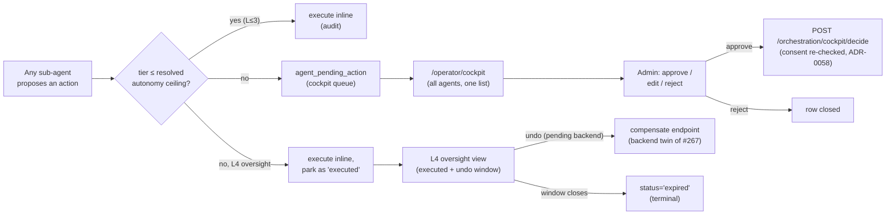

# The native approval cockpit

The cross-agent supervision surface (issue
[#1014](https://github.com/markdconnelly/ImperionCRM/issues/1014), parent
[#996](https://github.com/markdconnelly/ImperionCRM/issues/996) / 2E): ONE page listing
**every** sub-agent's pending actions — the actions any agent proposed that sit **above**
its resolved autonomy ceiling and are therefore parked for a human. An admin reviews the
proposing agent, the proposed action + tier, the dial decision that routed it, the
rationale and target, then approves / edits / rejects before anything executes.

[← The AI suite](README.md) ·
[The AI-Technician operator cockpit](technician-cockpit.md) ·
[Autonomy — the tiered dial](autonomy-dial.md) ·
[The agent roster](agent-roster.md)

> **Governing decisions:** [ADR-0109](../decision-records/ADR-0109-actuation-autonomy-dial.md)
> (the 1–5 actuation dial + the pending-action cockpit, ADR-0107 D5) · ADR-0055 (action
> tiers T0–T3) · ADR-0058 (consent re-asserted at execute) · ADR-0050 (`agents:operate`
> admin gate). The runtime that *proposes*, *routes*, and *executes* lives in the backend
> (`ImperionCRM_Backend`, system [CLAUDE.md §1](../../CLAUDE.md)) — this repo renders the
> surface and reads PostgreSQL.

---

## 1. What it is

Route: **`/operator/cockpit`** (under Settings → *Approval cockpit*; admin-only,
`canSeeAgentPages`). It is the **agent-agnostic** companion to the Technician-only
cockpit (`/operator/technician`, [#1056](technician-cockpit.md)): that surface is scoped
to the wedge agent and carries its per-workflow autonomy dial; this one lists the parked
queue across **all** agents in one place. The page has two parts:

1. **Pending agent actions** — every agent's proposed actions that sit **above** its
   resolved autonomy ceiling and are therefore parked. Each item shows the **proposing
   agent** (roster name), the catalog action kind, the ADR-0055 tier (T0–T3), the dial
   decision that routed it here (`dial L{level} · ceiling {tier}`), the target it acts on
   (a silver `ticket` when the payload carries one), the editable proposed body, the
   rationale, and — when present — a link to the glass-box run trace.
2. **Approve / edit-and-approve / reject** — the cockpit controls. Approving routes
   through the backend approval-gated executor with consent re-asserted (ADR-0058) and
   the approving human recorded as the audited actor; an edit sends the operator's revised
   body; a reject closes the row.
3. **Executed autonomously (L4 oversight)** — the after-the-fact half
   ([#1202](https://github.com/markdconnelly/ImperionCRM/issues/1202), ADR-0107 D5). At
   autonomy **level 4** (Autonomous-with-oversight) an action above the Supervised ceiling
   executes **inline** instead of parking for approval, then surfaces here so an operator
   can review what ran and **undo** it while the window is open. Each row shows the same
   provenance (agent · action · tier · dial decision · target · rationale · run trace)
   plus the execution stamp (`decided_at`, `interaction_id`) and the window state —
   `executed · undo window` (still potentially undoable) or `expired · terminal` (window
   closed). See [§5](#5-l4-oversight--executed--undo-window).



---

## 2. Data sources

| Surface | Reads | Module |
|---|---|---|
| Pending agent actions | `agent_pending_action` (mig 0158) where `status='pending'` (all `agent_key`s), joined to silver `ticket` via `payload->>'ticketId'` | `listPendingActions()`, `src/lib/agent/pending-action-cockpit.ts` |
| Executed (L4 oversight) | `agent_pending_action` (mig 0158) where `status IN ('executed','expired')` (all `agent_key`s), newest `decided_at` first, same `ticket` join | `listExecutedActions()`, same module |
| Proposing-agent label | `agent_key` → roster name (`docs/agents/agent-roster.md`), with the key itself as the fallback | `agentLabel()` in the same module |
| Run trace link | `agent_run` / `agent_message` (mig 0056) via the existing glass-box viewer | `/workflows/runs/[id]` |

All reads are **read-only and degrade** in the app's tiers (ADR-0042): DB unset → sample
rows; query failure → empty list. The decision write goes through the backend (the web
role has no `UPDATE` on `agent_pending_action`) via the `agents:operate`-gated
`decidePendingActionAction` server action in `src/app/(app)/operator/actions.ts`.

### The decide contract

Approve/reject is wired to the backend endpoint shipped as
[backend #267](https://github.com/markdconnelly/ImperionCRM_Backend/issues/267) via the
FE service layer (`agentService.decidePendingAction`, `src/lib/services/index.ts`):

```
POST /orchestration/cockpit/decide
  body  { pendingActionId, decision: 'approve'|'reject', approvedByUserId, editedBody? }
  → on reject:  UPDATE status='rejected', decided_by_user_id, decided_at; audit.
  → on approve: apply editedBody to the action body if present; execute via the one
                approval-gated executor (consent re-checked, ADR-0058); UPDATE
                status='executed', decided_by_user_id, decided_at, interaction_id;
                audit the approver as the actor.
  returns { pendingActionId, status, interactionId? }
```

The **enqueue** side (routing actions above the dial ceiling INTO the queue at dispatch)
is backend #250 / #258 / #263 — out of scope here; this surface is list + decide only.

---

## 2a. The dispatch-resolution contract (the FE half of the routing decision)

The routing decision — *does this action execute inline, execute + notify, or park for a
human?* — is one function of three inputs: the action's **tier** (from the catalog, #994),
the acting agent's **level** (from the most-specific `agent_action_autonomy` row, mig
0158), and ADR-0107 D4's level → **tier-ceiling** map. The **backend dispatcher (BE #250)
is authoritative** — it owns the runtime, re-asserts consent (ADR-0058), and writes the run
ledger. But the *logic* is a pure contract both planes share; the front end carries its
half in **`src/lib/agent/action-dispatch.ts`** (`resolveDispatch`), exactly as it mirrors
the catalog (`action-catalog.ts`) and the dial helpers (`action-autonomy.ts`). Repos don't
share code (system [CLAUDE.md §1](../../CLAUDE.md)); the two copies are kept in lockstep.

```
resolveDispatch(actionKind, agentKey, dials) → {
  tier,             // catalog tier; an UNCATALOGUED kind is T3 (most restrictive, fail-closed)
  resolvedLevel,    // most-specific dial row's level; no row ⇒ 1 (Manual), fail-closed
  resolvedCeiling,  // ADR-0055 ceiling the level mapped to (ADR-0107 D4 + per-row override)
  decision,         // 'execute' | 'execute_notify' (L4) | 'cockpit'
  routesToCockpit,  // decision === 'cockpit'
}
```

Dial precedence (most specific first), mirroring the backend SELECT: exact `(agent, class)`
→ `(agent, *)` → `(*, class)` → `(*, *)` → none. The two **fail-closed** invariants matter:
an **uncatalogued action** is treated as **T3** (so "we don't recognize this action" routes
to the cockpit, never silent-executes), and **no dial set** resolves to **level 1 (Manual)**.

The front-end uses this to **preview** a routing decision on the operator surfaces (what
would this level do to a T2 send?) and to shape the rendered record; it never dispatches.

### Recorded on the run (`agent_run`)

Issue #996's acceptance requires the resolved **level + ceiling + routing decision** to be
recorded on the run, so the glass-box trace shows *why* an action executed silently vs.
parked. `agent_pending_action` already records `resolved_level` / `resolved_ceiling` for the
actions that **park** (mig 0158). Migration **0176** (this PR — *RENUMBER AT MERGE*, §10.3)
adds the same record to **`agent_run`** for the actions that **execute inline** (L3–L5):
`resolved_level`, `resolved_ceiling`, `route_decision`. The **backend dispatcher writes
them** using the same `resolveDispatch` logic; the web role gets `SELECT` only (it renders
the trace). NULL on all three = a read-only / pure-reasoning run that dispatched no governed
action.

---

## 3. What is live vs. proposed

| Piece | State | Note |
|---|---|---|
| The cockpit surface (cross-agent queue + controls), read-side + degradation | **Live (this PR, #1014)** | renders sample data until agents produce real rows |
| `agent_pending_action` schema | **Live (mig 0158, prod-applied)** | ADR-0109 |
| **Backend decide endpoint** (`/orchestration/cockpit/decide`) | **Live (backend #267, CLOSED)** | the executor re-asserts consent and stamps the approver |
| **Dispatch-resolution contract (FE half)** — `resolveDispatch` (catalog tier + dial level → routing decision), pure + tested | **Live (this PR, #996)** | `src/lib/agent/action-dispatch.ts`; the backend (BE #250) mirrors it and is authoritative at runtime |
| **`agent_run` routing record** (`resolved_level` / `resolved_ceiling` / `route_decision`) | **Schema this PR (mig 0176, RENUMBER AT MERGE)** | backend dispatcher writes it; web `SELECT` only for the trace. NOT prod-applied (Mark-gated) |
| The dispatch-time routing that *enqueues* parked actions | **Pending** | backend #250 / #258 / #263 — until then the queue fills from the Technician propose-flow only |
| **L4 oversight view** (executed actions list) | **Live (this PR, #1202)** | reads `status IN ('executed','expired')`; renders sample data until L4 dispatch produces real rows |
| The L4 inline-execute-then-park dispatch path | **Pending** | backend #250 (dial→tier-ceiling routing) — until then no `executed` rows arrive from autonomy L4 |
| **Undo / compensate** affordance | **Pending backend** — undo endpoint not built (FE issue filed against backend) | the button renders disabled with a "pending backend" hint; it becomes a server-action submit once the compensate endpoint (twin of #267) lands |

No invented features — where a piece is dormant, the surface says so in line.

---

## 4. Security posture

- **Admin-only.** The route + nav entry gate on `canSeeAgentPages`; the controls gate on
  `agents:operate` (ADR-0050). A non-admin who reaches the page sees a read-only view.
- **Approver audited.** Every decision carries the resolved acting user; the backend
  stamps that human as `decided_by_user_id` / the audited actor at execute (ADR-0032).
- **Consent re-checked at execute.** Nothing executes without a human decision; the
  backend re-asserts consent at execution (ADR-0058) — the cockpit never executes
  directly.
- **Tier + dataClass gating preserved.** The dial decision (`resolved_level` /
  `resolved_ceiling`) that parked the action is shown but not re-derived here; raising
  autonomy never bypasses the Mark-gated money / customer-facing / deploy legs.
- **No secrets, no PII in code or docs.** The cockpit renders the same drafted-action
  payload the propose path already carries — never a credential (ADR-0109).
- **L4 oversight is admin-gated + audited.** The executed-actions list and the undo
  affordance gate on the same `agents:operate` capability (ADR-0050); the executed row
  carries `decided_by_user_id` / `decided_at` / `interaction_id` so every autonomous run
  is attributable after the fact (ADR-0032). Undo, when wired, will re-assert consent and
  audit the operator as the actor exactly as decide does.

---

## 5. L4 oversight — executed + undo window

At autonomy **level 4 (Autonomous-with-oversight)** the dial lets an action above the
Supervised ceiling **execute inline** rather than parking for approval — but it is **not
silent**: the backend records the executed action on `agent_pending_action` with
`status='executed'`, and the cockpit surfaces it in the **Executed autonomously (L4
oversight)** section for after-the-fact review. While the **undo window** is open the
operator can reverse it; once the window closes the backend transitions the row to
`status='expired'` (terminal) and the surface shows `expired · terminal`.

This is the safety counterpart to graduated autonomy (ADR-0107 D5 / ADR-0109,
[#996](https://github.com/markdconnelly/ImperionCRM/issues/996)): higher autonomy is only
acceptable because every autonomous action remains **visible and reversible** for a window.

### The undo / compensate contract (proposed — backend twin of #267)

Undo is a **compensating action** through the backend, the twin of the decide endpoint —
the front end never reverses an action directly (the web role has no write on
`agent_pending_action`, ADR-0042). The intended shape:

```
POST /orchestration/cockpit/undo
  body  { pendingActionId, undoneByUserId }
  → only valid while the undo window is open (status='executed');
    runs the compensating action for the original action kind (consent re-checked,
    ADR-0058); UPDATE status (terminal), records the operator as the audited actor;
    audit. A window-closed / already-terminal row is rejected.
  returns { pendingActionId, status }
```

That endpoint **does not exist yet** — this PR files a backend issue for it and ships the
oversight **list live** with the undo button **disabled** ("pending backend"). When the
endpoint lands, the affordance becomes an `agents:operate`-gated server action
(`src/app/(app)/operator/actions.ts`) gated on the open window, wired through a new
`agentService.undoPendingAction` binding — no UI rework.
