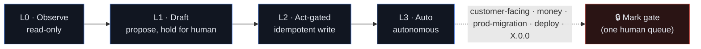
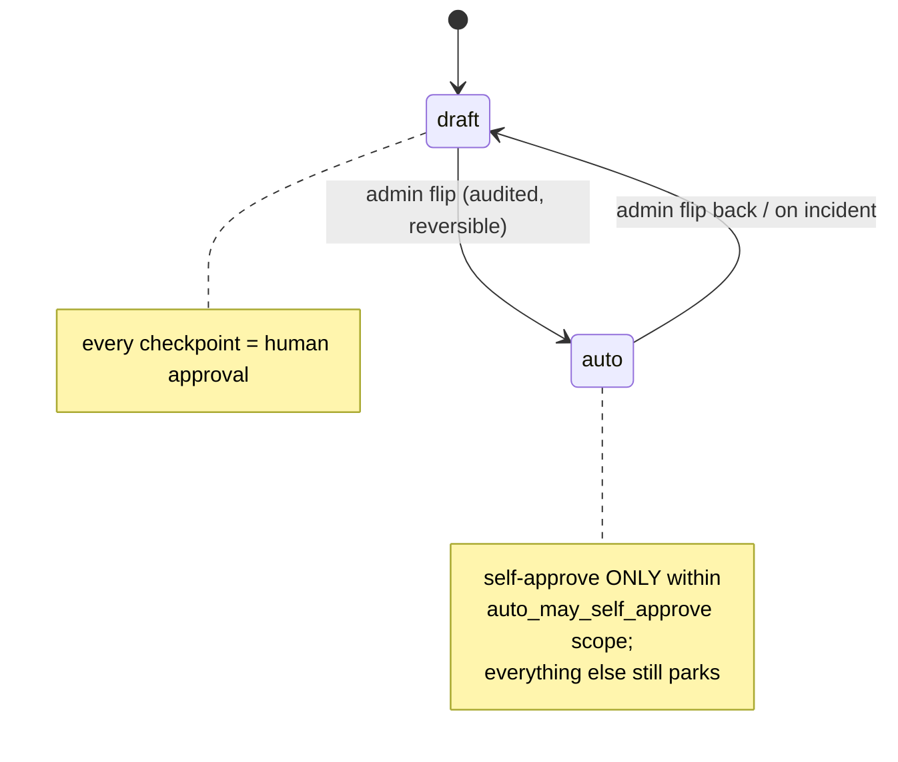

# Autonomy — the tiered dial

How much an agent may do on its own is **earned by track record and expressed as
data** — never hard-coded, never a prompt instruction. This guide covers the one
autonomy dial (`autopilot_policies`), the L0→L3 rungs, the T0–T3 action policy
they enforce, and the single human gate.

[← The AI suite](README.md) · Governing decision:
[ADR-0091](../decision-records/ADR-0091-agent-icm-platform-consolidated.md) (from
ADR-0055 the four-tier policy · ADR-0087 the one dial · ADR-0061 the ICM
draft→auto ramp · [ADR-0128](../decision-records/ADR-0128-canonical-agent-autonomy-ladder.md)
the canonical L0–L5 capability ladder + per-action `auto_at_level`).

---

## 1. The principle: autonomy is a mechanical control

Two rules make this safe rather than aspirational:

- **It lives in data.** Every tier reads its rung from **`autopilot_policies`**, so
  *gating an action, or ramping it after testing, is a data change, not a code
  change* (ADR-0087). This unifies the ICM draft→auto ramp (ADR-0061) with the
  coding-plane standing-OKs (system [CLAUDE.md §10.4](../../CLAUDE.md)).
- **It is enforced by the grant table.** The `agent_tool_grant` table (migration
  0056) is the enforcement point: every tool a sub-agent can invoke carries a tier
  in its grant `scope`, and the backend tool-use loop **refuses calls above the
  grant** (ADR-0055). A prompt that *says* "don't send" is not the control — the
  refused grant is.

---

## 2. The one dial: L0 → L3 → 🔒 (ADR-0087)

One dial spans both planes (the ICM product runtime and the coding plane):



| Rung | Meaning |
|---|---|
| **L0 · Observe** | read-only — analyze, search, summarize |
| **L1 · Draft** | propose an action, **hold for a human** |
| **L2 · Act-gated** | perform an idempotent write within scope |
| **L3 · Auto** | act autonomously within the declared self-approve scope |
| **🔒 Mark gate** | regardless of rung, customer-facing actions · money · prod-migration · deploy · `X.0.0` route to **one human queue** |

An ICM workflow declares its rung in `agent.yaml` (`autonomy_rung` +
`auto_may_self_approve` — see [agent-yaml-schema.md](agent-yaml-schema.md)). The
sales `lead-response` workflow is **L1**: it drafts, but every customer-facing
send still parks until the workflow is admin-flipped to `auto`, and even then only
within its narrow self-approve clause.

---

## 3. The action policy the rungs enforce (ADR-0055)

The four-tier action policy applies to **every agent capability across all four
repos** — it is what the rungs map onto:

| Tier | Scope | Policy |
|---|---|---|
| **T0** | Read / analyze / search / summarize | Always autonomous. |
| **T1** | Internal, reversible writes (draft tasks, enrichment facts, AI-labeled notes, knowledge syncs) | Autonomous + audited, with undo. AI-authored rows are labeled as such. |
| **T2** | Client-visible actions (email, SMS, proposals — anything a client could see) | **Propose-only by default, forever.** From v3, an *individual workflow step* may be whitelisted for autonomy **only** after running in propose mode with a sustained near-100% human-approval streak (threshold recorded on the grant). Whitelisting is **per-step, never per-channel.** |
| **T3** | Irreversible / financial / permissions / production-data mutations | **Human-only.** Agents may recommend; they never hold an executing tool grant. |

> **T2 whitelisting is proposed for v3.** The ADR is accepted in v1; grant
> *enforcement* is wired by v3. Until then, treat every client-visible action as
> propose-only.

---

## 3.5 The canonical L0–L5 capability ladder (ADR-0128)

The rungs above tell an agent *how much it may do*; the **canonical ladder** pins what
each **dial level means as a capability class** so the dial means the *same thing for
every agent* (no per-agent drift). It is the actuation-plane companion to the ICM rungs:
the ADR-0109 dial value `1–5` selects rungs **L1–L5**, with **L0** the implicit
read-only floor.

| Level | Capability class — what it auto-executes |
|---|---|
| **L0 · observe** | Read, research, surface. No writes, no proposals. |
| **L1 · propose** | Drafts/proposals only — everything **parks**. The default-safe wedge posture. |
| **L2 · auto-internal** | Internal, **reversible** writes (CRM hygiene, records, notes). Customer-facing parks. |
| **L3 · auto-low-risk-external** | Standard low-risk external touches, **execute-then-notify**. Higher-stakes parks. |
| **L4 · reversible-auto** | Broad auto-execution of **reversible** actions behind an undo window. |
| **L5 · max-within-ceiling** | Maximal autonomy — everything auto-executes **except the hard ceiling**. |

**Per-action tags.** Every catalog action declares two fields (front-end-owned schema,
[action-catalog.ts](../../src/lib/agent/action-catalog.ts), ADR-0042 §1):

- **`auto_at_level`** — the **minimum rung at which the action auto-executes**; below it,
  it parks. The action's inherent risk floor, *not* the operator's dial.
- **`always_gate`** — the **dial-proof** hard ceiling. When set, the action **never**
  auto-executes at any level. Reserved for external commitments that bind the company
  (send-for-signature, pricing/discount/term) and the ADR-0109 money ceiling. The
  always-gate `data_class`es (`financial`/`security_credentials`/`client_pii`, ADR-0118)
  carry their *own* ceiling via `data_class.always_gate` (mig 0175) and are enforced
  separately — so `always_gate` stays the explicit per-action commitment/money flag.

**Selection (ADR-0128 D4) — total and deterministic.** An action auto-executes IFF

```
dial ≥ auto_at_level   AND   NOT always_gate   AND   the gauntlet passes
```

otherwise it **parks to the cockpit**. Enforced at runtime by the gauntlet's gate 7
(`actuation_level`) + gate 8 (`hard_ceiling`); the front end mirrors the dial/ceiling
half in `selectActuation()` for the dial-legend + cockpit preview.

**Where the tags live as data.** The catalog is materialized as the kind-keyed
**`agent_action_catalog`** table (migration `0217`) — the DB twin the backend gauntlet
(BE #435) reads at dispatch, kept in lockstep with the TS catalog (the 0156/0209 FE↔BE
twin pattern). `auto_at_level`/`always_gate` are therefore queryable:
`SELECT kind, auto_at_level, always_gate FROM agent_action_catalog`. The catalog covers
both the comms/social kinds (mig `0217`) **and** the backend executor kinds the cockpit
must render — the Autotask ticket loop (`autotask_update_ticket` L2 · `autotask_post_reply`
L3 · `autotask_log_time` money-gated) and the Pax8 procure→provision→bill sequence
(`pax8_place_order`/`bill_attach_license` money-gated · `m365_provision_license`/
`agreement_attach_license` L2) — added in lockstep with the backend `ActionDef` tags by
mig `0218` (#1497). The dial value
itself stays in `agent_action_autonomy` (mig 0158); the ladder defines what that value
*means*. Chase (Sales) is the first agent mapped onto the ladder (ADR-0128 §worked
instance); the remaining agents map onto the same rungs as their workspaces are built.

---

## 4. The draft → auto ramp (ICM)

Every ICM workflow **starts in `draft`** — every checkpoint requires a human.
Flipping a trusted workflow to `auto` is:

- **per-workflow** (never per-channel, never global),
- **admin-only** in the GUI,
- **audited**, and
- **reversible.**

In `auto`, checkpoints self-approve **only within the workflow's
`auto_may_self_approve` clause** — anything unstated parks for a human. A `tiered`
mode (auto for low-risk, approval for substantive) is *anticipated* but needs its
own ADR defining the boundaries before it exists (ADR-0061).



---

## 5. The single human queue (the gate)

The **Gatekeeper** role routes every Mark-gated call to **one human queue**
([orchestration-matrix.md](orchestration-matrix.md)). The gate is rung-independent
— an L3 worker still hits it for anything customer-facing, money, prod-migration,
deploy, or an `X.0.0` declare (ICM Constitution §5.4). This is the real ceiling on
the whole system: many isolated sessions, one human reviewer (system
[CLAUDE.md §10.4](../../CLAUDE.md)).

---

## 6. How this shows up across the suite

- **Sub-agents** — the Sales/Outreach agent is T2 (propose-only); the Reporting
  agent is T0 (read-only). See [agent-platform.md](agent-platform.md).
- **ICM workflows** — the dial per workflow; sends always exit via ADR-0058.
- **The Board** — personas are tool-less (T0 by construction); recommendations are
  advisory, ratified/overruled by the human CISO. See
  [board-of-directors.md](board-of-directors.md).
- **Observe/Govern roles** — the Policy/guardrail role *enforces* rungs; the
  Gatekeeper routes the gated queue. See
  [orchestration-matrix.md](orchestration-matrix.md).

The thread through all of it: **autonomy is data + grants, the human gate is
single, and sends are always approval-gated.**
