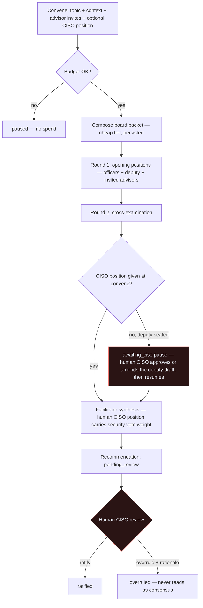

# The AI Board of Directors

A convened panel of AI **influence personas** that deliberates on a business topic
and produces one synthesized recommendation. It is the *same persisted agent core*
as the orchestrator, tagged `module='board'` — not a separate engine.

[← The AI suite](README.md) · Governing decision:
[ADR-0091](../decision-records/ADR-0091-agent-icm-platform-consolidated.md) (from
ADR-0054 design · ADR-0049 persistence · ADR-0055 autonomy · ADR-0050 admin-only).
Runtime: backend ADR-0039 (referenced, not restated — system
[CLAUDE.md §1](../../CLAUDE.md)).

> **State: live.** `/board` is a real page (`src/app/(app)/board/`), the runtime
> runs in the backend, and migration 0056 seeds five personas. The full resumable
> **deputy-CISO pause** (`awaiting_ciso`) is partly wired (the status exists in the
> convene action); its full v2 resume flow ships with its own migration.

---

## 1. Identity & purpose

The Board lets an admin convene an AI panel to pressure-test a business decision.
Personas are **reasoning lenses built from named thinkers' *published
frameworks*** — they **never impersonate or speak as a real person** (ADR-0054 §1).
This is deliberate: the repo is public and the output may one day be client-visible,
so right-of-publicity exposure is designed out. Seats keep functional names (Chief
Executive, Chief Financial Officer, …); a persona cites a framework, never claims
to *be* the person.

Personas read **granted business context only** and are **walled off from CRM
operational writes** (ADR-0091, from ADR-0015/0049). They are **tool-less in
deliberation** — they read the board packet and nothing else.

---

## 2. Seats (the influence profiles)

| Seat | Kind | Anchor framework | Secondary lenses |
|---|---|---|---|
| Chief Executive | officer | Herjavec — operator who built/sold an MSSP | Bezos (Day-1, written narratives, customer obsession) · Nadella (partner ecosystem) · Sinek (Why / Infinite Game) · Willink (Extreme Ownership) |
| Chief Financial Officer | officer | Crabtree — *Simple Numbers*, labor-efficiency ratio | Ramsey (debt aversion, cash reserves) · Dalio (macro/risk machine) |
| Chief Operating Officer | officer | Leila Hormozi — people systems, scaling ops | Lencioni (org health) · Covey (7 Habits, 4DX) |
| Chief Marketing Officer | officer | Alex Hormozi — offers, $100M Leads | Vaynerchuk (attention, volume) · Carnegie (relationship selling) |
| CISO Staff Analyst | deputy | Drafts the security position *for the human CISO*; MSP-under-continuous-attack threat model, grounded in posture gold data | — |
| Negotiation Advisor | advisor (invite-only) | Voss — tactical empathy, calibrated questions | — |
| Performance Advisor | advisor (invite-only) | Robbins — state, sales psychology | — |
| People & Responsibility Advisor | advisor (invite-only) | Peterson — responsibility, performance conversations | — |
| Facilitator (synthesis voice) | facilitator (hidden) | Lencioni — healthy conflict; surface disagreement, never paper over a split | — |

**Cap: ≤7 seated per session** (4 officers + deputy + ≤2 invited advisors).
Advisors are counsel, not votes. Seats carry a `seat_kind` check
(`officer | advisor | facilitator | deputy`) on the `module='board'` `agent` rows.

---

## 3. The deputy-CISO model (ADR-0054 §4)

The board's security voice is the **CISO Staff Analyst**, a *deputy* persona that
deliberates like any member but is labeled as drafting **for** the human CISO.
**Mark is the CISO of record** — his stated position carries **veto weight on
security matters** and supersedes the deputy's draft wherever they conflict.
Mechanically:

- **At convene time:** an optional CISO-position field
  (`board_session.ciso_position_md`). When empty, the deputy's draft stands,
  explicitly labeled as unreviewed staff analysis.
- **The deputy pause (`awaiting_ciso`):** when a deputy seat sits with no
  convene-time position, the session stops after round 2 as `awaiting_ciso`
  (`paused_at` starts the review-SLA clock). The session page surfaces the deputy's
  final stance as the draft; the human CISO resumes — **approve** adopts the draft,
  **amend** replaces it — which runs synthesis → conclude. *(The status is wired in
  `src/app/(app)/board/actions.ts`; the full resumable v2 ships with its own
  migration.)*
- **After the session:** he ratifies or overrules every concluded recommendation
  (`board_recommendation.review_status`: `pending_review → ratified | overruled`).

Voice before synthesis; verdict after it.

---

## 4. Inputs

- **Topic + optional convener context** (the convene form). Convening is
  **admin-only**, capability `agents:operate` (ADR-0050, superseding ADR-0049's
  `sales:write`).
- **Optional human-CISO position** (convene form; or entered at the deputy pause).
- **Board packet** (ADR-0054 §3): before round 1, one **cheap-tier** composition
  pass assembles a topic-relevant written packet — reporting aggregations,
  gold-layer semantic-search pulls, security-posture summary, pipeline/campaign
  numbers — and *every persona deliberates over the same packet.* It is persisted
  on the session (`packet_md`), so the record shows **what the board knew when it
  recommended.** The packet composer reads only data the convener is already
  authorized to see.

---

## 5. Outputs

- Round-1 / round-2 positions per persona (`board_message`; a NULL-`agent_id` row
  is the synthesis/facilitator voice).
- One synthesis recommendation with agreements/disagreements
  (`board_recommendation`, `session_id UNIQUE` — one per session).
- Per-persona `agent_run` rows with token/cost accounting (the Board writes
  `agent_run` from day one).
- Audit entries (`board.convene`, `board.conclude`) and a review verdict.

Costs count against the org **monthly AI ceiling** (the shared backend budget
ceiling); convening when the budget is reached returns a *paused* state **before
any spend.**

---

## 6. Workflow

---

## 7. The `/board` surface (this repo)

- **Convene card** — topic, optional context, persona checkbox chips (default the
  full board, max 5). Submitting calls the backend `POST /board/sessions`; the
  deliberation is synchronous (~30–90s) and the UI shows a "deliberating" pending
  state. The web role deliberately has **no INSERT grant** on `board_*` (migration
  0056) — convening goes through the backend.
- **Sessions list + `/board/[id]` detail** — direct DB reads of the `board_*`
  tables (web identity has SELECT, ADR-0042): members, the transcript grouped into
  rounds, and the recommendation card (stances / agreements / disagreements parsed
  defensively from the rationale jsonb).
- **Admin-only** (`canSeeAgentPages`); convening additionally gated
  `agents:operate`.

---

## 8. Tool access & security boundaries

- Personas are **tool-less in deliberation** (read the packet, nothing else).
- The packet composer reads only what the convener may already see.
- No persona proposes or executes actions; anything actionable exits the board as a
  **recommendation** for humans (or for orchestrator flows governed by the autonomy
  tiers — [autonomy-dial.md](autonomy-dial.md)).
- Pages and convening are admin-only (ADR-0050).

---

## 9. Failure handling (backend ADR-0039)

| Condition | Behavior |
|---|---|
| A persona fails | dropped, or falls back to its round-1 position |
| Round 1 or synthesis collapses | session marked `failed` (never a crash) |
| Budget exhausted | `paused` **before** any spend |
| Packet composition fails | degrades to the legacy reporting snapshot (stubbed-not-broken) |
| Synthesis fails on resume | leaves the session `awaiting_ciso` (resumable; the recorded position persists); resume is budget-gated like convene |
| Backend unset | convening disabled with a notice; lists still render from the DB |
| DB unset | personas fall back to `GET /board/agents`; lists to sample data |

The endpoint never hard-fails.

> The full agent record (workflow diagram, failure table, cost bounds) for the
> *runtime* lives in the backend repo:
> `ImperionCRM_Backend/docs/agents/board.md`.
