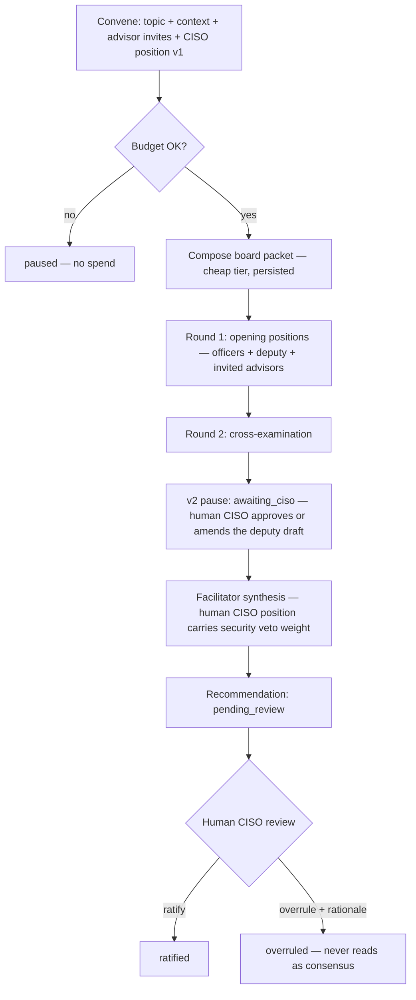

# Agent doc — AI Board of Directors

Governing decisions: ADR-0054 (this design), ADR-0049 (persistence), backend ADR-0039
(runtime), ADR-0050 (admin-only), ADR-0055 (autonomy tiers). Status: influence-persona
upgrade accepted 2026-06-10; implementation tracked under the v1 epic.

## Identity & purpose

A convened panel of AI **influence personas** that deliberates on a business topic and
produces one synthesized recommendation. Personas are reasoning lenses built from named
thinkers' *published frameworks* — they never impersonate or speak as a real person
(ADR-0054 §1; this repo is public and the output may one day be client-visible).

## Seats

| Seat | Kind | Anchor framework | Secondary lenses |
|---|---|---|---|
| Chief Executive | officer | Herjavec — operator who built/sold an MSSP | Bezos (Day-1, written narratives, customer obsession) · Nadella (partner ecosystem) · Sinek (Why / Infinite Game) · Willink (Extreme Ownership) |
| Chief Financial Officer | officer | Crabtree — *Simple Numbers*, labor-efficiency ratio | Ramsey (debt aversion, cash reserves) · Dalio (macro/risk machine) |
| Chief Operating Officer | officer | Leila Hormozi — people systems, scaling ops | Lencioni (org health) · Covey (7 Habits, 4DX) |
| Chief Marketing Officer | officer | Alex Hormozi — offers, $100M Leads | Vaynerchuk (attention, volume) · Carnegie (relationship selling) |
| CISO Staff Analyst | deputy | Drafts the security position *for the human CISO*; MSP-under-continuous-attack threat model, grounded in posture gold data | — |
| Negotiation Advisor | advisor (invite-only) | Voss — tactical empathy, calibrated questions | — |
| Performance Advisor | advisor (invite-only) | Robbins — state, sales psychology | — |
| People & Responsibility Advisor | advisor (invite-only) | Peterson — responsibility, performance conversations | — |
| Facilitator (synthesis voice) | facilitator (hidden) | Lencioni — healthy conflict; surface disagreement, never paper over a split | — |

Cap: ≤7 seated per session (4 officers + deputy + ≤2 invited advisors). Advisors are
counsel, not votes. The **human CISO (Mark) holds the security seat** (ADR-0054 §4,
deputy model): his stated position carries veto weight on security matters and supersedes
the deputy's draft — entered at convene time in v1 (`board_session.ciso_position_md`), at
a pause before synthesis (`awaiting_ciso`) in v2. He additionally ratifies or overrules
every concluded recommendation (`board_recommendation.review_status`).

## Inputs

- Topic + optional convener context (convene form, `agents:operate`, admin-only).
- Optional human CISO position (v1: convene form; when empty, the deputy's draft stands,
  labeled as unreviewed staff analysis).
- **Board packet** (ADR-0054 §3): one cheap-tier pre-deliberation pass composes a written
  packet — reporting aggregations, gold-layer semantic-search pulls, security-posture
  summary, pipeline/campaign numbers — persisted on the session (`packet_md`).

## Outputs

- Round-1/round-2 positions per persona (`board_message`), synthesis recommendation with
  agreements/disagreements (`board_recommendation`), per-persona `agent_run` rows with
  token/cost accounting, audit entries (`board.convene`, `board.conclude`).
- Review verdict: `pending_review → ratified | overruled` + rationale, by the human CISO.

## Tool access & security boundaries

Personas are **tool-less** in deliberation (T0-only by construction — they read the
packet, nothing else). The packet composer reads only data the convener is already
authorized to see. No persona proposes or executes actions; anything actionable exits the
board as a recommendation for humans or for orchestrator flows governed by ADR-0055
tiers. Pages and convening remain admin-only (ADR-0050). Costs count against the org
monthly AI ceiling (ADR-0037; $250/mo as of 2026-06-10).

## Failure handling

Unchanged from backend ADR-0039: per-persona degradation (a failed persona is dropped or
falls back to its round-1 position), session marked `failed` if round 1 or synthesis
collapses, budget exhaustion returns `paused` before any spend, endpoint never hard-fails.
Packet composition failure degrades to the legacy reporting snapshot (stubbed-not-broken).

## Workflow

