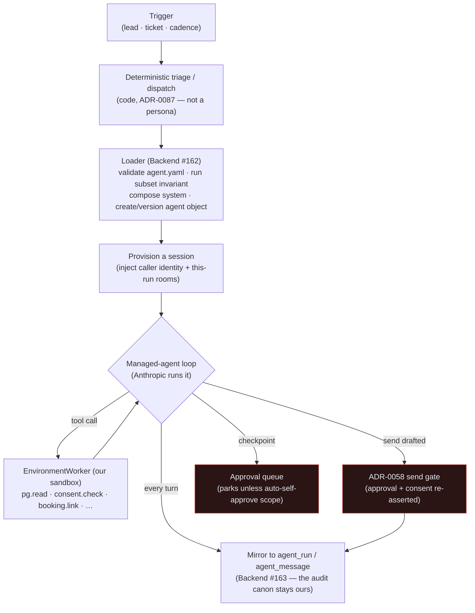
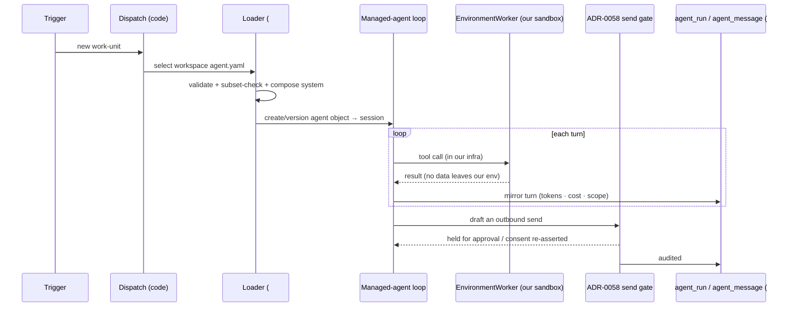

# The CMA runtime — self-hosted Managed Agents

How an ICM workflow actually *runs*. The ICM **factory** is files in this repo
([icm.md](icm.md)); the **runtime** is **self-hosted Managed Agents (CMA)** — the
Anthropic agent loop, with tools executing in **our** sandbox so client data never
leaves our environment.

[← The AI suite](README.md) · Governing decision:
[ADR-0091](../decision-records/ADR-0091-agent-icm-platform-consolidated.md)
(from ADR-0088, supersedes backend ADR-0036 *for the loop*; ADR-0029 settles the
own-data-residency principle).

> **State (2026-06-16): accepted, in build.** ADR-0088 is Accepted. The backend
> loader + ledger mirror are **Backend #162 / #163**. This guide documents the
> *decided* runtime; the in-flight pieces are flagged. Cross-repo runtime code
> lives in the backend (system [CLAUDE.md §1](../../CLAUDE.md)); backend ADRs are
> referenced, never restated.

---

## 1. Why self-hosted Managed Agents

ADR-0029 settled the principle: **our own agent layer over the providers, not a
managed-orchestration platform that exfiltrates data, and no low-code engine for
core logic.** ADR-0088 evolves *how the loop is run* without breaking that
principle:

- **The loop is managed (Anthropic runs it).** We don't hand-roll the tool-use
  loop, retries, and turn management anymore.
- **The sandbox is ours.** Tools execute on our infrastructure via an
  `EnvironmentWorker` (`config:{type:"self_hosted"}`). All client PII, Key Vault
  custody, and the ADR-0058 send gate stay on our infra.

So data residency is preserved; only the build-the-loop-from-scratch part changes.
This **supersedes backend ADR-0036 for the loop** — the backend becomes the
**worker host + loader + ledger mirror**, not the loop author.

---

## 2. The agent object vs. the session

The CMA shape (the same split `agent.yaml` encodes — see
[agent-yaml-schema.md](agent-yaml-schema.md)):

| Concept | Lifetime | Built from |
|---|---|---|
| **Agent object** | created once, **versioned on change** | a workspace `agent.yaml` (its `system` composed from `CONSTITUTION.md` → domain `room.md` → workflow `prose.md`; structured fields `model`/`tools`/`skills`/`mcp_servers`/`okf_rooms`/`autonomy_rung`) |
| **Session** | **ephemeral, run-scoped** — one per workflow run | the agent object + per-run volatile injection (caller identity, this-run rooms) at session time |

There is **no long-lived per-domain persona.** A trigger spins up a session, the
session does the run, the session ends. The composed `system` prefix is **stable,
so it prompt-caches**; volatile per-run data is injected at session time, never
baked into the cached prefix.

---

## 3. The managed-agent loop, end to end

---

## 4. Least privilege at the runtime: the budget files

Every tool/room a session may touch is bounded by the
`workflow ⊆ domain ⊆ Constitution` invariant, enforced **structurally** (not by
prompt). The budget files (ADR-0089):

| File | Tier | Holds |
|---|---|---|
| [`icm/CONSTITUTION.yaml`](../../icm/CONSTITUTION.yaml) | outer | the **union** of every `tool` + `okf_room` any worker may *ever* be granted — the one place a new capability enters the agent layer |
| [`icm/domains/<d>/room.yaml`](../../icm/domains/sales/room.yaml) | domain | narrows the Constitution to what *that* domain may grant |
| a workflow's `agent.yaml` `tools`/`okf_rooms` | workflow | narrows further to what *that* workflow needs |

`scripts/agent-yaml-gate.mjs` enforces the chain (`checkSubset`), and the
**backend loader imports the same pure functions** — one contract, no drift. A
domain `room.yaml` entry MUST itself appear in `CONSTITUTION.yaml`. Absent upper
budgets degrade safely (bound = next-lower declared list); adding a budget later
only ever *tightens*. Field detail: [agent-yaml-schema.md](agent-yaml-schema.md).

---

## 5. The non-negotiables every worker inherits (`CONSTITUTION.md` §5)

A worker is *born under* these — it cannot route around them because they were
never a destination:

1. **Sends exit only through ADR-0058** (approval-gated, consent re-asserted). No
   stage reaches an external party any other way.
2. **Least privilege & never exceed the caller.** A worker's permission scope
   never exceeds the invoking user's (ADR-0016). Tools/rooms are allow-listed.
3. **No secrets, no client PII in any `icm/` file** (ADR-0060) — they replicate
   everywhere. Non-MCP secrets stay host-side; MCP creds in vaults.
4. **One human queue.** Customer-facing actions, money, prod-migration, deploy,
   and `X.0.0` route to the single Mark-gate, regardless of rung.
5. **Autonomy is data.** Every workflow starts `draft`; the flip to `auto` is
   admin-only, audited, reversible, read from `autopilot_policies` — not code
   ([autonomy-dial.md](autonomy-dial.md)).
6. **Audit canon stays ours.** Session events mirror into
   `agent_run`/`agent_message` (Backend #163); the Postgres ledger is
   authoritative — *not* the provider's session log.

The inherited **horizontals** (Governance/Policy, Identity/Access, Observability,
Data Platform) wrap every worker; security-as-a-delivered-service (posture
monitoring, IR) is a *vertical* (Security Ops), distinct from
security-of-our-own-agents (the Governance wrapper). Don't conflate them.

---

## 6. The audit canon: our ledger, not theirs

Even though Anthropic runs the loop, **the system of record is ours.** CMA session
events are **mirrored into `agent_run` / `agent_message`** (the same append-only
tables from migration 0056), so:

- every run records *what · why · state · cost* in one ledger across both planes
  (ADR-0087),
- cost telemetry rolls up on `/agents` (see
  [agent-platform.md §4](agent-platform.md)),
- the Observe/Govern tier (run-ledger, drift, reconciler) reads our tables, never
  a provider API ([orchestration-matrix.md](orchestration-matrix.md)).

---

## 7. What is live vs. in build

| Piece | State |
|---|---|
| `agent.yaml` schema + conformance gate | **Live** (`icm/agent.schema.json`, `scripts/agent-yaml-gate.mjs`, CI `icm-conformance`) |
| Constitution + sales budget files | **Live** (`icm/CONSTITUTION.{md,yaml}`, `icm/domains/sales/room.{md,yaml}`) |
| The `lead-response` workspace (a real agent object's source) | **Live** (definitions) |
| Backend loader (compose `system`, version the agent object) | **In build — Backend #162** |
| Session-event mirror into `agent_run` / `agent_message` | **In build — Backend #163** |
| The other eight domains' workspaces | **Planned** (ADR-0088) |
