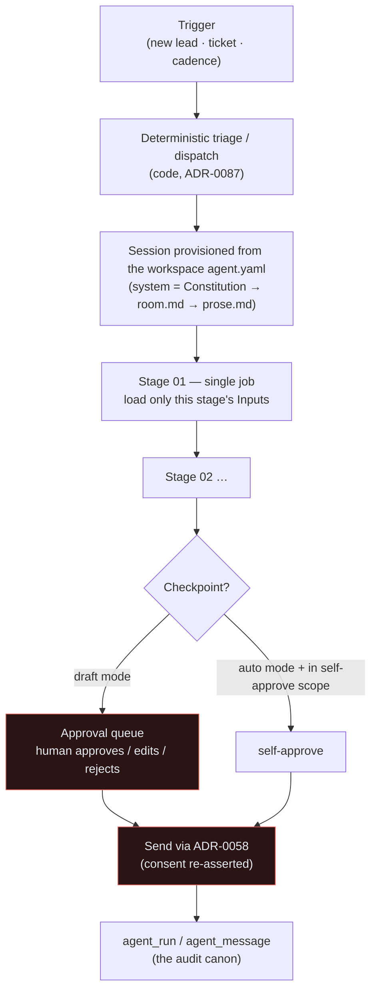

# ICM — business-process automation

Imperion OS automates MSP business processes — marketing → sales →
project management → service desk → finance — using the **Interpreted Context
Methodology (ICM)**. This guide is the onboarding tour: what ICM is, how the
factory tree is laid out, how a run flows, the autonomy dial, and the live
reference workspace.

[← The AI suite](README.md) · Governing decision:
[ADR-0091](../decision-records/ADR-0091-agent-icm-platform-consolidated.md)
(from ADR-0061, amended by ADR-0088/0089).

---

## 1. The one idea: the factory lives in git; the product lives in the platform

ICM separates **definitions** from **execution** (ADR-0091 §7):

- **The factory (definitions)** — business workflows are versioned in *this* repo
  under [`icm/`](../../icm/CONVENTIONS.md). They are **plain files**: prose,
  contracts, manifests, and skill bundles. Changing a workflow is a normal
  issue → micro-PR. Conventions: [`icm/CONVENTIONS.md`](../../icm/CONVENTIONS.md).
- **The product (execution)** — the **backend orchestrator** runs a workflow as a
  sequence of single-job agent turns, loading **only that stage's contract +
  referenced context** per turn (ICM layered loading). Stage artifacts persist as
  **Postgres run records**, editable in the GUI between stages — never as committed
  files.

> ICM is the *same* filesystem-as-orchestration pattern the coding plane uses
> (Van Clief, arXiv:2603.16021 — see the
> [orchestration matrix](orchestration-matrix.md)). The agents that build the app
> and the agents that run the business answer the same three routing questions:
> **where am I · what context do I load · which tools + how much autonomy.**

---

## 2. The factory tree (ADR-0091 §9, the domain tier)

ADR-0088 added a **domain tier** so workflows group by bounded context. The tree
under `icm/`:

```
icm/
  CONSTITUTION.md          # Layer 0a — the inherited contract every domain/workflow obeys
  CONSTITUTION.yaml        #            the OUTER least-privilege budget (tools + okf_rooms)
  CLAUDE.md                # Layer 0b — dev-tool/dry-run orientation (NOT the runtime brain)
  CONVENTIONS.md           # how Imperion applies ICM
  agent.schema.json        # machine contract for every agent.yaml
  skills/                  # TIER 1 — cross-domain runtime skills
  domains/
    sales/                 # Layer 1 — a bounded context
      room.md              #   thin domain prose (composed into system)
      room.yaml            #   the domain least-privilege budget (⊆ Constitution)
      skills/              #   TIER 2 — domain-shared runtime skills
      lead-response/       # Layer 2 — a workspace (one business workflow)
        CONTEXT.md         #   routing: trigger, stage order, autonomy notes
        agent.yaml         #   the declarative manifest (the CMA agent object)
        prose.md           #   workflow system prose (composed into system)
        stages/            #   Layer 3 — one CONTEXT.md per stage (NN = run order)
        skills/            #   TIER 3 — workflow-local runtime skills
```

The three tiers nest: a **workflow** sits in a **domain** under the
**Constitution**. The nine planned domains (Marketing, Sales, Delivery &
Projects, Service Desk, Customer Success, Finance, People, Knowledge, Security
Ops) each get a `room.md` + `room.yaml`; horizontals (Governance, Identity,
Observability, Data Platform, Engineering) are **inherited from the
Constitution, never peer folders** (ADR-0091 §9).

> **The runtime prose file is never named `CLAUDE.md`.** That name auto-loads in
> the Claude Code dev tool during dry-runs and would pull whole-tier context when
> a single stage is wanted. The runtime loader reads by explicit `system_compose`
> path regardless (`icm/CONVENTIONS.md` → Naming).

---

## 3. How a run flows



Key properties:

- **One stage, one job.** Each stage loads only its `Inputs` table — *layered
  context loading is the cost model.* A stage that needs "and" gets split.
- **Model tier per step.** Stage contracts mark steps `[haiku]` (mechanical) or
  `[sonnet]` (judgment/drafting) — the settled stack (ADR-0043).
- **Checkpoints are the approval queue.** A checkpoint stage emits an approval
  item; the run **parks** until a human approves/edits/rejects.
- **Every artifact is human-editable** between stages, in the GUI, before the next
  stage runs.
- **A failed audit parks the run** — it never "best-efforts" forward.
- **Sends always exit through the ADR-0058 path** (approval-gated, consent
  re-asserted). No stage reaches an external party any other way.

The runtime that executes this is the **self-hosted Managed Agents** loop —
covered in [cma-runtime.md](cma-runtime.md).

---

## 4. The autonomy dial (the trust ramp)

Every workflow carries an autonomy mode and **starts in `draft`** (every
checkpoint requires a human). Flipping a trusted workflow to `auto` is
**per-workflow, admin-only in the GUI, audited, and reversible** (ADR-0091 §7,
from ADR-0061). In `auto`, checkpoints self-approve **only within the workflow's
declared `auto_may_self_approve` scope** — anything outside it still parks.

This dial is the same one the whole agent system reads from `autopilot_policies`
(ADR-0087). The full state machine, the L0→L3 rungs, and the T0–T3 action policy
are in [autonomy-dial.md](autonomy-dial.md).

**Rollout order** (Mark, ADR-0061): marketing/sales first (lead response +
nurture), then project management, then service desk (the backup-failure monitor
is the canonical draft→auto example).

### The GUI surface (#278) — `/workflows/runs`

The glass-box view of the run ledger lives at **`/workflows/runs`** (linked from
the Workflows page). It is read-first and GUI-only — every *process* still calls
the backend (ADR-0042). Three panels:

- **Run viewer** — the `agent_run` ledger as a list (workflow, status, stage
  count, cost, acting user), each linking to **`/workflows/runs/[id]`** where the
  ordered stage artifacts (`agent_message` rows: role · content · tool calls) are
  inspectable plain text. "Editable between stages" is the parked-checkpoint path,
  surfaced as the approval queue below; the run write itself is backend-owned.
- **Approval queue** — each parked checkpoint surfaces the drafted artifact + the
  agent's **rationale** + the **triage class** + the **consent basis** (ADR-0058),
  with approve / edit-and-approve / reject. Decisions route through the backend
  approval-gated send path; consent is re-asserted at execution.
- **Autonomy dial** — reads the current rung (L0–L3) + Mark-gate flag from
  `agent_autopilot_policy` (migration 0123) for the workflow and flips it through
  the backend. Admin-only (`agents:operate`, ADR-0050), audited, reversible. The
  safe default when no row exists is L1 (draft), mark-gated — every workflow starts
  in draft (ADR-0061).

All three degrade like the rest of the app: no DB → sample rows; unwired executor
endpoint → an honest "not wired yet" notice instead of a failure.

---

## 5. The live reference workspace: `sales/lead-response`

The one fully-built workspace today is
[`icm/domains/sales/lead-response/`](../../icm/domains/sales/lead-response/CONTEXT.md)
(issue #701). Use it as the template for every new workflow.

**Job:** every inbound lead gets a fast, on-brand, consent-clean first response
and a managed follow-up loop, drafted by agents and sent on our behalf.

**Trigger:** a new lead from any wired source — Meta lead forms (bronze,
migration 0075), website forms, FB/IG DMs classified as a lead inquiry, or an
Apollo nurture entry. One run per lead. Sender identity is the shared sales
mailbox.

**Stages:**

| # | Stage | Job | Checkpoint |
|---|---|---|---|
| 01 | intake-triage | Classify + dedupe + fit-score the lead | — |
| 02 | research | Build the lead dossier from what we already know | — |
| 03 | draft-response | Channel-aware first response + rationale | — |
| 04 | review-send | Human approves/edits; send via ADR-0058 | **Yes** |
| 05 | follow-up | Schedule/execute the follow-up loop; detect replies | re-enters 03 |

**Autonomy:** starts `draft`. When flipped to `auto`, stage 04 may self-approve
**only** email replies to triage class `standard-inquiry` with an audit-clean
draft and an existing consent basis. Pricing/contract questions, complaints, DM
replies near the 24-hour window edge, and any audit failure always park for a
human, in every mode.

**Manifest:** `agent.yaml` — `model: claude-sonnet-4-5`, `autonomy_rung: L1`,
`okf_rooms: [contact, account, interaction, consent_event, lead_score, campaign]`,
`tools: [pg.read, consent.check, send.email, send.dm, booking.link]`. Each is a
strict subset of the sales domain budget (`room.yaml`), which is itself a subset
of the Constitution (`CONSTITUTION.yaml`). Field-by-field:
[agent-yaml-schema.md](agent-yaml-schema.md).

**Runtime skills:** workflow-local (Tier 3): `icp.md` · `offer-catalog.md` ·
`channel-rules.md`. Domain-shared (Tier 2): `voice-and-tone.md` (promoted so every
sales draft sounds the same).

---

## 6. Runtime skills vs. developer skills (don't mix them)

Two distinct skill systems live in this repo:

| | Runtime skills | Developer skills |
|---|---|---|
| **Home** | `icm/skills/` (Tier 1) · `domains/<d>/skills/` (Tier 2) · `<workflow>/skills/` (Tier 3) | `plugins/imperion-skills/` (ADR-0060) |
| **Consumed by** | the ICM **agent workforce** at runtime | **Claude Code** (the build crew) |
| **Promote when** | a 2nd domain / 2nd workflow needs it (one tier up, leave a pointer) | — |

Runtime skills are the workforce's business knowledge (ICP, voice, offer catalog,
channel rules). Developer skills are the engineering canon — see
[skills.md](skills.md). They never mix.

---

## 7. Authoring & change control

- **Author a workflow** with the `imperion-icm` developer skill (skills plugin).
- **Changing a workflow / domain / the Constitution is a normal unit of work:**
  issue → branch → micro-PR (ADR-0060/0061), one workspace per PR.
- **Conformance is gated by CI** (`icm-conformance`, #702): every `agent.yaml`
  is shape-checked against `icm/agent.schema.json` and the
  `workflow ⊆ domain ⊆ Constitution` invariant is enforced by
  `scripts/agent-yaml-gate.mjs` — the *same* pure functions the backend loader
  imports (no drift).
- An ADR that supersedes a clause a workflow obeys updates the workflow in the
  **same PR** (docs-gate — the definitions are docs).

Current domains/workflows: see [`icm/domains/`](../../icm/domains/) —
`sales/lead-response` is the live reference workspace; the other eight domains are
planned per ADR-0088.

## Operating rule for working *on* ICM

Any work on or dry-run of a workflow follows the Layer-0 protocol in
[`icm/CLAUDE.md`](../../icm/CLAUDE.md): route via the workspace `CONTEXT.md`, load
only the stage's `Inputs` table, **stop at checkpoints, never send.**
