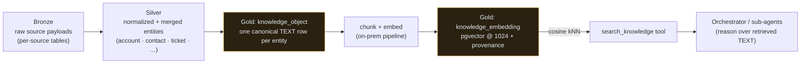

# The knowledge & RAG layer

What the agents *reason over.* The gold knowledge store, the vectorization
pipeline, the pinned vector contract, citations, and the `search_knowledge` tool
that grounds every answer in company facts.

[← The AI suite](README.md) · Governing decisions:
[ADR-0041](../decision-records/ADR-0041-gold-knowledge-vector-store.md) (the gold
store + pinned vector contract) ·
[ADR-0043](../decision-records/ADR-0043-settled-ai-stack-drop-legacy-vectors.md)
(the settled stack), consolidated in
[ADR-0092 medallion data platform](../decision-records/ADR-0092-medallion-data-platform-consolidated.md).
OKF orientation: [agent-rooms-okf.md](agent-rooms-okf.md).

> **State (2026-06-16): schema live, generation dormant.** The gold tables exist
> in prod (migration 0045) and the consumer path (`search_knowledge`) is
> registered. **Embedding *generation* is owned by the on-prem pipeline and is not
> yet running** — semantic search "arrives with vectorization" (overview §4). So
> the store is built and wired; it fills as the on-prem vectorizer goes live.

---

## 1. The medallion → gold flow

Data flows **bronze → silver → gold** (system [CLAUDE.md §4](../../CLAUDE.md),
ADR-0092). The agents consume **gold**:

- **Producer:** the on-prem **LocalPipelineEnrichment** repo owns **ALL**
  embedding/vectorization (system CLAUDE.md §1/§7) and writes both gold tables.
- **Consumer:** the backend orchestrator queries `knowledge_embedding` by cosine
  similarity, filtered to the pinned `(embedding_model, dimension,
  chunking_version)`.

---

## 2. The two gold tables (migration 0045)

`db/migrations/0045_gold_knowledge_vectors.sql`:

### `knowledge_object` — the agent-consumable text

One row per real-world entity (account, contact, device, contract, ticket,
proposal, exposure, assessment, security-posture item, IT Glue doc, …) holding the
**canonical text the orchestrator reasons over.**

| Column | Meaning |
|---|---|
| `tenant_id` | per-tenant isolation |
| `entity_type` · `entity_ref` | which silver/gold entity this describes (`UNIQUE` per tenant) |
| `title` · `body` · `summary` | the human label, the text that gets chunked + embedded, an optional gold summary |
| `source` | provenance (which pipeline/source produced it) |
| `content_hash` | hash of `body(+summary)` — **unchanged ⇒ skip re-embed** (no re-bill) |
| `metadata` | entity-specific extras, kept *out* of the embedded text |

### `knowledge_embedding` — chunked vectors + full provenance

One row per chunk, holding the pgvector embedding **plus full re-embed
provenance** so a model/chunking change is a *versioned re-embed*, never an
in-place overwrite.

| Column | Meaning |
|---|---|
| `knowledge_object_id` · `chunk_index` · `chunk_text` | the chunk |
| `embedding vector(1024)` | the Voyage `voyage-3-large` @ 1024 embedding |
| `embedding_model` · `dimension` · `chunking_version` | the versioned-query filter |
| `content_hash` · `token_count` | idempotency + cost telemetry |

Indexes: an **HNSW cosine** index on `embedding`, plus a `(embedding_model,
chunking_version)` index so multiple versions share the one HNSW index safely. The
`UNIQUE (knowledge_object_id, chunk_index, embedding_model, chunking_version)`
keeps re-embeds idempotent.

**Grants** (ADR-0042): the on-prem pipeline identity has SELECT/INSERT/UPDATE on
both and DELETE on `knowledge_embedding` only (re-embeds prune old vectors); the
web identity has **SELECT only**.

---

## 3. The pinned vector contract (ADR-0041)

> **Voyage AI `voyage-3-large` at dimension 1024**, system-wide.

The reasoning, kept honest:

- **Embeddings are decoupled from the generation model.** The agent is Claude, but
  Claude consumes retrieved **text**, not vectors — so the embedding model is an
  independent retrieval/cost/governance choice. Voyage is Anthropic's recommended
  embeddings provider for Claude RAG.
- **`vector(1024)` is fixed-width.** A *same-dimension* model/chunking change is a
  versioned row (old + new coexist until pruned). A **different** dimension needs a
  new column + migration — never silently.
- **The same contract governs `agent_memory`** (`vector(1024)`, same provenance
  columns, migration 0056) — one vector space across knowledge and memory.
- The legacy `interaction_embedding` / `contact_embedding` tables (OpenAI 1536,
  migrations 0001/0021) are a **different space**, unused/deferred; they converge
  onto this store via a versioned re-embed when generation goes live (ADR-0043
  dropped the legacy vectors from the settled stack).

---

## 4. Retrieval & citations

The agent never free-associates over company facts — it **retrieves, then
reasons:**

1. A turn calls `search_knowledge` with the user's intent.
2. The backend runs cosine kNN over `knowledge_embedding`, filtered to the pinned
   `(embedding_model, dimension, chunking_version)`.
3. The retrieved **chunk text + its `knowledge_object` provenance** come back —
   so an answer can be **grounded and attributed** to the entity/source it came
   from, not invented.

This is why the **Reporting** sub-agent "grounds every figure in the same
aggregations the Reporting page shows; never invents numbers," and the **Sales**
sub-agent drafts "grounded in their gold-layer history" (see
[agent-platform.md §3](agent-platform.md)).

---

## 5. `search_knowledge` — the registered tool

`search_knowledge` is registered in the orchestrator's tool catalog (mirrored on
`/agents` → `TOOLS`): *semantic search over the gold knowledge store (accounts,
contacts, contracts, tickets) — Voyage embeddings @ 1024 dims.* The user-facing
**Knowledge** page (`/knowledge`) is the human surface over the same store;
semantic results there arrive with vectorization.

---

## 6. Cost & governance properties

- **No re-bill on unchanged content** — `content_hash` skips re-embedding.
- **Versioned, never destructive** — a model/chunking upgrade adds rows; the old
  space stays queryable until pruned.
- **Token telemetry** — `token_count` per chunk feeds cost rollups.
- **Tenant isolation** — every object carries `tenant_id`.
- **PII boundary** — the *meaning* layer (OKF) is PII-free and lives in docs
  ([agent-rooms-okf.md](agent-rooms-okf.md)); the *data* with client PII lives only
  in these gold tables under SELECT-gated access — never copied into docs, issues,
  or skills.

---

## 7. Future / dependencies

- **Vectorization going live** is the on-prem pipeline's work
  (LocalPipelineEnrichment); until then the store is built but unfilled and
  semantic search degrades gracefully.
- Vectorizing the **ADR/OKF corpus** itself into gold is a planned follow-up
  (ADR-0090/0091 future considerations; LocalPipeline) so the agents can reason
  over the platform's own decisions.
