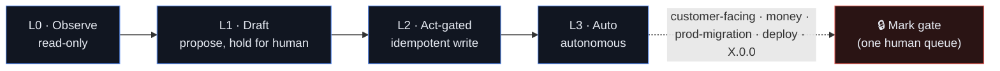
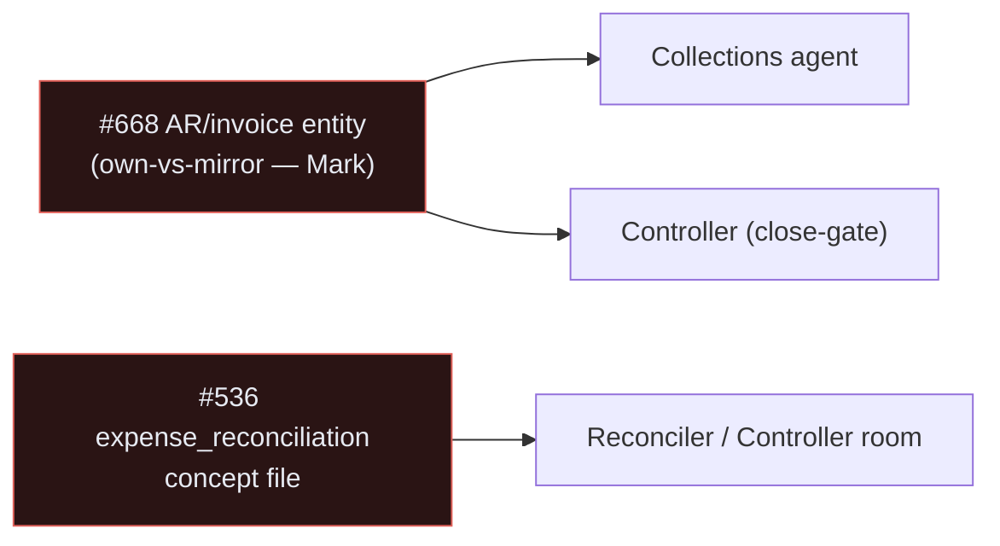

# 🛰️ Agent orchestration & observability matrix

The single map of **every agent** in Imperion OS — what it owns, how
much autonomy it has, what context it loads, and which roles *watch* the system
rather than act on it. Where [agent-platform.md](agent-platform.md) covers the
user-facing orchestrator and [icm.md](icm.md) covers the workflows, this is the
*whole roster* by **tier**. For the roster by **named agent** — the eight personas
(Felix · Chase · Belle · …), one per workspace, with their guardrails — see the
[agent roster](agent-roster.md).

Governing decision:
[ADR-0091](../decision-records/ADR-0091-agent-icm-platform-consolidated.md) (from
[ADR-0087](../decision-records/ADR-0087-agent-orchestration-and-observability-layer.md)).
Grounded in [ICM (ADR-0061)](../decision-records/ADR-0061-icm-business-process-automation.md),
the [data & automation doctrine](../architecture/data-and-automation-doctrine.md), and
the [OKF semantic layer (ADR-0086)](../decision-records/ADR-0086-okf-semantic-layer-over-silver.md).

[← The AI suite](README.md)

> **What's actually built (2026-06-16).** This matrix is the *target roster* — the
> full taxonomy ADR-0091 (from ADR-0087) ratifies. Live today: the orchestrator +
> Reporting/Sales executors, the Board personas, the `agent_run` ledger schema,
> and the ICM `lead-response` workflow. Many Observe/Govern roles are the design
> surface, not running code; the §"Reality check" and §"Dependencies" sections
> below flag the genuine gaps (notably the missing AR/invoice entity, #668).

> **One methodology, two planes.** This is the **Interpreted Context Methodology** (ICM,
> Van Clief arXiv:2603.16021 — the same filesystem-as-orchestration pattern our `icm/`
> factory is built on) applied to the agents themselves. Every agent answers three
> routing questions: **where am I** (Map → repo / silver entity) · **what context do I
> load** (Room → repo CLAUDE.md / OKF concept file) · **which tools + how much autonomy**
> (skills/MCP + a dial rung). The two planes are the same machine pointed at different
> work-units:

| Plane | Work-unit | Map | Room |
|---|---|---|---|
| **Coding** (meta-layer) | a GitHub issue → worktree | repo CLAUDE.md | repo CLAUDE.md + `docs/STATE.md` |
| **ICM** (product runtime) | a trigger → workflow run | silver entity + archetype | OKF concept file |
| **Infra** | a metric/alert | the service topology | Azure Monitor / Log Analytics |

## The five tiers (the closed loop)

```mermaid
flowchart LR
    subgraph T1["① TRIAGE — the front door"]
        TR["Triager<br/>service-ticket · project-task<br/>lead · coding-issue"]
    end
    subgraph T2["② DISPATCH — code, not personas"]
        RT["Router"]
        SC["Scheduler"]
        CG["Concurrency&nbsp;governor"]
    end
    subgraph T3["③ EXECUTE"]
        EX["ICM executors<br/>+ coding builders"]
    end
    subgraph T4["④ OBSERVE / GOVERN"]
        OB["ledger · SLA · SRE health<br/>drift · reconciler · controller<br/>gatekeeper · guardrail"]
    end
    TR -->|"stamp:<br/>archetype·owner·rung·gate"| RT
    RT --> EX
    SC --> EX
    CG -. caps .-> EX
    EX --> OB
    OB -->|"exceptions & findings<br/>become new units"| TR
    SPINE["⛓️ SPINE · Canon steward — OKF · skills · ADR · handoff"]
    DIAL[("⚙️ autopilot_policies<br/>· autonomy dial ·")]
    SPINE -. keeps maps fresh .-> T1
    SPINE -. .-> T3
    DIAL -. governs every act .-> T1
    DIAL -. .-> T3
    DIAL -. .-> T4
    classDef t1 fill:#1b2a4a,stroke:#5B8DEF,color:#E6EAF2
    classDef t2 fill:#241b3a,stroke:#7C6BF0,color:#E6EAF2
    classDef t3 fill:#10241c,stroke:#3FBF8F,color:#E6EAF2
    classDef t4 fill:#2a2110,stroke:#E0A33E,color:#E6EAF2
    class TR t1
    class RT,SC,CG t2
    class EX t3
    class OB t4
```

Triage stamps → Dispatch routes → Execute acts → Observe watches → findings re-enter as
new triage units. The same medallion→IKF→ICM closed loop, at the agent layer.

## The autonomy dial (one dial, stored as data)

Every tier reads its rung from `autopilot_policies` — so **gating an action, or ramping
it after testing, is a data change, not a code change.** This unifies the ICM draft→auto
ramp (ADR-0061) with the coding-plane standing-OKs (system CLAUDE.md §10.4).

> **Canonical autonomy ladder (ADR-NNNN, extends ADR-0109).** The dial value is one of
> a single L0–L5 capability ladder every agent maps onto — L0 observe · L1 propose · L2
> auto-internal · L3 auto-low-risk-external (execute-then-notify) · L4 reversible-auto ·
> L5 max-within-ceiling — with a **dial-proof hard ceiling** (`always_gate`: external
> commitments + the ADR-0118 always-gate `data_class`es) that never auto-executes at any
> level. Each action carries `auto_at_level` (the min dial level at which it auto-runs);
> selection is deterministic (`dial ≥ auto_at_level AND NOT always_gate`).
> [Chase (Sales)](../../icm/domains/sales/chase.md) is the first worked instance.



## Full agent roster

| Tier | Role | Plane | Owns / work-unit | Autonomy | OKF rooms |
|---|---|---|---|---|---|
| **① Triage** | Service-ticket triager | ICM | inbound ticket → archetype·priority·owner | L1→L2 | `ticket` ✅ `account` ✅ `contract` ✅ |
| | Project-task triager | ICM | new/changed task → sequence·lane·owner | L1→L2 | `task` ✅ `project` ✅ `sprint` ✅ |
| | Lead triager | ICM | inbound lead → workflow·score | L1 | `opportunity` ✅ `account` ✅ `lead_score` ✅ |
| | Issue triager | Coding | new GitHub issue → repo·label | L1 | — (CLAUDE.md) |
| **② Dispatch** *(code)* | Router | both | reads matrix + stamp → assigns | — | `coverage-matrix` (routing rows only) |
| | Scheduler | both | cron/cadence: `pollDue` · close · release batch | — | — |
| | Concurrency governor | both | worktree/port (§10) + ICM run caps | — | — |
| **③ Execute** | FE builder ×3 | Coding | `area:frontend` issues | L2 | per §11, when touching an entity |
| | Schema steward | Coding | any migration/schema touch | L2 → 🔒 apply | **WRITE** the touched concept file |
| | BE builder ×2 | Coding | `area:backend` | L1 (deploy 🔒) | the touched entity |
| | Pipeline ×2 | Coding | `area:pipeline` | L2 | the touched entity |
| | Local-pipeline ×2 | Coding | `area:local-pipeline` | L2 | the touched entity |
| | Reviewer | Coding | PR opened | L0 | — |
| | Release-merger | Coding | release-please PR | L2 (X.0.0 🔒) | — |
| | Lead-response | ICM | opportunity workflow | L1 | `opportunity` ✅ `account` ✅ `conversation` ✅ |
| | Time / payroll | ICM | `time_record` monthly close | L2 (CFO send 🔒) | `time_record` ✅ `timesheet` ✅ · `pay_rate` ⏳† |
| | Expense | ICM | `expense_item` monthly close | L2 | `expense_item` ✅ `expense_report` ✅ |
| | **Collections / AR-dunning** | ICM | overdue invoice | detect L0 → draft L1 → send 🔒 | ⚠️ AR entity missing (#668) · `account` ✅ `contract` ✅ |
| | Board personas (CEO/CFO/COO/CMO/CISO) | ICM | board session, cross-entity | L0–L1 | whole bundle (read) |
| **④ Observe / Govern** | Run ledger | both | every run: what·why·state·cost | — | — (`agent_run`) |
| | Health / SLA monitor | both | stuck runs · dormant triggers · stale polls | L1 | — |
| | **Platform / SRE health** | Infra | website·function·db uptime·latency·errors·usage·cost | L0–L1 (remediate 🔒) | — (Azure Monitor + `pg_stat*`) |
| | Drift detector | both | schema ↔ OKF ↔ graph divergence | L1 | **every** concept file (schema section) |
| | Reconciler | ICM | output vs source-of-truth (deviations) | L1 | reconciled entity · `expense_reconciliation` ⏳ (#536) |
| | **Controller / recon-assurance** | ICM | proves every recon ran · ages exceptions · gates close | L1 (never auto-close) | `coverage-matrix` + financial concepts |
| | Gatekeeper | both | routes Mark-gated calls to one human queue | — | — |
| | Policy / guardrail | both | secrets · PII · autonomy-rung enforcement | — | **every** concept file (PII-note section) |
| **⛓️ Spine** | Canon steward | both | keeps OKF / skills / ADR / handoff fresh | L1 | **WRITE / own** the whole bundle |

✅ concept file exists · ⏳ planned (#536) · ⚠️ entity does not exist · † comp data is
1099-gated, admin-tier only (ADR-0082).

## Workflows + tools wired per tier

Each tier loads only the processes and tools it needs — the ICM Layer-3 "plug-in" idea.

| Tier | Workflows (processes) | Tools / data sources |
|---|---|---|
| **① Triage** | classify → stamp → route · `/triage` state machine · SLA-priority assign · lead scoring | `postgres` MCP · OKF coverage-matrix (archetype lookup) · Autotask API (ticket SoR) · Haiku classifier · `lead_score` |
| **② Dispatch** | matrix-lookup → assign · worktree/port alloc (§10) · cron (`pollDue` · weekly/monthly close · release batch) | `gh` (labels/assign) · git worktree · `agent_settings`/`agent_tool_grant` · `autopilot_policies` (dial) · Functions timer triggers |
| **③ Execute — Coding** | issue → worktree → branch → micro-PR → docs-gate → merge (§3) · **blast-radius before refactor** · conventional commits · release-please | `graphify` MCP · `postgres` MCP · imperion-skills (`tdd`/`review`/`code-review`/`verify`/`run`) · `gh` · `migrate.mjs` |
| **③ Execute — ICM** | `icm/` factory → backend executor · idempotent write-back · attest → approve → paid/reimbursed · lead-response sequence · dunning ladder | `workflow_*` engine · Autotask API (ticket/time/expense write) · QBO read-only match · DocuSign/`esign` · Meta/M365 send (gated, ADR-0058) · Voyage + `knowledge_object` |
| **④ Observe / Govern** | ledger-append · recon-assurance close-gate · drift scan · exception-aging state machine · gate → human queue | `agent_run` + `audit_log` · **Azure Monitor / Log Analytics / App Insights (KQL)** + `pg_stat*` · `graphify` (drift) · `postgres` · `notification` · `autopilot_policies` (enforce) |
| **⛓️ Spine** | OKF sync rule (§11) · skill micro-PR (§9) · ADR discipline · handoff condensation | imperion-skills marketplace · OKF bundle · `semantic-layer` docs-gate CI (#535) · `handoff` skill · `knowledge_embedding` |

## OKF access — the section-level model

OKF concept files are the per-agent context "rooms." Each file has five sections
(**definition · source-of-record/authority · schema · joins · PII-note**), and roles are
**section-stable** — which is what lets the generic Observe/Govern roles wire across
*every* entity at once:

| Role kind | Sections consumed | Scope |
|---|---|---|
| Triagers | definition + coverage-matrix archetype | the entity being triaged |
| ICM executors | source-of-record + joins | their owned entity |
| Reconciler | **source-of-record/authority + joins** | the reconciled entity |
| Controller | IKF-status + source-of-record | coverage-matrix + financial concepts |
| Drift detector | **schema** (diff vs live DB + graph) | **every** concept file |
| Policy / guardrail | **PII-note only** | **every** concept file |
| Schema steward | all five (**authors** the file, §11) | the changed entity |
| Canon steward | all five (**owns** the bundle) | whole bundle |

**Reality check (2026-06-15):** the bundle is well past the 3-entity pilot — ~40 concept
files exist, so most agents' rooms are already authored (`account`, `ticket`, `contract`,
`task`, `project`, `opportunity`, `conversation`, `time_record`, `expense_item`, … all
✅). The genuine gaps blocking roles above are narrow:

- `expense_reconciliation` (archetype F, ⏳ #536) — the **Reconciler/Controller** room.
- `pay_rate` / `employee_profile` (⏳, comp-gated) — the **Time/payroll** room.
- **AR / invoice** — no entity exists at all (#668); blocks **Collections** and the
  **Controller's** close-gate. Own-vs-mirror is a Mark-gated decision.

## Dependencies



## Related guides

[agent-platform.md](agent-platform.md) (the orchestrator + surfaces) ·
[icm.md](icm.md) (the workflows the Execute tier runs) ·
[cma-runtime.md](cma-runtime.md) (how a run executes) ·
[autonomy-dial.md](autonomy-dial.md) (the dial in detail) ·
[agent-rooms-okf.md](agent-rooms-okf.md) (the OKF rooms) ·
[knowledge-and-rag.md](knowledge-and-rag.md) (the gold store).

## Governing decisions

[ADR-0091 agent & ICM platform (consolidated)](../decision-records/ADR-0091-agent-icm-platform-consolidated.md)
— from its members
[ADR-0087 orchestration & observability](../decision-records/ADR-0087-agent-orchestration-and-observability-layer.md) ·
[ADR-0061 ICM](../decision-records/ADR-0061-icm-business-process-automation.md) ·
[ADR-0048 AI Agents page](../decision-records/ADR-0048-ai-agents-operations-page.md) —
plus [ADR-0086 OKF](../decision-records/ADR-0086-okf-semantic-layer-over-silver.md),
backend ADR-0036 (orchestrator runtime, superseded for the loop by ADR-0088) ·
backend ADR-0039 (board) ·
[data & automation doctrine](../architecture/data-and-automation-doctrine.md)
