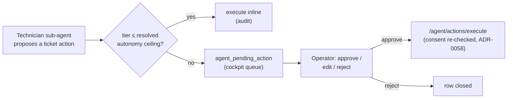

# The AI-Technician operator cockpit

The supervised-first surface for the **AI Technician** wedge (epic
[#1038](https://github.com/markdconnelly/ImperionCRM/issues/1038)): the page where an
operator reviews the ticket actions the Technician sub-agent proposes, approves / edits /
rejects them before anything touches a ticket, watches the run trace, and raises the
Technician's autonomy only once its draft-quality is trusted. Ship supervised, log every
action, earn the tier.

[← The AI suite](README.md) ·
[Autonomy — the tiered dial](autonomy-dial.md) ·
[Orchestration & observability matrix](orchestration-matrix.md)

> **Governing decisions:** [ADR-0109](../decision-records/ADR-0109-actuation-autonomy-dial.md)
> (the 1–5 actuation dial + the pending-action cockpit) · ADR-0055 (action tiers
> T0–T3) · ADR-0058 (consent re-asserted at send) · ADR-0050 (`agents:operate` admin
> gate). The runtime that *proposes* and *executes* lives in the backend
> (`ImperionCRM_Backend`, system [CLAUDE.md §1](../../CLAUDE.md)) — this repo renders the
> surface and reads PostgreSQL.

---

## 1. What it is

Route: **`/operator/technician`** (under Settings → *Technician cockpit*; admin-only,
`canSeeAgentPages`). The page has three parts:

1. **Ticket queue** — the Technician's proposed actions that sit **above** its resolved
   autonomy ceiling and are therefore parked for a human. Each item shows the catalog
   action kind, the ADR-0055 tier (T0–T3), the dial decision that routed it here
   (`dial L{level} · ceiling {tier}`), the target silver `ticket`, the editable proposed
   body, the rationale, and — when present — a link to the glass-box run trace.
2. **Approve / edit-and-approve / reject** — the cockpit controls. Approving routes
   through the backend approval-gated executor (`/agent/actions/execute`), with consent
   re-asserted (ADR-0058) and the approving human recorded as the audited actor; an edit
   sends the operator's revised body; a reject closes the row.
3. **Autonomy dial** — the per-workflow dial bound to the `technician` workflow. Raising
   it lets routine, low-tier actions execute inline so fewer items hit the queue; the
   Mark-gate keeps money / customer-facing / deploy legs human-queued regardless.

---

## 2. Data sources

| Surface | Reads | Module |
|---|---|---|
| Ticket queue | `agent_pending_action` (mig 0158) where `agent_key='technician'` and `status='pending'`, joined to silver `ticket` via `payload->>'ticketId'` | `src/lib/agent/technician-cockpit.ts` |
| Run trace link | `agent_run` / `agent_message` (mig 0056) via the existing glass-box viewer | `/workflows/runs/[id]` |
| Autonomy dial | `agent_autopilot_policy` (mig 0123) for the `technician` workflow | `getAutonomyPolicy` in `src/lib/agent/icm-runs.ts` |

All reads are **read-only and degrade** in the app's tiers (ADR-0042): DB unset → sample
rows; query failure → empty list. The decision write and the autonomy flip go through the
backend (the web role has no `UPDATE` on `agent_pending_action` / `agent_autopilot_policy`)
via `agents:operate`-gated server actions in `src/app/(app)/operator/actions.ts`.

---

## 3. What is live vs. proposed

| Piece | State | Note |
|---|---|---|
| The cockpit surface (queue + controls + dial), read-side + degradation | **Live (this PR, #1056)** | renders sample data until the Technician produces real rows |
| `agent_pending_action` / `agent_action_autonomy` schema | **Live (mig 0158, prod-applied)** | ADR-0109 |
| The L0–L3 autonomy dial bound to `technician` | **Live (reuses the wired dial)** | ICM `agent_autopilot_policy` |
| **Backend cockpit-decision endpoint** (`/orchestration/cockpit/decide`) | **Pending** — the action degrades honestly until wired | backend run-ledger + propose-flow, [BE #258](https://github.com/markdconnelly/ImperionCRM_Backend/issues/258) / [#263](https://github.com/markdconnelly/ImperionCRM_Backend/issues/263) |
| Technician runs writing `agent_run` (the trace link target) | **Pending** | BE #258 — the CRM orchestrator writes `audit_log`, not `agent_run`, today (ADR-0109 Context) |
| **Native 1–5 actuation slider** (replaces the L0–L3 dial on this surface) | **Proposed** — own issue | [#1013](https://github.com/markdconnelly/ImperionCRM/issues/1013), pure helper `src/lib/agent/action-autonomy.ts` already shipped |

No invented features — where a piece is dormant, the surface says so in line.

---

## 4. Security posture

- **Admin-only.** The route + nav entry gate on `canSeeAgentPages`; the controls gate on
  `agents:operate` (ADR-0050). A non-admin who reaches the page sees a read-only view.
- **Approval-gated sends.** Nothing executes without a human decision; the backend
  re-asserts consent at execution (ADR-0058) and stamps the approver as the actor.
- **No secrets, no PII in code or docs.** The cockpit renders the same drafted-action
  payload the propose path already carries — never a credential (ADR-0109).
