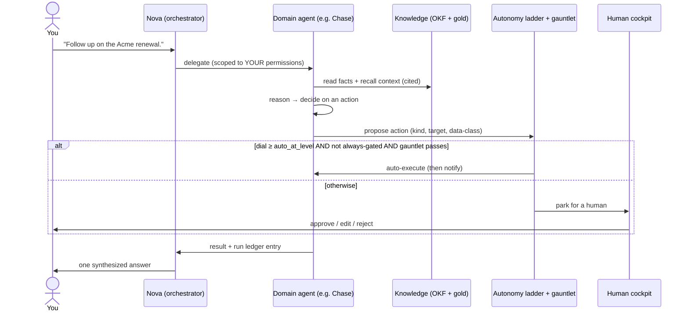

# Understanding the AI agent system — start here

> **Read this first.** This is the single narrative walkthrough of how Imperion OS's
> AI agents actually work — end to end, in plain language. It is the front door to
> [`docs/agents/`](README.md): once the picture below makes sense, the other guides
> in this folder fill in each piece with depth. Nothing here is invented — every
> claim links to the reference doc or ADR that owns it.
>
> Audience: a new engineer, a new operator, or a new agent that needs the whole map
> before diving into one corner of it.

---

## 1. The one-sentence model

**A human talks to one agent. Everything else happens behind it.**

That one agent is the **orchestrator** (named **Nova**). You ask Nova for something;
Nova figures out who should handle it, hands the work to a specialist, supervises the
result, and gives you back a single answer. You never juggle a fleet of bots — you
have one point of contact, and the org behind it is an implementation detail you can
ignore until you want to look (governing decision:
[ADR-0091](../decision-records/ADR-0091-agent-icm-platform-consolidated.md) §1;
core principle [CLAUDE.md §2.2](../../CLAUDE.md)).

This single choke point is not a UX nicety — it is what makes the whole system safe
to operate. Because every request flows through one place, permissions, memory, and
audit all have exactly one gate to enforce instead of twenty-six.

---

## 2. The mental model: agents are processes on a data operating system

Imperion OS is built as **an operating system for AI agents over the company's
knowledge and actions**. The metaphor is load-bearing and worth holding in your head:

| OS concept | Imperion OS |
|---|---|
| Filesystem | the **medallion data tiers** (bronze → silver → gold) |
| Type system | the **OKF semantic layer** — what each entity *means* |
| Long-term memory | **gold + Voyage embeddings** — addressable, searchable knowledge |
| Permission rings | the **two-axis RLS access spine** (owner + data-class) |
| Scheduler / syscalls | the **orchestrator + the autonomy dial** |
| Processes | the **agents** |
| I/O | the **Pipeline + LocalPipeline** (data in, vectors built) |

The point: an agent is not a magic box that "knows things." It is a process that
**reads curated company data, reasons over it, and proposes or takes scoped actions**
— with every step governed by the same data-driven rules. The full argument is the
canonical [`data-design-for-agents.md`](../architecture/data-design-for-agents.md)
(ADR-0110). The AI itself is settled: **Claude** for generation (a cheap + a premium
tier) and **Voyage `voyage-3-large` @ 1024 dims** for embeddings; the front end holds
**no AI key** — the backend and the on-prem pipeline call the providers.

---

## 3. The org: one orchestrator, five executives, the doers

Behind Nova is a three-tier org chart — a company staffed by agents, deliberately
shaped like a real one (decision: [ADR-0131](../decision-records/ADR-0131-executive-suite-tier.md)
Executive Suite tier; persona model: [ADR-0135](../decision-records/ADR-0135-persona-schema-and-three-matrix-org.md)).

```
                    Nova  · the orchestrator — the one agent a human talks to
                      │     delegate-only: routes & synthesizes, never actuates
   ┌──────────────┬───┴───────┬──────────────┬───────────────┐
 Rachel         Dexter       Roman         Sterling        Jessica
 Chief of Staff   CTO       Deputy CISO    Deputy CFO     Chief Risk Officer
 Internal Ops   Delivery    Security      Revenue & Fin   Platform & Assurance
   │              │            │              │                │
 people,        service,     soc,grc,      sales,           platform,
 legal          noc,problem, identity      marketing,       service-quality,
                change,                     client-success,  knowledge
                dispatch,bcdr,              procurement,
                projects                    finance
```

- **Tier 0 — the orchestrator (Nova).** The single user-facing agent. **Delegate-only**:
  it routes and synthesizes but holds no tool that changes anything. (Front door:
  [`nova.md`](nova.md).)
- **Tier 1 — the Executive Suite (5 C-suite agents).** Each runs a division: it
  aggregates what its reports are doing, writes a pulse/brief for the human it serves,
  and delegates work down. Executives are **also delegate-only** — their budgets grant
  only `{read, knowledge.search, memory.recall, delegate, handoff}`, so there is
  literally no action for them to auto-execute. That is what makes their autonomy
  ceiling *structural* rather than a promise.
- **Tier 2 — the domains (the doers).** The agents that actually do work — Felix
  (service), Chase (sales), Audrey (finance), Celeste (client-success), and ~16 more.
  Each operates under its own persona, guardrails, and autonomy ceiling.

The **authoritative roster** (every agent, who it reports to, its ceiling) is
[`org-structure.md`](org-structure.md) and [`agent-roster.md`](agent-roster.md), both
generated from the single source of truth, [`icm/org.yaml`](../../icm/org.yaml). The
count grows as divisions are staffed — trust those files, not a number frozen here.
You can also see the whole tree **live** in the app at **`/org`** (a react-flow map
with a click-through panel per agent — persona, ceiling, tool budget, live dial,
queue; [`org-visualization.md`](org-visualization.md)).

---

## 4. The life of a request — the walkthrough

This is the heart of it. Follow one request from your keystroke to a finished,
audited outcome.



Step by step:

1. **You ask Nova** for something, in chat. Nova interprets intent and decides which
   division/agent owns it.
2. **Nova delegates** the work down — to a C-suite agent who delegates further, or
   straight to the domain doer. Crucially, the worker inherits **your** Entra
   permission scope: an agent acting for you can never reach data or actions you
   yourself couldn't (ADR-0091, the single-permission-choke-point rule).
3. **The agent reasons over knowledge.** It pulls structured facts and semantic
   context from the company's curated data — **grounded** by the OKF semantic layer so
   it uses the right meaning of each entity, and **always cited, never fabricated**
   ([`knowledge-and-rag.md`](knowledge-and-rag.md), [`agent-rooms-okf.md`](agent-rooms-okf.md)).
4. **The agent decides on an action** and *proposes* it as a structured object: what
   kind of action, against what target, in what data-class (e.g. "send renewal email
   to Acme", `data_class = client_pii`).
5. **The autonomy ladder + gauntlet decide auto-vs-park** (next section). Either the
   action auto-executes and the agent notifies, or it **parks** to a human cockpit for
   approve / edit / reject. This is the safety valve.
6. **Everything is logged.** Each run writes to the `agent_run` ledger with full
   correlation (conversation → run → action), so any outcome is traceable after the
   fact ([`orchestration-matrix.md`](orchestration-matrix.md)).
7. **Nova synthesizes** the result back into one answer for you.

---

## 5. How an agent decides what it is *allowed* to do

Autonomy is **earned, mechanical, and stored as data** — never a prompt instruction
that says "please don't send." A prompt can be talked around; a refused grant cannot.

**The canonical ladder (L0–L5)** pins what each dial level means as a *capability
class*, so the dial means the same thing for every agent (decision:
[ADR-0128](../decision-records/ADR-0128-canonical-agent-autonomy-ladder.md); full
guide: [`autonomy-dial.md`](autonomy-dial.md)):

| Level | What it auto-executes |
|---|---|
| **L0 · observe** | read, research, surface — no writes, no proposals |
| **L1 · propose** | drafts only; everything **parks** (the default-safe wedge posture) |
| **L2 · auto-internal** | internal, **reversible** writes (CRM hygiene, notes); customer-facing parks |
| **L3 · auto-low-risk-external** | standard low-risk external touches, execute-then-notify |
| **L4 · reversible-auto** | broad auto-execution of reversible actions behind an undo window |
| **L5 · max-within-ceiling** | maximal autonomy — everything auto-executes *except the hard ceiling* |

Two per-action tags do the real work, and one rule combines them:

- **`auto_at_level`** — the lowest rung at which an action may auto-execute. Below it,
  it parks. (The action's inherent risk floor.)
- **`always_gate`** — the **dial-proof hard ceiling**. Some actions *never* auto-execute
  at any level: external commitments that bind the company (send-for-signature, pricing,
  contract terms) and anything touching money. The sensitive data-classes —
  `financial`, `security_credentials`, `client_pii` — carry their own always-gate
  ([ADR-0118](../decision-records/ADR-0118-data-class-third-rls-axis-action-ceiling.md)).

> **The selection rule is total and deterministic:**
> an action auto-executes **if and only if** `dial ≥ auto_at_level` **AND** `NOT always_gate`
> **AND** the gauntlet passes — otherwise it **parks to the cockpit**.

The **gauntlet** is the runtime sequence of gates an action must clear before it fires
(permission, scope, actuation-level, hard-ceiling, and more). And above all of it sits
**one human queue**: regardless of an agent's rung, anything customer-facing, money,
a production migration, a deploy, or a `v1.0.0`-style milestone routes to a single
human gate (the **Gatekeeper** role). That single reviewer — not the tooling — is the
real ceiling on the whole system.

Two special cases worth knowing early, because they look like exceptions:

- **Finance never moves money.** Audrey and the finance workflows are read-only over
  QuickBooks; QBO is the system of record for money and is read-only on our side. Each
  finance workflow declares its autonomy explicitly rather than inheriting the ladder
  ([ADR-0139](../decision-records/ADR-0139-finance-autonomy-explicit-per-workflow.md)).
- **Advisory desks are consultable but inert.** A domain agent can answer a question
  with its full reasoning (an `advisory` workspace) at L0 — read-only, no side effect,
  no send ([ADR-0138](../decision-records/ADR-0138-advisory-desk-archetype.md)).

---

## 6. Where the human stays in control

The system is **supervised-first by design**. The human surfaces:

- **The chat panel** — the right-hand orchestrator on every page; how you talk to Nova.
- **`/agents`** (admin) — the operations page: each agent's preset, budget, spend, and
  its **autonomy slider** (`agents:operate`-gated). This is where you dial an agent up
  or down. ([`agent-platform.md`](agent-platform.md).)
- **`/operator/cockpit`** — the cross-agent approval queue: *every* agent's parked
  actions in one place — proposing agent, rationale, target, the dial decision — with
  approve / edit / reject wired to the live executor ([`approval-cockpit.md`](approval-cockpit.md)).
- **`/operator/technician`** — the same idea scoped to the AI-Technician (Felix), the
  first wedge surface ([`technician-cockpit.md`](technician-cockpit.md)).
- **`/org`** — the live org map described above.
- **`/board`** — the AI Board of Directors: a panel of advisory personas that
  deliberate and recommend, ratified or overruled by the human ([`board-of-directors.md`](board-of-directors.md)).

Backing those surfaces: **sends are always approval-gated** (every outbound message
exits through one consent-re-asserted path — there is no other route to a client), the
autonomy dial is reversible and audited, and a **kill-switch** can pause an agent,
a division, or the whole fleet. Quality is held by an **eval plane** — golden test
sets score each agent's runs, and a CI gate makes *raising* an agent's autonomy safe
rather than a leap of faith ([`eval-quality-plane.md`](eval-quality-plane.md)).

---

## 7. What is live today vs. dormant

Be honest with yourself about state before trusting a flow:

- **The factory is built top-to-bottom on `main`** — Nova, the 5 C-suite, the domain
  agents, their personas, playbooks, and eval goldens all exist as definitions.
- **The runtime is gated.** Agents don't *act* in production yet: that waits on the
  backend delegate/handoff executor + the autonomy dial being switched on + the gold
  vector store being seeded (so `knowledge.search` returns more than nothing). Much of
  what looks "deferred" is **deploy-dormant**, not missing — it lights up when its
  credential lands and the collectors hydrate.
- **Operating rule today:** every agent is propose-only / test-pool until Mark opens
  the live pool. Treat every customer-facing action as parked.

The dated, authoritative "what's actually shipped" ledger is
[`docs/STATE.md`](../STATE.md) — always reconcile a feature against it (and against the
GitHub issues/PRs + ADRs) before relying on it.

---

## 8. Go deeper

This narrative is the map; these are the territories. Read in roughly this order:

| If you want to understand… | Read |
|---|---|
| The whole AI suite as an indexed library | [`README.md`](README.md) |
| The orchestrator front door | [`nova.md`](nova.md) |
| The full org tree + roster | [`org-structure.md`](org-structure.md) · [`agent-roster.md`](agent-roster.md) |
| Every agent on one observability map | [`orchestration-matrix.md`](orchestration-matrix.md) |
| Autonomy, the dial, and the hard ceiling | [`autonomy-dial.md`](autonomy-dial.md) |
| How an agent workspace is declared | [`agent-yaml-schema.md`](agent-yaml-schema.md) · [`icm.md`](icm.md) |
| The self-hosted runtime that executes agents | [`cma-runtime.md`](cma-runtime.md) |
| Knowledge, RAG, and OKF grounding | [`knowledge-and-rag.md`](knowledge-and-rag.md) · [`agent-rooms-okf.md`](agent-rooms-okf.md) |
| The human approval surfaces | [`approval-cockpit.md`](approval-cockpit.md) · [`technician-cockpit.md`](technician-cockpit.md) |
| Why the data is shaped for agents at all | [`../architecture/data-design-for-agents.md`](../architecture/data-design-for-agents.md) |

**Governing ADRs:** [ADR-0091](../decision-records/ADR-0091-agent-icm-platform-consolidated.md)
(agent & ICM platform) · [ADR-0110](../decision-records/ADR-0110-rebrand-imperion-os.md)
(the OS framing) · [ADR-0128](../decision-records/ADR-0128-canonical-agent-autonomy-ladder.md)
(autonomy ladder) · [ADR-0131](../decision-records/ADR-0131-executive-suite-tier.md)
(Executive Suite) · [ADR-0135](../decision-records/ADR-0135-persona-schema-and-three-matrix-org.md)
(persona schema) · [ADR-0138](../decision-records/ADR-0138-advisory-desk-archetype.md)
(advisory desks) · [ADR-0139](../decision-records/ADR-0139-finance-autonomy-explicit-per-workflow.md)
(finance autonomy).
