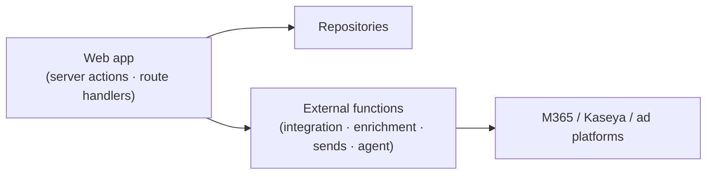

# 🧩 API

The contracts between the web app, external functions, and integrations.

[← Documentation library](../README.md)

## Shape

Most reads/writes go through **server actions + the repository layer** (no public REST
surface for core CRUD). External functions expose the integration/enrichment/agent
endpoints the app calls.

## What belongs here

- An **OpenAPI spec** + an endpoint catalog for the external-function surface.
- Per endpoint: purpose · inputs · outputs · validation · dependencies · security.

> Status: **server actions + the repository layer are built and live** (real CRUD and
> reads against PostgreSQL). The **external-function** surface (OAuth ingestion, real
> sends, enrichment) is stubbed (`src/lib/services`) and **fails
> closed** until it lands — document each external endpoint here as it does.

## Live external endpoints (backend Function App, MI bearer + Easy Auth)

| Endpoint | Used by | Contract |
| --- | --- | --- |
| `POST /api/agent` | Agent panel (`askAgentAction`) | One orchestrator turn → `{ text, routedTo, routingReason, usage, … }` (backend ADR-0036) |
| `GET /api/agent/settings` | AI Agents page | `{ preset, budgetUsdMonthly, models, spendMonthToDateUsd, presets }` (backend ADR-0037 / ADR-0048) |
| `PUT /api/agent/settings` | AI Agents page (admin save) | Body `{ preset?, budgetUsdMonthly?, actingUserId? }` → same shape |

Governing decisions:
[ADR-0018 GUI-only frontend](../decision-records/ADR-0018-gui-only-frontend-external-functions.md) ·
[ADR-0012 integration identity map](../decision-records/ADR-0012-integration-identity-map-ingest-poll.md)
