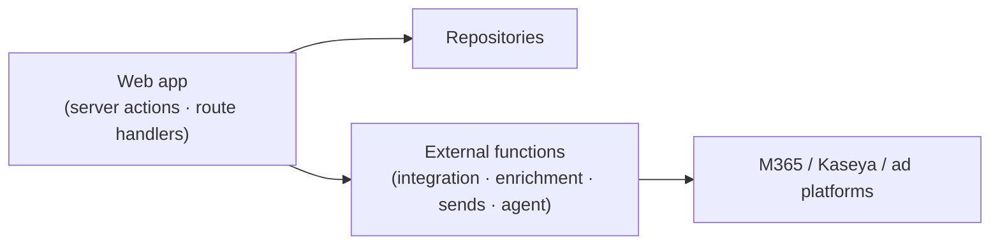

# 🧩 API

The contracts between the web app, external functions, and integrations.

[← Documentation library](../README.md)

## Shape

Most reads/writes go through **server actions + the repository layer** (no public REST
surface for core CRUD). External functions expose the integration/enrichment/agent
endpoints the app calls.

## What belongs here

- An **OpenAPI spec** + an endpoint catalog for the external-function surface.
- Per endpoint: purpose · inputs · outputs · validation · dependencies · security.

> Status: **server actions + the repository layer are built and live** (real CRUD and
> reads against PostgreSQL). The **agent**, **board**, and **per-user OAuth connection**
> surfaces are live (below); the remaining external surface (ingestion engines, real
> sends, enrichment) is stubbed (`src/lib/services`) and **fails closed** until it
> lands — document each external endpoint here as it does.

## Live external endpoints (backend Function App, MI bearer + Easy Auth)

| Endpoint | Used by | Contract |
| --- | --- | --- |
| `POST /api/agent` | Agent panel (`askAgentAction`) | One orchestrator turn → `{ text, routedTo, routingReason, usage, … }` (backend ADR-0036) |
| `GET /api/agent/settings` | AI Agents page | `{ preset, budgetUsdMonthly, models, spendMonthToDateUsd, presets }` (backend ADR-0037 / ADR-0048) |
| `PUT /api/agent/settings` | AI Agents page (admin save) | Body `{ preset?, budgetUsdMonthly?, actingUserId? }` → same shape |
| `POST /api/board/sessions` | Board page (`conveneBoardAction`, `sales:write`) | `{ topic ≤2000, actingUserId, personaAgentIds? (1–5), context? ≤8000 }` → ALWAYS 200 past validation: `{ sessionId\|null, status: concluded\|failed\|paused, message, recommendation\|null, usage }`; `paused` = monthly budget reached, no session started; synchronous ~30–90s (backend ADR-0039) |
| `GET /api/board/sessions/{id}` | Board detail (DB-unset fallback — direct reads are primary, ADR-0042) | `{ session, members[], messages[] (agentId null = synthesis voice), recommendation\|null }` |
| `GET /api/board/agents` | Convene persona picker (DB-unset fallback) | `{ agents: [{ id, name, personaRole }] }` — active `module='board'` personas |
| `POST /connections/{provider}/start` | Settings connect (`connectAction`) | `{ userId, displayName? }` → `{ authorizationUrl, state }` — one-time CSRF state parked in Key Vault (backend ADR-0038) |
| `POST /connections/{provider}/callback` | The web app's callback route (below) | `{ code, state }` → `{ connectionId, provider, status }` — tokens → Key Vault; 501 unconfigured · 400 bad/expired state · 502 exchange failed |
| `POST /connections/{provider}/disconnect` | Settings disconnect (`disconnectAction`) | `{ userId }` → `{ disconnected, connectionId, status }` — deletes the Key Vault token secret, row → `revoked` |

## Web-app route handlers (inbound)

| Route | Purpose | Security |
| --- | --- | --- |
| `GET /api/connections/{provider}/callback` | OAuth provider redirect target — forwards `code`+`state` to the backend server-side, then bounces to Settings with a `connect=<result>` notice | Session + `settings:write` (ADR-0045); CSRF/replay via the backend's one-time state; no token material transits the web app |

Governing decisions:
[ADR-0018 GUI-only frontend](../decision-records/ADR-0018-gui-only-frontend-external-functions.md) ·
[ADR-0012 integration identity map](../decision-records/ADR-0012-integration-identity-map-ingest-poll.md)
