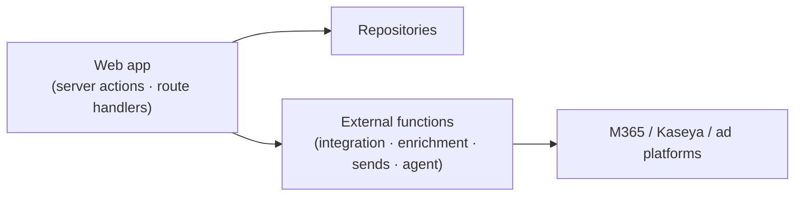

# 🧩 API

The contracts between the web app, external functions, and integrations.

[← Documentation library](../README.md)

## Shape

Most reads/writes go through **server actions + the repository layer** (no public REST
surface for core CRUD). External functions expose the integration/enrichment/agent
endpoints the app calls.

## What belongs here

- An **OpenAPI spec** + an endpoint catalog for the external-function surface.
- Per endpoint: purpose · inputs · outputs · validation · dependencies · security.

> Status: external-function endpoints are stubbed (`src/lib/services`) and **fail closed**
> until they exist; document each here as it lands.

Governing decisions:
[ADR-0018 GUI-only frontend](../decision-records/ADR-0018-gui-only-frontend-external-functions.md) ·
[ADR-0012 integration identity map](../decision-records/ADR-0012-integration-identity-map-ingest-poll.md)
