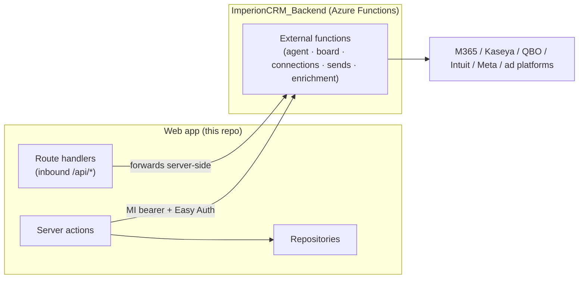

# 🧩 API

The contracts between the **Imperion OS** web app, the external Azure
Functions backend, and the integrations they reach. This is the onboarding-grade reference
for *how the app talks to anything outside the browser*.

[← Documentation library](../README.md) ·
[Integrations](../integrations/README.md) ·
[System of systems](../architecture/system-of-systems.md)

---

## 1. The big picture: there is (almost) no public REST surface

Imperion OS is a Next.js app, not an API product. **Most reads and writes go
through server actions + the repository layer** — there is no public REST surface for core
CRUD. The API surface that *does* exist is narrow and falls into three buckets:

1. **Server actions → repositories.** The default path for CRUD and reads. Direct,
   server-side, no HTTP API. (Documented per-module, not here.)
2. **Outbound calls to the backend Function App.** Processes (the agent turn, a board
   session, an OAuth start/callback, a real send) are *not* run in the front end — they are
   called on the backend over a managed-identity bearer behind Easy Auth (ADR-0028 /
   ADR-0042). These are listed in §3.
3. **Inbound route handlers (`/api/*`).** A small set of HTTP endpoints the *browser* or an
   *external provider* hits — OAuth redirect targets, an activity feed, notifications.
   Listed in §4.

> **Why this shape.** The front end is GUI-only (ADR-0042): it renders and orchestrates,
> but every *process* lives in a sibling repo. The front end never holds an AI provider key
> (ADR-0043) and never custodies a token (it gets a Key Vault *reference* back). See
> [integrations](../integrations/README.md) for the connection model behind these calls.

---

## 2. Status

- **Server actions + the repository layer are built and live** — real CRUD and reads
  against PostgreSQL.
- The **agent**, **board**, and **per-user OAuth connection** surfaces are **live** (§3).
- The remaining external surface (the deferred ingestion engines, some enrichment paths) is
  stubbed in `src/lib/services` and **fails closed** until it lands — document each external
  endpoint here as it does.

---

## 3. Live external endpoints (backend Function App)

Called server-side by the web app with a **managed-identity bearer**, behind **Easy Auth +
a caller allowlist** (backend ADR-0035). Verified against the front-end service callers
(`src/lib/services/index.ts`) and the route handlers below.

| Endpoint | Used by | Contract |
| --- | --- | --- |
| `POST /api/agent` | Agent panel (`askAgentAction`) | One orchestrator turn → `{ text, routedTo, routingReason, usage, … }` (backend ADR-0036) |
| `GET /api/agent/settings` | AI Agents page | `{ preset, budgetUsdMonthly, models, spendMonthToDateUsd, presets }` (backend ADR-0037 / ADR-0048) |
| `PUT /api/agent/settings` | AI Agents page (admin save) | Body `{ preset?, budgetUsdMonthly?, actingUserId? }` → same shape |
| `POST /api/board/sessions` | Board page (`conveneBoardAction`, `sales:write`) | `{ topic ≤2000, actingUserId, personaAgentIds? (1–5), context? ≤8000 }` → ALWAYS 200 past validation: `{ sessionId\|null, status: concluded\|failed\|paused, message, recommendation\|null, usage }`; `paused` = monthly budget reached, no session started; synchronous ~30–90s (backend ADR-0039) |
| `GET /api/board/sessions/{id}` | Board detail (DB-unset fallback — direct reads are primary, ADR-0042) | `{ session, members[], messages[] (agentId null = synthesis voice), recommendation\|null }` |
| `GET /api/board/agents` | Convene persona picker (DB-unset fallback) | `{ agents: [{ id, name, personaRole }] }` — active `module='board'` personas |
| `POST /connections/{provider}/start` | Settings connect (`connectAction`) | `{ userId, displayName? }` → `{ authorizationUrl, state }` — one-time CSRF state parked in Key Vault (backend ADR-0038) |
| `POST /connections/{provider}/callback` | The web app's callback route (§4) | `{ code, state }` → `{ connectionId, provider, status }` — tokens → Key Vault; 501 unconfigured · 400 bad/expired state · 502 exchange failed |
| `POST /connections/{provider}/disconnect` | Settings disconnect (`disconnectAction`) | `{ userId }` → `{ disconnected, connectionId, status }` — deletes the Key Vault token secret, row → `revoked` |
| `POST /connections/qbo/start` | QuickBooks connect (`connectQuickBooksAction`, `settings:write`) | parks CSRF `state` in Key Vault, returns Intuit consent URL (ADR-0085) |
| `POST /connections/qbo/callback` | The QBO callback route (§4) | `{ code, realmId, state }` → exchanges code, writes token to `conn-company-qbo`, row → `active` |
| `POST /api/autotask/tickets` | `ticketsService.createTicket` (SBR / Feedback / Tasks) | `{ queue, title, description?, accountId, origin:{type,id} }` → idempotent ticket create (ADR-0052 §7); retried push returns the existing `ticketRef` (`created:false`) |
| `GET /api/orchestration/metrics/{key}` | `metricsService.lookup` — the metric query interface (#1115, epic #1050) | `?period=&period_start=&period_end=` (YYYY-MM-DD) → `{ key, name, value\|null, unit, grain, asOf, dataClass, status }`. The single governed-number read path the `metric_lookup` sub-agent tool ALSO uses, so agent + BI agree by construction; the engine binds the pre-vetted `metric_definition.expression` in a READ-ONLY txn (backend #259/ADR-0078). `status` ∈ ok\|unbound\|not_found\|error |

> Some of these are **fail-closed stubs** until the backend app settings + provider app
> registrations land (e.g. unconfigured OAuth providers return 501, the web app records a
> stub row with a notice — the page never breaks). See
> [integrations](../integrations/README.md) and
> [`../operations/credential-wiring-next-steps.md`](../operations/credential-wiring-next-steps.md).

---

## 4. Web-app route handlers (inbound `/api/*`)

These are HTTP endpoints in *this* repo (`src/app/api/**/route.ts`). They are hit by the
browser or by an external provider redirect — never by another service for core data.
Verified against source.

| Route | Method | Purpose | Security |
| --- | --- | --- | --- |
| `/api/connections/{provider}/callback` | GET | Per-user OAuth provider redirect target — forwards `code`+`state` to the backend server-side, then bounces to Settings with a `connect=<result>` notice | Session + `settings:write` (ADR-0045); CSRF/replay via the backend's one-time state; **no token material transits the web app** |
| `/api/qbo/callback` | GET | Intuit (QuickBooks) OAuth redirect target — forwards `code`+`realmId`+`state` to the backend, bounces to Settings with `qbo=<result>` | Session + `settings:write` (admin only); CSRF via the backend's one-time state |
| `/api/notifications` | GET | The signed-in user's in-app notifications — `?unread=1` filters to unread, `?limit` (1–100, default 30) paginates; returns `{ notifications, unreadCount }` | Session (returns an empty payload when unauthenticated); read-only |
| `/api/work/{parentType}/{parentId}/activity` | GET | Work-object activity feed (ADR-0064 A1, #330) — `?comments=1` comments-only, `?limit`/`?offset` paginate; returns `{ entries }` newest-first (comments ∪ audit events). Soft-deleted comment bodies never surface | Session (middleware-gated) + UUID-validated `parentId` + provisioned acting user, else empty (#883); read-only |
| `/api/metrics` | GET | Governed-metric CATALOG (#1115) — `{ metrics: [{ key, name, grain, unit, owner, dataClass, bound }] }` for the BI metric picker. Direct DB read of `metric_definition` (a definition is a formula, not row data) | Session (middleware-gated); filtered to the caller's `data_class` read ceiling (#1034) on top of DB RLS; read-only |
| `/api/metrics/{key}` | GET | Resolve ONE governed metric's value (#1115) — `?period=&period_start=&period_end=` → the `MetricResult` shape. Enforces the `data_class` gate (returns `status:forbidden` WITHOUT a backend call when out of ceiling), then delegates to the backend engine. Never sends SQL — only the key + sanitized params | Session (middleware-gated) + `data_class` read axis (#1034); read-only |
| `/api/auth/[...nextauth]` | (NextAuth) | Entra ID auth handler (sign-in / callback / session). | Managed by NextAuth + Entra (ADR-0005) |

---

## 5. Cross-cutting contract rules

- **Identity & auth.** Inbound `/api/*` routes require an Entra session; admin-scoped ones
  also require `settings:write`. Outbound backend calls carry a managed-identity bearer and
  are accepted only from the allowlisted caller (backend ADR-0035).
- **Secrets stay in Key Vault.** No token, key, or connection string is returned to the
  browser or stored in this repo's DB — only Key Vault *references*. **Never commit
  secrets.** Full posture: [unified security standard](../security/unified-security-standard.md).
- **Fail closed, never break the page.** Unconfigured external surfaces degrade to a stub +
  honest notice rather than throwing; result vocabularies (e.g. the `qbo=` / `connect=`
  codes) are pure modules in `src/lib/integrations` so the UI can render a specific message.
- **Idempotency where it writes.** Backend writes that could be retried (e.g. Autotask
  ticket creation) carry a server-side idempotency ledger so a retry returns the existing
  reference (ADR-0052 §7).

---

## 6. What belongs here next

As the deferred external surface lands, document each endpoint here with: purpose · inputs ·
outputs · validation · dependencies · security. An **OpenAPI spec** for the external-function
surface is the target artifact (CLAUDE.md §8) once the contracts stabilize.

Governing decisions:
[ADR-0018 GUI-only frontend](../decision-records/ADR-0018-gui-only-frontend-external-functions.md) ·
[ADR-0012 integration identity map](../decision-records/ADR-0012-integration-identity-map-ingest-poll.md) ·
[ADR-0042 four-repo division of labor](../decision-records/ADR-0042-division-of-labor-reads-direct-processes-backend.md)
