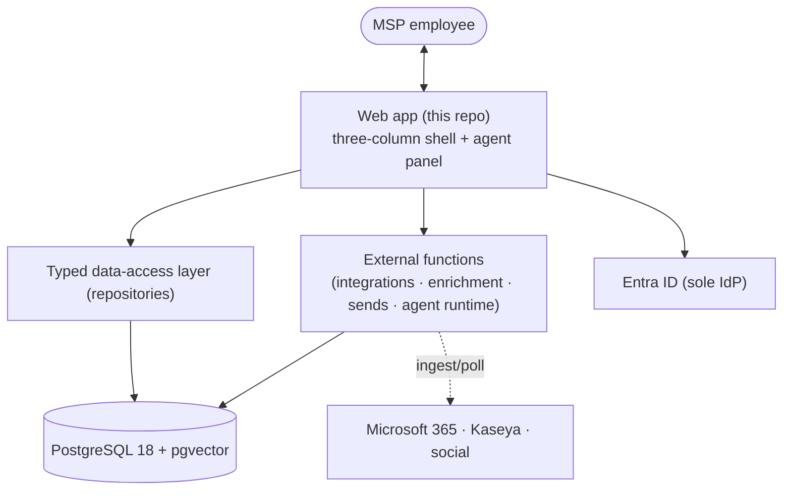

# 🧭 Architecture

How Imperion CRM is shaped, where its boundaries are, and the motion it models.

[← Documentation library](../README.md)

## In one picture

The web app is the **authoritative interface** (ADR-0018); heavy and integration work
runs in external functions. Everything shares one store: **PostgreSQL + pgvector**.

## What's here

| Doc | What it covers |
| --- | --- |
| [application-boundary](application-boundary.md) | **What lives in this repo vs. in external functions** — the single most important boundary to understand before changing code. |
| [customer-lifecycle](customer-lifecycle.md) | The assessment-led GTM motion (audience → lead → discovery → paid assessment → managed services → SBRs) and how it maps to the schema. |
| [product-requirements](product-requirements.md) | Scope, build phasing, and open questions. |

## The eight required diagrams

Per CLAUDE.md §8 this area owns the eight system diagrams — high-level, application,
infrastructure, data-flow, security, agent, integration, deployment. Diagram source is
kept in [../diagrams](../diagrams/README.md) and the [data model](../database/data-model.md);
this README is the index that ties them together.

## Governing decisions

[ADR-0001 open web stack](../decision-records/ADR-0001-open-web-stack-over-power-platform.md) ·
[ADR-0004 single orchestrator](../decision-records/ADR-0004-single-orchestrator-agent-model.md) ·
[ADR-0010 data model](../decision-records/ADR-0010-customer-data-model-dual-axis-stages.md) ·
[ADR-0018 GUI-only frontend](../decision-records/ADR-0018-gui-only-frontend-external-functions.md)
