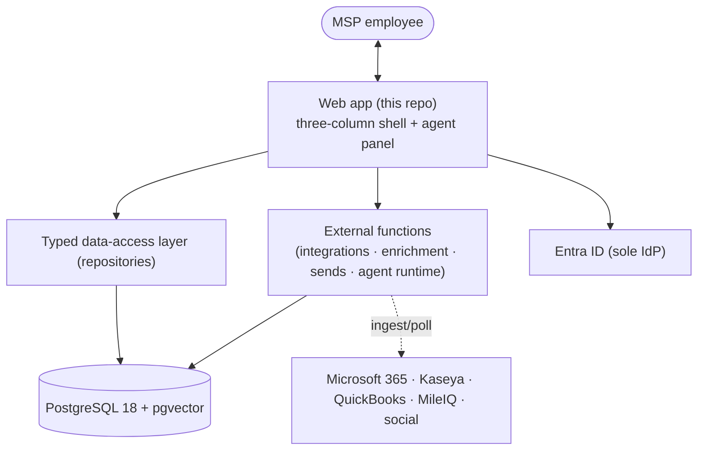
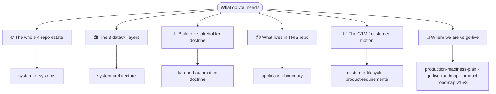

# 🧭 Architecture

How **Imperion Business Manager** is shaped, where its boundaries are, and the motion
it models. This is the index for the architecture area — start here, then follow the
path that matches what you need.

[← Documentation library](../README.md) ·
[Capability overview](../product/imperion-business-manager-overview.md) ·
[Decision records](../decision-records/README.md)

> **Imperion Business Manager** is the single operational platform a Managed Service
> Provider runs its whole business on — **CRM + ERP + extras + a full AI suite** over
> one data store and one identity spine. It began as a CRM ("Imperion CRM" survives in
> the repo slug and `package.json` name, which are out of scope for the rebrand); the
> product and its docs are now **Imperion Business Manager**. For the full capability
> surface, read the
> [capability overview](../product/imperion-business-manager-overview.md).

## In one picture

The web app is the **authoritative interface** (ADR-0018); heavy and integration work
runs in external functions. Everything shares one store: **PostgreSQL + pgvector**.
This repo is one of **four** that make up the product — the whole-estate map is
[system-of-systems](system-of-systems.md).

## Pick your path

## What's here

| Doc | What it covers |
| --- | --- |
| [system-of-systems](system-of-systems.md) | **The four repositories as one platform** — who owns what, how a fact crosses repo boundaries (bronze → silver → gold), the GUI-reads-vs-backend-processes boundary, identity across the estate, and the canon-ownership rules. **Start here for the cross-repo view; it is authoritative for everything cross-repo.** |
| [system-architecture](system-architecture.md) | **The three layers in one place** — Medallion data lake · Model Workspace Protocol agent framework · OKF knowledge layer — and how a fact travels source → bronze → silver → gold → agent → employee. Start here for the whole-system view inside this repo. |
| [data-and-automation-doctrine](data-and-automation-doctrine.md) | **The deeper builder + stakeholder doctrine** — the eight implementation archetypes every data object falls into, a worked example each, a master object → archetype → IKF → ICM map, and the "possible vs not possible" use-case triage. |
| [data-design-for-agents](data-design-for-agents.md) | **Why the data design is built for agentic workloads** — the data-as-kernel + second-brain-as-OS thesis, the OS map (kernel/memory/scheduler/processes/I-O/governance), the six-point superiority argument vs. an LLM bolted onto a human-form schema, and the external influences. The canonical "why our data is superior for agents" doc siblings link. |
| [application-boundary](application-boundary.md) | **What lives in this repo vs. in external functions** — the single most important boundary to understand before changing code. |
| [customer-lifecycle](customer-lifecycle.md) | The assessment-led GTM motion (audience → lead → discovery → paid assessment → managed services → SBRs) and how it maps to the schema. |
| [product-requirements](product-requirements.md) | The originally-elicited, module-by-module requirements and build phasing — the design-intent record behind the modules now shipped. |
| [product-roadmap-v1-v3](product-roadmap-v1-v3.md) | The cross-repo product roadmap: v1 "Complete" (AI-first, the whole filed product) → v2 "Refined" → v3 (TBD), with capability gates. |
| [go-live-roadmap](go-live-roadmap.md) | The internal sequencing of how the app gets fully online — phases 0–5 with exit criteria. |
| [production-readiness-plan](production-readiness-plan.md) | The cross-repo readiness snapshot: what code shipped, what remains as operator configuration, and the per-repo change lists. |
| [versioning-standard](versioning-standard.md) | The normative `MAJOR.FEATURE.MINOR` versioning + release standard shared by all four repos (ADR-0056). |

## The eight required diagrams

Per CLAUDE.md §8 this area owns the eight system diagrams — high-level, application,
infrastructure, data-flow, security, agent, integration, deployment. Several render
inline in the docs above: the **high-level** and **infrastructure** estate diagram and
the **security/identity** diagram in [system-of-systems](system-of-systems.md); the
**data-flow** and **agent** diagrams in [system-architecture](system-architecture.md)
and [data-and-automation-doctrine](data-and-automation-doctrine.md); the **integration**
surface in [application-boundary](application-boundary.md). The diagram source index is
kept in [../diagrams](../diagrams/README.md) and the
[data model](../database/data-model.md); this README is the map that ties them together.

## The four-repo estate, in one line each

| Repo | Role |
| --- | --- |
| **`ImperionCRM`** (this repo) | **GUI.** Next.js front end; owns the database schema/migrations, the OKF semantic layer, the skills canon, the unified security standard. |
| **`ImperionCRM_Backend`** | **All processes.** Identity-gated Azure Functions: orchestrator runtime, sends, executors, OAuth token custody. |
| **`ImperionCRM_Pipeline`** | **Live data.** Webhooks, bronze→silver merge, on-demand refresh. |
| **`ImperionCRM_LocalPipelineEnrichment`** | **Heavy lifting.** On-prem PowerShell: bulk ingestion, IT Glue hub, ALL vectorization. |

Full ownership table and cross-repo rules: [system-of-systems](system-of-systems.md).

## Governing decisions

The significant architecture decisions are now grouped into **consolidated dossiers**
(each carries its member ADRs verbatim with a zero-loss traceability table; the member
ADRs are retained):

- [ADR-0091 Agent & ICM platform](../decision-records/ADR-0091-agent-icm-platform-consolidated.md) — single orchestrator, agent core + AI Board, ICM, autonomy tiers, Managed Agents runtime.
- [ADR-0092 Medallion data platform](../decision-records/ADR-0092-medallion-data-platform-consolidated.md) — per-source bronze, silver entities, gold vector store (Voyage 1024d), the settled AI stack.
- [ADR-0093 Employee finance](../decision-records/ADR-0093-employee-finance-consolidated.md) · [ADR-0094 PM-parity](../decision-records/ADR-0094-pm-parity-consolidated.md) · [ADR-0095 Authorization & RBAC](../decision-records/ADR-0095-authorization-rbac-consolidated.md) · [ADR-0096 Sale → delivery](../decision-records/ADR-0096-sale-delivery-consolidated.md).

Foundational decisions still cited directly:
[ADR-0042 four-repo division of labor](../decision-records/ADR-0042-division-of-labor-reads-direct-processes-backend.md) ·
[ADR-0018 GUI-only front end](../decision-records/ADR-0018-gui-only-frontend-external-functions.md) ·
[ADR-0004 single orchestrator](../decision-records/ADR-0004-single-orchestrator-agent-model.md) ·
[ADR-0010 dual-axis data model](../decision-records/ADR-0010-customer-data-model-dual-axis-stages.md) ·
[ADR-0086 OKF semantic layer](../decision-records/ADR-0086-okf-semantic-layer-over-silver.md).
