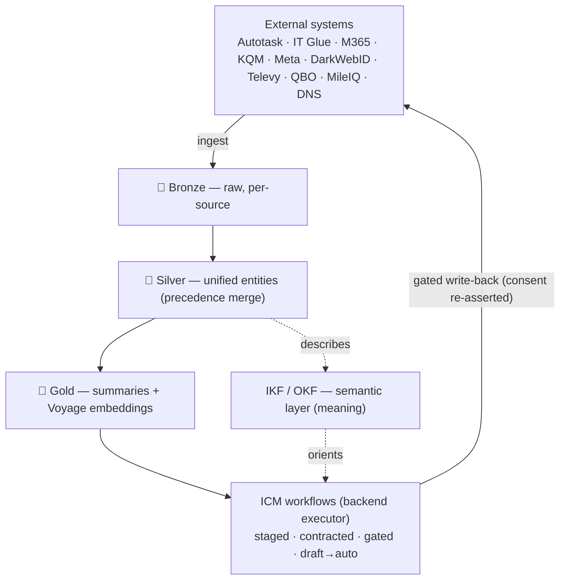

# 🧬 Data & automation doctrine — medallion, IKF, ICM

The three big data-architecture bets, why they were made, and **how every data object
in the system is actually implemented** under them. This is the builder's recipe and the
stakeholder's explainer.

[← Architecture](README.md) · [← Documentation library](../README.md)

This doc goes **deeper** than [system-architecture](system-architecture.md): that doc
narrates the three layers at altitude; this one gives the **eight implementation
archetypes** every object falls into, a worked example each, and a master map of every
silver/bronze/gold object → archetype → IKF status → acting ICM workflow.

---

## 1. One bet, three altitudes

The three decisions feel coherent because they are the **same design DNA** applied to
data, meaning, and action:

| Layer | Bet | What it refines | ADR |
| --- | --- | --- | --- |
| **Medallion** | bronze → silver → gold | the **data** (raw → trustworthy → AI-ready) | [0039](../decision-records/ADR-0039-per-source-bronze-tables.md) · [0044](../decision-records/ADR-0044-silver-contracts-tickets.md) · [0041](../decision-records/ADR-0041-gold-knowledge-vector-store.md) |
| **IKF / OKF** | concept-per-file semantic layer | the **meaning** (what an entity is, which source wins) | [0086](../decision-records/ADR-0086-okf-semantic-layer-over-silver.md) |
| **ICM** | filesystem-as-orchestration | the **action** (drafted → approved → auto) | [0061](../decision-records/ADR-0061-icm-business-process-automation.md) |

> **IKF** (Imperion Knowledge Format) is our adoption of Google's **Open Knowledge
> Format (OKF)**. **ICM** (Interpreted Context Methodology / Model Workspace Protocol;
> Van Clief, arXiv:2603.16021) is the filesystem-as-agent-architecture pattern our `icm/`
> workspaces are built on.

All three share four traits, and that is the whole pitch to any stakeholder:

1. **Progressive refinement** — nothing jumps from raw to trusted; data ripens, autonomy
   ramps, meaning accretes. Trust is *earned in stages*, never declared.
2. **Plain text, version-controlled** — migrations, IKF concept files, ICM stage
   contracts are all markdown/SQL in git. Diffable, reviewable in PRs, no black box.
3. **Human-readable = machine-readable** — the same artifact a person reads is what an
   agent consumes. No translation layer to drift.
4. **Human-in-the-loop by default; autonomy is a dial** — the safe state is default;
   automation is turned *up* deliberately and can be turned back down.

**The doctrine in one sentence:** an agent can only safely automate what it can **trust**
(medallion), **understand** (IKF), and **act on through a gated, auditable process**
(ICM) — and the autonomy dial decides how much of that action runs without us.

---

## 2. The closed loop

Data flows up the medallion tiers; IKF gives that data meaning an agent can consume; ICM
acts on it — reading the meaning, retrieving the gold context, drafting the action, and
(under the autonomy dial) executing through one approval-gated, consented, audited path.
Writes flow back to source systems and re-enter as bronze. A closed, auditable loop.

---

## 3. The eight implementation archetypes

The system has ~190 tables/views, but nearly every one is an instance of **one of eight
shapes**. Identify an object's archetype and you know its bronze/silver/IKF/ICM
implementation. This is what makes the system buildable (you instantiate, you don't
invent) and explainable (eight shapes, not 190 special cases).

### Worked example (the full machine): `account`

Every archetype is this with parts added or removed.

- **Bronze:** four per-source physical tables — `autotask_companies`,
  `apollo_companies`, `itglue_companies`, `website_companies` — each holding the raw
  `payload_bronze`; a `account_bronze_all` UNION view adds a `source` discriminator.
- **Silver:** the pipeline reads the union, normalizes each row, matches to an existing
  `account` (by domain + name), and **recomputes the unified row field-by-field, each
  field from the highest-precedence non-empty source.** Verified order
  ([ADR-0039](../decision-records/ADR-0039-per-source-bronze-tables.md)):
  `website > autotask > itglue > apollo`. A website row is app-created and pre-linked, so
  the merge never *creates* an account from one (the resurrection guard).
- **IKF:** `docs/database/semantic-layer/tables/account.md` — frontmatter
  (`type/title/description/resource/tags/timestamp`) + body: definition, the **authority
  rule** (the precedence order above), schema table, joins, PII note.
- **Gold:** the on-prem pipeline summarizes `account` into a `knowledge_object` and embeds
  it into `knowledge_embedding` (Voyage `voyage-3-large` @ 1024d). Drafts carry no
  embedding — invisible to retrieval until published.
- **ICM:** a workflow stage loads the IKF concept (what `account` means, which source
  wins), retrieves the gold summary as context, queries the **live DB** for specific PII
  values, drafts an artifact, and parks at a checkpoint for human approval.

### The archetypes

**A — Multi-source merge silver.** N per-source bronze tables → `*_bronze_all` union →
normalize/match/recompute by precedence → unified silver. **IKF authority = the
precedence order.** Build cost of a new source: add a bronze table + one precedence-list
entry; nothing downstream changes.

| Object | Bronze sources | Precedence (authority) |
| --- | --- | --- |
| `account` | autotask, apollo, itglue, website | website > autotask > itglue > apollo |
| `contact` | autotask, apollo, m365, itglue, website | website > autotask > itglue > m365 > apollo |
| `device` | itglue, m365, website | website > itglue > m365 |
| `opportunity` | kqm, autotask, website | website > autotask > kqm (join key `autotask_opportunity_id`) |
| `time_record` | website_time_entry, autotask_time_entry | website attendance authoritative; Autotask allocation corroborates |
| `expense_item` | website_expense_item, mileiq_drive | website → out-of-pocket $; MileIQ → miles only ($ derived by backend) |
| `credential_exposure` | darkwebid_exposures | dark-web email + domain match |

**B — Single-source-of-record silver (born silver, no merge).** The app *is* the source
of truth; no external merge. **IKF authority = "website system of record"**; the IKF body
documents the status lifecycle and joins, not a precedence rule.
`project` (+milestone/+type/+provisioning), `delivery_template` (+phase/+task),
`onboarding_step`, `handoff`, `task`, `proposal`, `assessment`, `discovery_call`,
`strategic_business_review` (+dimension_score/+ticket), `ticket` (Autotask-fetched),
`workflow` (+step/+enrollment), `audience` (+member), `event` (+registration), `campaign`
(+ad/+metric), `lead_hook`, `lead_capture_event`, `question_template` (+question),
`engagement_answer`, `meeting`, `meeting_action_item`, `interaction`.

**C — Append-only ledger + derived current-state view.** Facts are immutable; "current"
is a *view*, never an update. **IKF authority = "a change of mind is a new event, never an
update."** This is the compliance backbone — you can prove state as of any past moment.
`consent_event` → `current_consent` (the gate on every send and ad); `posture_snapshot`
(GRANT INSERT-only; grade stored at capture, never recomputed); `audit_log`,
`agent_run`/`agent_message`.

**D — Write-back sidecar (idempotent external write).** A 1:1 sidecar tracking an
idempotent write to an external system, with `write_state` + `idempotency_key` +
`external_ref` (null until written). **This is where ICM / the backend executor acts** —
the front end *requests*, the backend *writes* and stamps the id. **IKF authority =
"front end requests; backend executor performs the write."**
`time_ticket` (→ Autotask Time Ticket), `autotask_expense_report` (→ Autotask
ExpenseReport), `task_ticket_fire` (→ Autotask ticket), `project_provisioning` (→ Autotask
Project+Tasks, DocuSign-gated), `defender_incident_ticket_link`. Idempotency + a
write-state column is how "automate everything" avoids double-firing.

**E — Golden / drift (security posture).** Observed state (bronze) + human-approved
**golden** + a `classification` (compliant / drift / ungoverned / missing) by
full-outer-join. **IKF authority = "golden is human-approved; drift = observed ≠ golden;
surface, never hide."** Posture for an *unmapped* tenant still lands and surfaces in an
"unmapped" list rather than being rejected. Our MSSP engine.
`dns_golden`/`dns_domain`, `posture_policy`/`tenant_posture`, the `*_golden` policy
tables (CA, Intune, Autopilot, device-config, Defender XDR), `posture_snapshot_pillar`.

**F — Reconciliation verdict (derived comparison).** Compare two trusted sources → a
verdict view; no stored verdict where derivable. **IKF: "derived; query for actuals."**
`time_reconciliation_day`, `expense_reconciliation`, `timesheet_payroll_status`,
`monthly_close`, `expense_policy_violation`.

**G — Gold knowledge object + embedding.** On-prem produces a summary (`knowledge_object`)
+ Voyage embedding (`knowledge_embedding`, 1024d), polymorphic over any silver entity;
drafts carry no embedding (invisible until published). **IKF itself lands here** — the
roadmap vectorizes the semantic bundle into this same space so agents retrieve curated
meaning as RAG context. Vector contract pinned by
[ADR-0041](../decision-records/ADR-0041-gold-knowledge-vector-store.md).

**H — Reference / config / identity.** Enumerations, settings, identity,
secrets-by-reference. Hand/seed-managed; tokens in Key Vault, never in a row.
`app_user` (from Entra), `connection` (OAuth token custody + `poll_interval_minutes`),
`agent`/`agent_tool_grant`/`agent_settings`, `expense_category`/`qbo_expense_account`/
`expense_policy`, `pay_rate`/`mileage_rate` (comp-gated; GRANT finance+backend SELECT
only), `project_type`, `account_tenant`/`account_domain`.

---

## 4. Master coverage map

Every object → archetype → IKF status → the ICM workflow that acts on it. ✅ = an IKF
concept file exists today (the three pilots); ⏳ = expansion (issue #536), one micro-PR
per batch following the pilot template.

| Domain | Objects | Archetype | IKF | Acting ICM workflow |
| --- | --- | --- | --- | --- |
| **CRM core** | account, contact, device | A | ⏳ | research / QBR-prep; lead dedupe |
| | external_identity, contact_social_identity | H / B | ⏳ | identity resolution |
| **Sales** | opportunity | A | ✅ | sale→delivery |
| | proposal, assessment | B | ⏳ | proposal-draft |
| **Delivery/PM** | project, milestone, task, templates, onboarding_step, handoff | B | ⏳ | provisioning |
| | project_provisioning, task_ticket_fire | D | ⏳ | provisioning executor (autonomy-dialed) |
| **Engagement** | discovery_call, SBR (+scores/+ticket), question/answer | B | ⏳ | discovery-prep |
| | ticket | B (Autotask-fetched) | ⏳ | service-desk |
| **Comms** | interaction, meeting | B (+ gold) | ⏳ | every workflow's research stage |
| **Consent/enrich** | consent_event → current_consent | C (ledger) | ⏳ | **gates all sends** |
| | contact_enrichment, credential_exposure | B / A | ⏳ | exposure-response |
| **Demand gen** | campaign, ad, metric, audience, event, lead_hook, lead_capture, social_metric | B | ⏳ | lead-response ✅ / nurture |
| **Automation** | workflow (+step/+enrollment) | B | ⏳ | nurture executor |
| **Time** | time_record | A | ✅ | monthly-close |
| | timesheet, time_ticket, autotask_time_entry | B / D | ⏳ | time-approval (write sidecar) |
| **Expense** | expense_item | A | ✅ | monthly-close |
| | expense_report, autotask_expense_report, expense_reconciliation, receipt | B / D / F | ⏳ | expense-approval |
| **Security/MSSP** | posture_snapshot (+pillar) | C (INSERT-only) | ⏳ | posture-report |
| | dns_golden/domain, posture_policy, *_golden | E (drift) | ⏳ | drift-monitor (autonomy-dialed) |
| | defender_incidents/alerts/link | B / D | ⏳ | incident→ticket |
| **Reconciliation** | time_reconciliation_day, expense_reconciliation, timesheet_payroll_status, monthly_close | F (view) | ⏳ | monthly-close |
| **Gold** | knowledge_object, knowledge_embedding | G | (is the consumer) | RAG for all workflows |
| **Reference/config** | app_user, connection, agent*, categories, rates, project_type, tenants | H | ⏳ | n/a (config) |
| **Audit/board** | audit_log, agent_run/message/memory, board_*, feature_* | C / B | n/a | board deliberation |

The **maintained, every-object** version of this map — kept next to the concept files and
expanded as the build progresses — is the
[master coverage matrix](../database/semantic-layer/coverage-matrix.md). Authored IKF
concepts live at [docs/database/semantic-layer/](../database/semantic-layer/index.md).

---

## 5. ICM: the action layer in detail

ICM workflows are folders of staged markdown contracts the backend orchestrator runs one
stage at a time. Five principles ([source](https://github.com/RinDig/Interpreted-Context-Methdology),
[ADR-0061](../decision-records/ADR-0061-icm-business-process-automation.md)): one stage /
one job · plain-text interface · layered context loading · every output is an edit
surface · **configure the factory, not the product**.

**Five-layer context model** — what loads when (per-stage budget 2–8k tokens vs 30–50k
monolithic):

| Layer | File | Question | Role |
| --- | --- | --- | --- |
| 0 | `icm/CLAUDE.md` | "Where am I?" | routing protocol |
| 1 | workspace `CONTEXT.md` | "Where do I go?" | stage order, autonomy contract |
| 2 | stage `CONTEXT.md` | "What do I do?" | the contract (Job · Inputs · Process · Outputs · Audit · Checkpoint) |
| 3 | skills / references | "What rules apply?" | internalized as **constraints** (ICP, voice, offers) — often sourced from IKF |
| 4 | `output/` artifacts | "What am I working with?" | processed as **input** |

**The autonomy dial** is the single most important governance concept. Every workflow
carries `autonomy_mode`:
- **`draft` (default, always the startup state):** every checkpoint requires a human.
- **`auto`:** checkpoints self-approve *only* within explicitly contracted narrow
  conditions (e.g. lead-response stage 04 auto-sends only when intent =
  `standard-inquiry`, channel = email, stage-03 audit green, consent basis ≠ none).
  Everything else parks for a human in every mode — all DM replies, pricing/contract
  questions, complaints, any audit failure.

Flipping to `auto` is per-workflow, admin-only, audited, and reversible. **Glass-box by
construction:** every intermediate output is a plain-text artifact, so auditing what the
agent did is the substrate, not an add-on. Sends exit one approval-gated path with consent
re-asserted at execution.

> ICM vs MCP: complementary, not competing. MCP (our `postgres`, `graphify` servers) is
> *how a model reaches tools/data*; ICM is *how context is structured across a multi-stage
> workflow*. A stage may query the read-only DB via the postgres MCP.

---

## 6. What each business unit gains

| Unit | Gain | Enabling layers |
| --- | --- | --- |
| **Sales** | fast, on-brand, consent-clean lead response + managed follow-up; unified opportunity across KQM/Autotask/manual | ICM + silver A + IKF |
| **Service desk (MSP)** | JIT ticket-fire, auto-provisioned projects/tasks, unified ticket timeline | ICM + B/D |
| **SOC (MSSP)** | merged posture (DarkWebID, Televy, DNS drift, CMDB impact); detect→draft→escalate under the dial; immutable bronze provenance | medallion (security bronze) + E + ICM |
| **Finance** | monthly time+expense close: attest → admin-approve (idempotent Autotask write) → finance-approve → reconcile vs QBO; mileage $ derived | A + D + F + IKF authority rules |
| **Onboarding** | sale→delivery: template → project+tasks+provisioning, DocuSign-gated, idempotent | ICM + B/D |
| **vCIO / account mgmt** | semantically-described 360° client view agents can reason over for QBRs | silver + IKF + gold |
| **Marketing** | Meta/website capture → channel-aware, consent-governed nurture | ICM + B |
| **Leadership** | gold aggregates + a BI hub; every agent action auditable to a person and a decision record | gold + the audit discipline |

The universal deal: **mechanical work is drafted by AI; judgment stays human until that
unit turns the dial up; every action is logged, consented, and reversible.**

---

## 7. Possible vs not possible (stakeholder use-case triage)

Locate the object's archetype, then:

- **A/B object — read / understand it?** ✅ silver + IKF.
- **A specific person/client value (a number, a name)?** → the **live DB**, not a static
  file. The IKF layer is PII-free by design (ADR-0086 constraint 2).
- **D object — auto-write to Autotask/QBO?** ✅ via the executor, under the dial — narrow
  cases auto, risky cases park.
- **E object — auto-remediate a drift?** detect + draft now; auto-remediate only when
  dialed up. Human-approved golden is the gate.
- **C object — change a past fact?** ❌ — you append a new event; history is immutable
  (and that is the compliance feature).
- **Real-time streaming dashboards?** ❌ — near-real-time (webhooks + on-demand refresh),
  not streaming analytics.
- **Explain the code / why a feature works?** → Graphify / ADRs / CLAUDE.md, **not** IKF
  (constraint 4).
- **One autonomous AI that just runs the business?** ❌ by design — staged, contracted,
  gated. Reframe "fully autonomous" as "fully automated with supervision you can dial."

**Meta-skill:** most "no"s are "not yet" or "wrong layer," not "impossible."

---

## 8. Cautions to design against (and to voice — it builds credibility)

1. **A stale semantic layer lies with confidence.** IKF's value collapses if it drifts;
   the freshness machinery (CI gate now / enrichment agent later) is not optional.
2. **The PII boundary is load-bearing — one mistake is a breach.** Bundles and skills are
   PII-free by design; enrichment agents must aggregate/redact when walking prod.
3. **Merge precedence is where correctness lives or dies.** It is subtle (matching,
   out-of-order data); test it, version it, never hand-wave it.
4. **ICM fits sequential, human-reviewed work — not everything.** Don't force
   parallel/real-time/self-branching problems into filesystem orchestration.
5. **Autonomy is governance, not convenience.** Every `auto` flip is a risk decision —
   keep it gated, audited, reversible, and narrow.

---

## Governing decisions

Medallion: [ADR-0039](../decision-records/ADR-0039-per-source-bronze-tables.md) ·
[ADR-0044](../decision-records/ADR-0044-silver-contracts-tickets.md) ·
[ADR-0041](../decision-records/ADR-0041-gold-knowledge-vector-store.md) — Knowledge:
[ADR-0086](../decision-records/ADR-0086-okf-semantic-layer-over-silver.md) — Action:
[ADR-0061](../decision-records/ADR-0061-icm-business-process-automation.md) ·
[ADR-0004](../decision-records/ADR-0004-single-orchestrator-agent-model.md) ·
[ADR-0060](../decision-records/ADR-0060-agent-skills-canon-plugin.md) — Domain examples:
[ADR-0080](../decision-records/ADR-0080-sale-to-delivery-orchestration.md) ·
[ADR-0081](../decision-records/ADR-0081-delivery-provisioning-template-model.md) ·
[ADR-0082](../decision-records/ADR-0082-employee-time-tracking-and-payroll-reconciliation.md) ·
[ADR-0083](../decision-records/ADR-0083-employee-expense-tracking-and-reimbursement.md) —
Boundary: [ADR-0042](../decision-records/ADR-0042-division-of-labor-reads-direct-processes-backend.md) ·
[ADR-0018](../decision-records/ADR-0018-gui-only-frontend-external-functions.md). Related:
[system-architecture](system-architecture.md) · [data model + ERD](../database/data-model.md) ·
[semantic layer](../database/semantic-layer/index.md).
