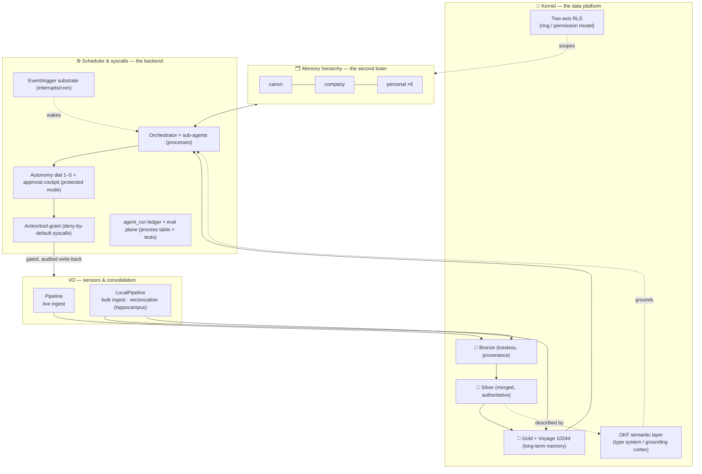

# 🧠 Why Imperion OS's data design is built for agentic workloads

**Imperion OS is an operating system for AI agents over a company's knowledge and
actions.** This document makes the case that its data design — the medallion platform,
the OKF semantic layer, the gold/vector memory tier, the RLS access spine, and the
governed action plane on top — is not a CRM with an LLM bolted on, but a substrate
*designed from the ground up* for agents to reason and act on safely. It is the
canonical "why our data design is superior for agentic workloads" argument; the sibling
repos and the public `/story` page link here rather than restating it.

[← Architecture](README.md) · [← Documentation library](../README.md) ·
[Data & automation doctrine](data-and-automation-doctrine.md) ·
[Capability overview](../product/imperion-os-overview.md) ·
[Decision records](../decision-records/README.md)

---

## 1. The thesis: an OS for agents

An operating system schedules **processes** over shared **resources** under **governed
access**: a kernel manages the filesystem and memory, a scheduler runs processes through
syscalls, a permission/ring model isolates them, and protected mode keeps a misbehaving
process from taking down the machine. Imperion OS does exactly this — but the processes
are **AI agents**, and the shared resource is **everything the business knows and can
do**.

The metaphor is not decoration. It is the design constraint that produced the
architecture, and it commits to **two claims woven together**:

- **Data-as-kernel.** The data platform is the kernel. It owns provenance, meaning,
  retrieval, and permissions — the things an agent must be able to *trust* before it
  reasons or acts. Agents never touch raw resources directly; they go through the kernel's
  governed interfaces.
- **Second-brain-as-OS.** The knowledge tiers (canon · company · personal) are the
  agent's **memory hierarchy** — a second brain whose recall is identity-scoped, citation-
  backed, and consolidated by a background process, the way a real OS pages memory and a
  real brain consolidates during sleep.

### The OS map

Every part of an operating system has a concrete Imperion artifact behind it. This is the
whole system on one page.

| OS concept | Imperion OS realization | Governing decision |
|---|---|---|
| **Kernel — filesystem** | Medallion data platform: bronze (raw, lossless) → silver (merged, authoritative) → gold (AI-ready) | [ADR-0092](../decision-records/ADR-0092-medallion-data-platform-consolidated.md) · [ADR-0039](../decision-records/ADR-0039-per-source-bronze-tables.md) · [ADR-0044](../decision-records/ADR-0044-silver-contracts-tickets.md) |
| **Kernel — type system / schema of meaning** | OKF semantic layer — concept-per-file meaning, authority, and joins; the orchestrator's deterministic **grounding cortex** | [ADR-0086](../decision-records/ADR-0086-okf-semantic-layer-over-silver.md) · [ADR-0104](../decision-records/ADR-0104-okf-orchestrator-grounding-cortex.md) |
| **Long-term memory (addressable)** | Gold knowledge objects + Voyage `voyage-3-large` @ 1024d embeddings — one citation-backed object per entity | [ADR-0041](../decision-records/ADR-0041-gold-knowledge-vector-store.md) · [ADR-0102](../decision-records/ADR-0102-vector-contract-single-home.md) |
| **Permission / ring model** | Two-axis RLS access spine — role-scoped company + owner-scoped personal, enforced in the database | [ADR-0105](../decision-records/ADR-0105-two-axis-rls-access-spine.md) |
| **Memory hierarchy (the second brain)** | Tiered knowledge: **canon** (company truth) · **company** (shared operational) · **personal** (6 per-user brains) | [#966](https://github.com/markdconnelly/ImperionCRM/issues/966) · [#967](https://github.com/markdconnelly/ImperionCRM/issues/967) · [#968](https://github.com/markdconnelly/ImperionCRM/issues/968) |
| **Scheduler & syscalls** | Backend orchestrator + sub-agents · ICM workflows · the 1–5 autonomy dial · the `agent_run`/`agent_message` ledger | [ADR-0091](../decision-records/ADR-0091-agent-icm-platform-consolidated.md) · [ADR-0061](../decision-records/ADR-0061-icm-business-process-automation.md) · [ADR-0109](../decision-records/ADR-0109-actuation-autonomy-dial.md) |
| **Capability-scoped syscalls (deny-by-default)** | Action/tool-grant plane — typed action catalog + per-agent grants + scope ceilings | [ADR-0107](../decision-records/ADR-0107-governed-action-tool-grant-plane.md) |
| **Process table + audit / test harness** | The agent run ledger + the eval/quality plane | [ADR-0106](../decision-records/ADR-0106-agent-eval-quality-plane.md) · backend ADR-0077 |
| **Interrupts / cron** | Event & trigger substrate (reactive autonomy) | [#991](https://github.com/markdconnelly/ImperionCRM/issues/991) |
| **Processes** | The 5-tier agent roster (triage → dispatch → execute → observe → spine) | [ADR-0087 → ADR-0091](../decision-records/ADR-0091-agent-icm-platform-consolidated.md) |
| **I/O — sensory ingest** | Pipeline (live/webhook ingest, bronze→silver merge) | [ADR-0042](../decision-records/ADR-0042-division-of-labor-reads-direct-processes-backend.md) |
| **I/O — memory consolidation (the hippocampus)** | LocalPipeline (on-prem bulk ingest + **all vectorization**) | LocalPipeline ADR-0026 |
| **Protected mode / governance** | Autonomy dial + approval cockpit + Mark-gates | [ADR-0109](../decision-records/ADR-0109-actuation-autonomy-dial.md) · [ADR-0107](../decision-records/ADR-0107-governed-action-tool-grant-plane.md) |

---

## 2. The contrast: a substrate, not a bolt-on

The default way to add AI to a business application is to **bolt an LLM + RAG onto a
human-form schema** — a CRM whose tables were shaped for a person clicking through a UI,
with a vector index stapled to the side and a chatbot reading off it. That works for a
demo and fails in production for a predictable set of reasons: the agent can't tell where
a fact came from or whether it's stale, it doesn't know which of three conflicting sources
is authoritative, its "memory" is an undifferentiated soup with no identity boundaries,
and nothing governs what it's allowed to *do* with what it retrieves.

Imperion OS inverts the order. The data design came **first**, shaped for agents; the UI
renders over it. The next section is the six-part argument for why that ordering is the
one that holds up under real client data, real autonomy, and real audit.

---

## 3. The superiority argument

### 3.1 Provenance & freshness — the medallion kernel

**An agent must know *when* and *from where* a fact came.** Imperion lands every external
fact as **lossless per-source bronze** (one physical table per source × entity,
[ADR-0039](../decision-records/ADR-0039-per-source-bronze-tables.md)), merges it into
**silver** entities by an **explicit authority-precedence** recompute (e.g. `contact`:
`website > autotask > itglue > m365 > apollo`), and distils it into **gold**. Bronze is an
immutable audit trail and a reprocessing safety net: if a merge rule changes, silver
rebuilds from raw without re-fetching. **Freshness is correctness** — a fact carries its
source and its capture time, so an agent (and an auditor) can reason about staleness
instead of trusting a flattened cell.

A generic app schema **discards provenance**: it overwrites the old value, keeps no source
discriminator, and cannot answer "says who, and as of when?" — the first question any
agent acting on a fact should be able to answer. The medallion kernel makes that question
answerable by construction. Governing: [ADR-0092](../decision-records/ADR-0092-medallion-data-platform-consolidated.md),
[ADR-0044](../decision-records/ADR-0044-silver-contracts-tickets.md).

### 3.2 Meaning & authority — the OKF type system

**An agent must know what an entity *means* and which source *wins*.** The OKF (Open
Knowledge Format) semantic layer is **one concept file per silver entity**
([ADR-0086](../decision-records/ADR-0086-okf-semantic-layer-over-silver.md)): a
version-controlled, PII-free, human-reviewed contract giving each entity's definition, its
**authority rule** (the precedence order), its documented join paths, and a PII note. The
orchestrator **grounds** on this deterministically per workflow stage — the **grounding
cortex** ([ADR-0104](../decision-records/ADR-0104-okf-orchestrator-grounding-cortex.md)).

This is the difference between **retrieval you can trust and vibes**. Agents never guess a
join path or invent which source is authoritative — they read it from the contract. Three
freshness gates (same-repo docs-gate, cross-repo `okf-sync`, on-prem reconciliation) make
**staleness a CI failure**, so the map cannot silently drift from the schema. A bolt-on RAG
system has no such type system: it embeds rows and hopes the model infers meaning from
text — which is exactly where confident, wrong answers come from.

### 3.3 Retrieval & memory — gold + Voyage 1024d

**An agent's long-term memory should be addressable and citation-backed.** The gold tier
is **one knowledge object per entity** plus a Voyage `voyage-3-large` @ **1024-dimension**
embedding ([ADR-0041](../decision-records/ADR-0041-gold-knowledge-vector-store.md)),
polymorphic over any silver entity, pinned to a **single vector space**
([ADR-0102](../decision-records/ADR-0102-vector-contract-single-home.md)) so every vector
is comparable. Drafts carry no embedding — they are invisible to retrieval until
published, so memory never recalls something unapproved.

Because each gold object is **derived from a known silver row**, retrieval is *verifiable*:
a recalled summary traces back to its source rows and through bronze to its origin. This is
RAG **over a curated, provenanced substrate**, not over a pile of scraped text — the
single biggest lever on whether an agent hallucinates from noise.

**Verbatim recall, the second-brain way** ([ADR-0113](../decision-records/ADR-0113-verbatim-memory-tier.md)).
A summary answers "tell me about X"; it cannot answer "what *exactly* did the client say,"
"what did I decide, in my words," or "what were the agent's exact steps." So verbatim turns
live in **bronze**, split by origin — agent-run transcripts in the Jarvis ledger
(`agent_message`), non-agent notes & captured human conversations in `memory_drawer` — raw,
never summarized — while the **summary of each conversation lives in gold** (a
`knowledge_object` with `entity_ref=conversation_id`, embedded and hybrid-searchable).
Retrieval is
**two-level**: hybrid-search the dense gold summaries, then **drill via the reference** to
the faithful verbatim turns only when the exact words matter. The reference between the two
is the point — search stays cheap and few, recall stays faithful and complete. This is the
MemPalace verbatim-recall capability, expressed natively in the medallion (bronze raw + gold
index + a reference) instead of a bolt-on store with its own vector space.

### 3.4 Identity-scoped memory — the RLS spine + knowledge tiers

**An agent's memory must have boundaries enforced where the data lives, not where the app
asks nicely.** Imperion's memory hierarchy is three tiers — **canon** (company truth),
**company** (shared operational), and **personal** (six per-user brains) — under a
**two-axis RLS access spine** ([ADR-0105](../decision-records/ADR-0105-two-axis-rls-access-spine.md)):
role-scoped on the company axis, owner-scoped on the personal axis, enforced in PostgreSQL
row-level security. A personal brain **cannot leak** into the company tier; privileged
service-identity **curation agents** cross the wall from personal → company only under
audit. This is the **OS permission model, applied to memory** — the knowledge-tiers epics
[#966](https://github.com/markdconnelly/ImperionCRM/issues/966) /
[#967](https://github.com/markdconnelly/ImperionCRM/issues/967) /
[#968](https://github.com/markdconnelly/ImperionCRM/issues/968).

A bolt-on system enforces (at best) memory boundaries in application code — one missed
check and a personal note surfaces in a shared answer. Pushing the boundary into the
database makes the leak structurally impossible rather than conventionally discouraged.

### 3.5 Action governance — the autonomy dial, ledger, grants & eval

**Every agent action must be metered, gated, logged, capability-scoped, and evaluated.**
This is the actuation half of the OS, and Imperion governs it on four planes:

- **Autonomy dial (protected mode).** A native **1–5 dial** per agent
  ([ADR-0109](../decision-records/ADR-0109-actuation-autonomy-dial.md)) resolves to a tier
  ceiling; actions above the ceiling route to a **native approval cockpit** instead of
  executing. Levels 1 and 5 are fixed (approve-everything / fully-autonomous); 2–4 are
  tunable data on `autopilot_policies`.
- **Deny-by-default capability grants (syscalls).** The action/tool-grant plane
  ([ADR-0107](../decision-records/ADR-0107-governed-action-tool-grant-plane.md)) makes every
  tool call check a per-agent grant with an **evaluated scope**; outbound actions are a typed
  **action-contract catalog**, not a hardcoded enum. A prompt-injected agent cannot reach a
  tool it was never granted, nor exceed a scope.
- **Process table + audit.** Every run is an append-only `agent_run`/`agent_message` row;
  every grant decision (allow / deny-no-grant / deny-out-of-scope / route-to-approval) is
  auditable — the denial path is itself a detection signal.
- **Test harness (eval/quality plane).** The eval plane
  ([ADR-0106](../decision-records/ADR-0106-agent-eval-quality-plane.md), backend ADR-0077)
  measures whether agent output is *correct* against committed baselines, gating regressions
  in CI.

Autonomy is only safe because all four hold at once: **trust to act** (grant), **metered
action** (dial + cockpit), **proof of what happened** (ledger), and **proof it was right**
(eval). A chatbot bolted onto a CRM has none of these — which is why "let the AI do it
automatically" is reckless there and routine here.

### 3.6 One loop, three altitudes

**It is one architecture, not three add-ons.** The same refinement DNA appears at three
altitudes (see the [doctrine](data-and-automation-doctrine.md)):

- **Medallion refines DATA** — raw → trustworthy → AI-ready.
- **OKF / IKF refines MEANING** — observed → defined → authoritative.
- **ICM refines ACTION** — drafted → approved → auto.

Each shares the doctrine's four traits: progressive refinement (trust is earned in stages,
never declared), plain-text and version-controlled, human-readable = machine-readable, and
human-in-the-loop by default with autonomy as a dial. The coherence is the point: **agentic
capability is designed in from the substrate, not bolted on** ([ADR-0061](../decision-records/ADR-0061-icm-business-process-automation.md),
[ADR-0087 → ADR-0091](../decision-records/ADR-0091-agent-icm-platform-consolidated.md)).

---

## 4. Honest limits (what this design does *not* claim)

A credible argument names its edges:

- **Not one autonomous AI that "just runs the business."** By design it is staged,
  contracted, and gated. Reframe "fully autonomous" as "fully automated with supervision you
  can dial."
- **Not real-time streaming analytics.** The kernel is near-real-time (webhooks + on-demand
  refresh), not a stream processor.
- **A stale semantic layer lies with confidence.** The grounding cortex is only as good as
  its freshness gates; that machinery is load-bearing, not optional.
- **The PII boundary is load-bearing — one mistake is a breach.** Bundles and skills are
  PII-free by design; curation agents must aggregate/redact when walking production.

These are the same cautions the doctrine voices; surfacing them is part of why the design is
trustworthy.

---

## 5. Influences & further reading

> **Deep dives.** Each layer argued above has a canonical deep dive under
> [`deep-dives/`](deep-dives/README.md): [medallion architecture](deep-dives/medallion-architecture.md)
> (the kernel filesystem), [Open Knowledge Format](deep-dives/open-knowledge-format.md) (the
> type system / grounding cortex), and [how it all fits together](deep-dives/how-it-all-fits-together.md)
> (the synthesis), plus the sibling-repo deep dives on MWP/ICM, MemPalace, and Open Brain.
> The public-facing versions are the
> [executive summary](../../public/papers/executive-summary.html) and the
> [research paper](../../public/papers/research-paper.html).

Imperion OS's data design is a synthesis: established data-platform patterns underneath, and
the recent state of the art in **agentic memory, second-brain, and context-engineering** on
top. The finding that motivated this document is that the patterns this literature advocates
for agent memory — tiered, provenanced, semantically-grounded, citation-backed,
identity-scoped — were already substantially realized here via the medallion platform + OKF
+ gold/vector tier, and the remaining gap was closed by the knowledge tiers, the RLS spine,
the autonomy dial, the eval plane, and the action/event planes. The sources below shaped that
synthesis. *(All retrieved 2026-06-21.)*

**Data-platform & retrieval foundations**

- **What is Medallion Architecture?** — Databricks.
  <https://www.databricks.com/glossary/medallion-architecture>. The bronze/silver/gold
  lakehouse pattern for progressively improving data quality across layers — the kernel's
  filesystem model.
- **Introducing the Open Knowledge Format** — Sam McVeety & Amir Hormati, Google Cloud.
  <https://cloud.google.com/blog/products/data-analytics/how-the-open-knowledge-format-can-improve-data-sharing>.
  OKF v0.1: a vendor-neutral markdown + YAML-frontmatter spec for sharing curated knowledge
  with AI agents — the basis of our IKF/OKF semantic layer.
- **voyage-3-large: a new state-of-the-art general-purpose embedding model** — Voyage AI.
  <https://blog.voyageai.com/2025/01/07/voyage-3-large/>. The embedding model and Matryoshka
  dimensions behind the gold memory tier's pinned 1024-d vector contract.
- **Contextual Retrieval in AI Systems** — Anthropic.
  <https://www.anthropic.com/engineering/contextual-retrieval>. Contextual Embeddings +
  Contextual BM25 to cut RAG retrieval failures — the rationale for retrieval *over a curated,
  contextualized substrate* rather than raw chunks.
- **Interpretable Context Methodology: Folder Structure as Agentic Architecture** — Jake Van
  Clief & David McDermott (arXiv:2603.16021). <https://arxiv.org/abs/2603.16021>. Filesystem
  structure as a deterministic agentic architecture — the pattern our `icm/` action layer is
  built on.

**Agentic memory, second-brain & context-engineering (state of the art)**

- **mempalace** — MemPalace. <https://github.com/MemPalace/mempalace>. Local-first AI memory
  storing history verbatim with semantic retrieval — a reference point for provenanced,
  no-API recall (patterns borrowed, not a dependency).
- **OB1 / Open Brain** — Nate B. Jones. <https://github.com/NateBJones-Projects/OB1>. A
  unified DB + AI gateway + chat channel giving any tool shared persistent memory — the
  "one store, many agents" shape mirrored by our single PostgreSQL kernel.
- **Karpathy's Wiki vs. Open Brain — One Fails When You Need It Most** — Nate B. Jones.
  <https://www.youtube.com/watch?v=dxq7WtWxi44>. Synthesize-on-write (wiki) vs
  synthesize-on-query — informs where we consolidate memory (gold, on-prem) vs ground at
  query time (OKF + live DB).
- **claude-mem — Introduction** — Claude-Mem. <https://docs.claude-mem.ai/introduction>.
  Persistent memory-compression preserving context across sessions via captured tool usage
  and semantic summaries — a model for memory consolidation as a background process.
- **How I Finally Sorted My Claude Code Memory** — John Conneely, *Young Leaders in Tech*.
  <https://www.youngleaders.tech/p/how-i-finally-sorted-my-claude-code-memory>. A structured
  file-directory memory system — kin to our tiered, file-per-concept knowledge layout.
- **Stop Building AI Agents — Use This Folder System Instead** *(channel unconfirmed)*.
  <https://www.youtube.com/watch?v=MkN-ss2Nl10>. Argues for deterministic folder/context
  structure over fragile multi-agent frameworks — the ICM thesis, independently.
- **Open Knowledge Format Explained — Google's New AI Standard** — Nate B. Jones.
  <https://www.youtube.com/watch?v=wczuwg9EZdg>. Explainer of the OKF markdown
  knowledge-bundle standard for feeding curated context to agents.
- **Finally — Agent Loops Clearly Explained** — Nate B. Jones.
  <https://www.youtube.com/watch?v=EuzYhzB0vbI>. Agent-loop primitives (heartbeats, crons,
  goals, subagents) — the scheduler/interrupt model our backend realizes.
- **Every Claude Code Concept Explained for Normal People** — Sabrina Ramonov.
  <https://www.youtube.com/watch?v=ZlDnsf_DOzg>. A walkthrough of context-engineering
  primitives (CLAUDE.md, memory, skills, hooks, MCP, subagents) that frame how agents consume
  governed context.
- **The Medallion Data Architecture (Pros & Cons)** *(channel unconfirmed)*.
  <https://www.youtube.com/watch?v=8p77fOWp5F4>. Advantages and trade-offs of bronze/silver/gold
  layering — a balanced view of the kernel pattern we adopted.

---

## Governing decisions

Kernel / data: [ADR-0092](../decision-records/ADR-0092-medallion-data-platform-consolidated.md) ·
[ADR-0039](../decision-records/ADR-0039-per-source-bronze-tables.md) ·
[ADR-0044](../decision-records/ADR-0044-silver-contracts-tickets.md) ·
[ADR-0041](../decision-records/ADR-0041-gold-knowledge-vector-store.md) ·
[ADR-0102](../decision-records/ADR-0102-vector-contract-single-home.md) — Meaning:
[ADR-0086](../decision-records/ADR-0086-okf-semantic-layer-over-silver.md) ·
[ADR-0104](../decision-records/ADR-0104-okf-orchestrator-grounding-cortex.md) — Memory / access:
[ADR-0105](../decision-records/ADR-0105-two-axis-rls-access-spine.md) — Action / governance:
[ADR-0061](../decision-records/ADR-0061-icm-business-process-automation.md) ·
[ADR-0091](../decision-records/ADR-0091-agent-icm-platform-consolidated.md) ·
[ADR-0107](../decision-records/ADR-0107-governed-action-tool-grant-plane.md) ·
[ADR-0109](../decision-records/ADR-0109-actuation-autonomy-dial.md) ·
[ADR-0106](../decision-records/ADR-0106-agent-eval-quality-plane.md) — Boundary:
[ADR-0042](../decision-records/ADR-0042-division-of-labor-reads-direct-processes-backend.md).
Companion: [data & automation doctrine](data-and-automation-doctrine.md).
