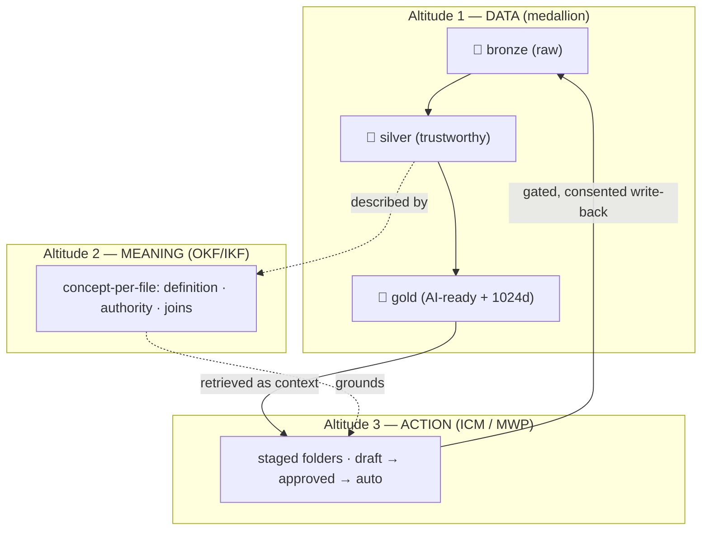

# 🧩 How it all fits together — one ideal agentic system

**Five ideas, one machine.** Imperion OS did not invent five separate things and bolt
them together — it found that **the medallion data platform, the OKF semantic layer, the
ICM / Model Workspace Protocol action layer, and the borrowed second-brain memory patterns
(MemPalace, Open Brain) are the *same idea at different altitudes*.** This is the synthesis
deep dive: how the pieces compose into one coherent operating system for agents.

[← Deep dives](README.md) · [← Architecture](../README.md) ·
[Data design for agents](../data-design-for-agents.md) ·
[Data & automation doctrine](../data-and-automation-doctrine.md)

> Read the per-layer deep dives first if you want the detail:
> [medallion](medallion-architecture.md) · [OKF](open-knowledge-format.md) ·
> [MWP / ICM](https://github.com/markdconnelly/ImperionCRM_Backend/blob/main/docs/architecture/deep-dives/model-workspace-protocol.md) ·
> [MemPalace](https://github.com/markdconnelly/ImperionCRM_LocalPipelineEnrichment/blob/main/docs/architecture/deep-dives/mempalace-memory-architecture.md) ·
> [Open Brain](https://github.com/markdconnelly/ImperionCRM_LocalPipelineEnrichment/blob/main/docs/architecture/deep-dives/open-brain-second-brain.md).
> This doc is the *assembly*.

---

## 1. The reframe: a second brain that was built as data engineering

Late in the build a question turned outward: *how do the serious people give agents durable
memory and context?* The literature — MemPalace, Open Brain (OB1), claude-mem, the
Claude-Code-memory practitioners — describes one blueprint for agent memory: **tiered,
provenance-tagged, semantically grounded, citation-backed, identity-scoped.**

The surprise was that **~70% of that blueprint already existed here**, not as a memory
product but as plain data engineering:

| The blueprint asks for… | …which Imperion already had as |
| --- | --- |
| **Provenance & freshness** | the **medallion** tiers (per-source bronze, capture time, rebuildable silver) |
| **Meaning & authority** | the **OKF** semantic layer (which source wins, how entities join) |
| **Citation-backed recall** | **gold** knowledge objects + Voyage `voyage-3-large` @ 1024d |

The remaining 30% was then built *deliberately*: the **tiered knowledge** memory hierarchy
+ **two-axis RLS** access spine, the **autonomy dial + cockpit**, the **eval/quality**
plane, and the **action/tool-grant + event/trigger** governance planes. That forced the
rename: this was never a CRM with AI bolted on — the substrate had been an **operating
system for agents** the whole time ([ADR-0110](../../decision-records/ADR-0110-rebrand-imperion-os.md)).

---

## 2. One loop, three altitudes

The three big bets share one **refinement DNA** — trust is *earned in stages, never
declared* — applied to data, then meaning, then action:

- **Medallion refines DATA** — raw → trustworthy → AI-ready.
- **OKF / IKF refines MEANING** — observed → defined → authoritative.
- **ICM / MWP refines ACTION** — drafted → approved → auto.

Writes flow back to source systems and re-enter as bronze: a **closed, auditable loop**.
All three share four traits — progressive refinement, plain-text & version-controlled,
human-readable = machine-readable, human-in-the-loop by default with autonomy as a dial.

### Where each borrowed idea lands

- **Medallion** (Databricks) = altitude 1, the kernel filesystem.
- **OKF** (Google) = altitude 2, the type system / grounding cortex.
- **ICM / Model Workspace Protocol** (Van Clief & McDermott, arXiv:2603.16021) = altitude 3,
  filesystem-as-orchestration — numbered stage folders, one orchestrator doing the work of a
  fleet. Realized in the backend's `icm/` workspaces.
- **MemPalace** = the *verbatim-recall* pattern, expressed natively as **bronze raw turns +
  a gold summary index + a reference between them** (ADR-0113) instead of a bolt-on store
  with its own vector space.
- **Open Brain (OB1)** = the *one-store-many-agents* shape — a single PostgreSQL kernel every
  agent plugs into, rather than scattered per-agent notes.

---

## 3. The memory hierarchy — three tiers, one ring model

A second brain needs **boundaries enforced where the data lives**, not where the app asks
nicely. Imperion's memory hierarchy is three tiers under a **two-axis RLS access spine**
([ADR-0105](../../decision-records/ADR-0105-two-axis-rls-access-spine.md)):

| Tier | What it holds | Scope axis |
| --- | --- | --- |
| **canon** | company truth — the OKF bundle, ADRs, published gold | role-scoped (company axis) |
| **company** | shared operational memory — gold summaries, run history | role-scoped (company axis) |
| **personal** | six per-user brains — private notes, captures, a temporal knowledge graph | owner-scoped (personal axis) |

The personal tier is a **two-substrate** design ([ADR-0114](../../decision-records/ADR-0114-personal-knowledge-store-data-model.md)):
a **Postgres Synthesis Store** (verbatim captures in `memory_drawer` → a temporal
**knowledge graph** of entity–relation–object facts, each with a **validity window** so a
changed mind is a *new fact* that closes the old one, never a destructive edit) and a
per-owner **Azure Blob "Curated Vault"** of markdown the owner edits, synced over HTTPS. A
privileged, **non-BYPASSRLS** Personal Curator crosses personal → company only under an
append-only god-view ledger. A personal brain **cannot leak** into the company tier — the
boundary is a database invariant, not a code convention.

Recall is the MemPalace shape made native: **hybrid-search the dense gold summaries, then
drill via a reference to the faithful verbatim bronze** only when the exact words matter
(ADR-0113). The **gold hybrid ranker** ([ADR-0115](../../decision-records/ADR-0115-gold-hybrid-ranker-contract.md),
migration 0166) scores **semantic similarity + full-text + metadata + temporal recency**
together, and a **Universal Memory MCP** ([ADR-0116](../../decision-records/ADR-0116-universal-memory-mcp-contract.md),
migration 0170) exposes `store` / `recall` / `list_agents` so any agent uses one memory
surface.

> **Status (verified vs prod 2026-06-22).** The substrate is real and provisioned
> (migrations through 0170; per-owner vault containers + RBAC + the curator identity live),
> but **unhydrated** — `memory_drawer` / `personal_fact` are empty and **embedding
> generation has not yet run** (LocalPipeline #176). The architecture is complete; recall
> lights up when the on-prem collectors and vectorization run.

---

## 4. The governed action half — why autonomy is safe

Trust to *read* is the data half; trust to *act* is the action half. Raising autonomy is
only safe because four governance planes hold at once (the doctrine's actuation stack):

- **Trust to act** — the deny-by-default action/tool-grant plane ([ADR-0107](../../decision-records/ADR-0107-governed-action-tool-grant-plane.md)).
- **Metered action** — the 1–5 autonomy dial + native approval cockpit ([ADR-0109](../../decision-records/ADR-0109-actuation-autonomy-dial.md)).
- **Proof of what happened** — the append-only `agent_run` / `agent_message` ledger.
- **Proof it was right** — the eval / quality plane ([ADR-0106](../../decision-records/ADR-0106-agent-eval-quality-plane.md)).

These are the OS's syscall table, protected mode, process table, and test harness. With the
**event/trigger substrate** (`agent_event`, migration 0164) as interrupts/cron, the
orchestrator (the **scheduler**) wakes, grounds on OKF, recalls from gold, drafts an action,
and routes anything above its ceiling to a human.

---

## 5. The whole machine on one page

| OS organ | Imperion realization | Deep dive |
| --- | --- | --- |
| **Kernel — filesystem** | medallion bronze → silver → gold | [medallion](medallion-architecture.md) |
| **Kernel — type system** | OKF semantic layer / grounding cortex | [OKF](open-knowledge-format.md) |
| **Long-term memory** | gold knowledge objects + Voyage 1024d + hybrid ranker | [medallion](medallion-architecture.md) · [MemPalace](https://github.com/markdconnelly/ImperionCRM_LocalPipelineEnrichment/blob/main/docs/architecture/deep-dives/mempalace-memory-architecture.md) |
| **Memory hierarchy** | canon · company · personal (×6) under two-axis RLS | [Open Brain](https://github.com/markdconnelly/ImperionCRM_LocalPipelineEnrichment/blob/main/docs/architecture/deep-dives/open-brain-second-brain.md) |
| **Scheduler & syscalls** | orchestrator + ICM + autonomy dial + grants | [MWP / ICM](https://github.com/markdconnelly/ImperionCRM_Backend/blob/main/docs/architecture/deep-dives/model-workspace-protocol.md) |
| **I/O** | Pipeline (live) + LocalPipeline (bulk + vectorization) | [medallion](medallion-architecture.md) §5 |

The point is the coherence: **agentic capability is designed in from the substrate, not
bolted on.** The argument for *why that ordering wins* is
[data design for agents](../data-design-for-agents.md); the builder's recipe is the
[doctrine](../data-and-automation-doctrine.md).

---

## Governing decisions

[ADR-0092 medallion](../../decision-records/ADR-0092-medallion-data-platform-consolidated.md) ·
[ADR-0086 OKF](../../decision-records/ADR-0086-okf-semantic-layer-over-silver.md) ·
[ADR-0061 ICM](../../decision-records/ADR-0061-icm-business-process-automation.md) ·
[ADR-0113 verbatim memory](../../decision-records/ADR-0113-verbatim-memory-tier.md) ·
[ADR-0114 personal knowledge store](../../decision-records/ADR-0114-personal-knowledge-store-data-model.md) ·
[ADR-0115 gold hybrid ranker](../../decision-records/ADR-0115-gold-hybrid-ranker-contract.md) ·
[ADR-0116 universal memory MCP](../../decision-records/ADR-0116-universal-memory-mcp-contract.md) ·
[ADR-0105 two-axis RLS](../../decision-records/ADR-0105-two-axis-rls-access-spine.md) ·
[ADR-0106 eval plane](../../decision-records/ADR-0106-agent-eval-quality-plane.md) ·
[ADR-0107 action/tool-grant](../../decision-records/ADR-0107-governed-action-tool-grant-plane.md) ·
[ADR-0109 autonomy dial](../../decision-records/ADR-0109-actuation-autonomy-dial.md) ·
[ADR-0110 Imperion OS](../../decision-records/ADR-0110-rebrand-imperion-os.md).
