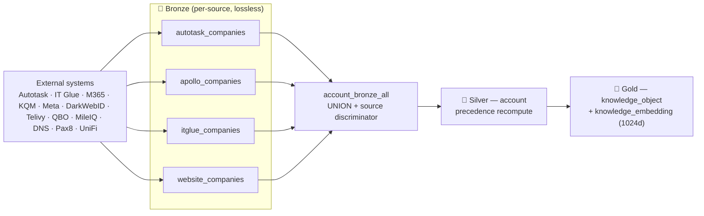

# 🥉🥈🥇 Medallion architecture — the kernel filesystem

**How Imperion OS turns a spider's web of external systems into data an agent can
trust.** This is the canonical deep dive on the medallion data platform: the three
tiers in detail, the merge rules that make silver authoritative, the gold/vector
contract that makes recall addressable, and how the two ingestion planes realize all
of it. It is the *kernel filesystem* of the agentic OS — the thing every agent reads
before it reasons.

[← Deep dives](README.md) · [← Architecture](../README.md) ·
[Data & automation doctrine](../data-and-automation-doctrine.md) ·
[Data design for agents](../data-design-for-agents.md) ·
[Decision records](../../decision-records/README.md)

> **Where this sits.** The [doctrine](../data-and-automation-doctrine.md) narrates the
> three big bets (medallion · IKF/OKF · ICM) at altitude and gives the eight
> implementation archetypes; [data-design-for-agents](../data-design-for-agents.md)
> argues *why* the design is superior for agents. This doc is the **builder's recipe for
> the medallion tier specifically** — read it when you need to add a source, change a
> merge rule, or understand exactly what lands where.

---

## 1. Why three tiers

An agent acting on a fact must be able to answer two questions a flattened CRM cell
cannot: **"says who?"** and **"as of when?"** The medallion pattern (bronze → silver →
gold; Databricks' lakehouse model) answers both by **never throwing provenance away** and
**refining quality in stages** instead of overwriting in place. Trust is *earned across
hops*, never declared at ingest.

| Tier | What it holds | Mutability | Governing ADR |
| --- | --- | --- | --- |
| 🥉 **Bronze** | raw, per-source payloads — one physical table per (source × entity), plus verbatim agent/conversation memory turns | append / replace-from-source; lossless | [ADR-0039](../../decision-records/ADR-0039-per-source-bronze-tables.md) · [ADR-0113](../../decision-records/ADR-0113-verbatim-memory-tier.md) |
| 🥈 **Silver** | one unified, authoritative entity per real-world thing, recomputed field-by-field from bronze by explicit precedence | derived; rebuildable from bronze | [ADR-0044](../../decision-records/ADR-0044-silver-contracts-tickets.md) |
| 🥇 **Gold** | one citation-backed knowledge object per entity + a Voyage `voyage-3-large` @ 1024d embedding | derived; drafts carry no embedding | [ADR-0041](../../decision-records/ADR-0041-gold-knowledge-vector-store.md) · [ADR-0102](../../decision-records/ADR-0102-vector-contract-single-home.md) |

The consolidated dossier is
[ADR-0092 medallion data platform](../../decision-records/ADR-0092-medallion-data-platform-consolidated.md).

---

## 2. Bronze — lossless, per-source, provenanced (ADR-0039)

**One physical table per (source, entity).** `account` lands as `autotask_companies`,
`apollo_companies`, `itglue_companies`, `website_companies` — each storing the original
`payload_bronze` JSON verbatim. A `*_bronze_all` **union view** stacks them with a
`source` discriminator so downstream code reads one shape without losing which system a
row came from. Manual entries made in the app use the `website` source, so user input is
just another provenanced bronze row.

Why per-source and not one wide table:

- **Provenance is structural, not a column you remember to set.** The table name *is* the
  source; a row can never lose its origin.
- **Reprocessing safety net.** Bronze is immutable raw truth, so if a merge rule changes,
  silver **rebuilds from bronze without re-fetching** the external systems.
- **Adding a source is additive.** New source = new bronze table + one precedence-list
  entry. Nothing downstream is rewritten (see archetype A in the
  [doctrine](../data-and-automation-doctrine.md)).

**Bronze is also where verbatim memory lands** ([ADR-0113](../../decision-records/ADR-0113-verbatim-memory-tier.md)):
agent-run transcripts in `agent_message`, deliberate human/agent captures in
`memory_drawer` (migration 0167; `agent_slug` attribution added in 0170) — raw, never
summarized. The reasoning substrate is always the *summary* in gold; verbatim is what you
**drill to** when the exact words matter.

---

## 3. Silver — merged, authoritative, contract-described (ADR-0044)

Silver is **one row per real-world entity**, recomputed **field-by-field, each field from
the highest-precedence non-empty source.** The precedence order *is* the authority rule,
and it is documented per entity in the OKF concept file (see the
[OKF deep dive](open-knowledge-format.md)).

| Silver entity | Bronze sources | Precedence (authority) |
| --- | --- | --- |
| `account` | autotask, apollo, itglue, website | website > autotask > itglue > apollo |
| `contact` | autotask, apollo, m365, itglue, website | website > autotask > itglue > m365 > apollo |
| `device` | itglue, m365, website | website > itglue > m365 |
| `opportunity` | kqm, autotask, website | website > autotask > kqm (join `autotask_opportunity_id`) |

Two correctness rules carry the tier:

- **Resurrection guard.** A `website` row is app-created and pre-linked, so the merge never
  *creates* an entity from a low-precedence source alone — it corroborates, it doesn't
  conjure.
- **Born-silver entities.** Where the app itself is the system of record (`project`,
  `proposal`, `ticket` fetched from Autotask, `task`, …) there is no external merge —
  authority is simply "website system of record." These are archetype B.

> **Merge precedence is where correctness lives or dies** — matching keys, out-of-order
> arrivals, and empty-vs-null all bite here. It is tested, versioned, and never
> hand-waved (doctrine §8).

---

## 4. Gold — addressable, citation-backed long-term memory (ADR-0041/0102)

Gold is **one `knowledge_object` per entity** plus a **`knowledge_embedding`** —
Voyage `voyage-3-large` at a **pinned 1024 dimensions**, polymorphic over any silver
entity, in a **single vector space** ([ADR-0102](../../decision-records/ADR-0102-vector-contract-single-home.md))
so every vector is comparable. Two properties make this memory an agent can trust:

- **Drafts carry no embedding** — they are invisible to retrieval until published, so the
  agent never recalls something unapproved.
- **Every gold object derives from a known silver row**, so a recalled summary traces back
  through silver to its bronze origin. This is RAG **over a curated, provenanced
  substrate**, not over a scraped pile — the single biggest lever on hallucination.

**Hybrid recall (migrations 0166).** The gold tier carries a hybrid-search substrate so a
query scores **semantic similarity + full-text + metadata + temporal** signals together
rather than vector-only — see the [synthesis deep dive](how-it-all-fits-together.md) for
how the ranker composes these. **Verbatim drill-down** (ADR-0113): hybrid-search the dense
gold summaries first, then follow the reference to the faithful bronze turns only when the
exact words matter — search stays cheap, recall stays complete.

> **Honest status (verified against prod 2026-06-25).** The gold schema, knowledge objects
> (~1,500 modelled), and the hybrid-search substrate are in place; the on-prem collectors are
> now running on the host and **hydrating bronze/silver** (e.g. silver `contact` ≈260,
> `device` ≈430), but **embedding generation has not yet run** (`knowledge_embedding` = 0 —
> owned by LocalPipeline #176). Semantic search lights up when vectorization runs. This doc
> describes the **contract and the pipeline that realizes it**, not a live semantic index.

---

## 5. Who builds it — merge co-locates with ingestion (LP ADR-0026)

The two ingestion planes split the medallion by *how* a source arrives, and **whichever
plane ingests a source's bronze owns that source's bronze→silver merge**:

| Plane | Role in the medallion |
| --- | --- |
| **`ImperionCRM_Pipeline`** (cloud) | **Live I/O.** Webhooks + on-demand refresh; the **live/webhook-driven** bronze→silver merge (the `website_*`-fed contact/account/device/ticket/opportunity/expense sweep + DocuSign). |
| **`ImperionCRM_LocalPipelineEnrichment`** (on-prem) | **Bulk + consolidation.** Scheduled bulk ingestion, the IT Glue hub, security-posture bronze, **the bronze→silver merge for the sources it ingests**, and **ALL vectorization** (the gold embeddings — the "hippocampus"). |

Co-location (LP ADR-0026) ended an earlier live double-merge: the migration moved
`cloud_asset` merge on-prem next to its collector, and the cloud Pipeline keeps only the
live/webhook merges. Both copies are idempotent replace-from-source, so any in-flight cede
is gap-free. The front end (this repo) never runs a process — it **reads** silver/gold
directly for rendering and **requests** writes from the backend ([ADR-0042](../../decision-records/ADR-0042-division-of-labor-reads-direct-processes-backend.md)).

---

## 6. What this buys an agent

- **"Says who, as of when?"** is answerable by construction — provenance + capture time
  survive to silver.
- **One authoritative value** per field, by a documented rule the agent reads rather than
  guesses.
- **Verifiable recall** — every gold summary cites its source rows; nothing is recalled
  from noise.
- **Cheap reprocessing** — change a rule, rebuild silver from bronze, no re-fetch.

The companion tiers complete the picture: meaning lives in the
[OKF semantic layer](open-knowledge-format.md), and the whole loop (medallion → OKF → ICM,
plus the memory tiers) is in [how it all fits together](how-it-all-fits-together.md).

---

## Governing decisions

[ADR-0092 medallion platform](../../decision-records/ADR-0092-medallion-data-platform-consolidated.md) ·
[ADR-0039 per-source bronze](../../decision-records/ADR-0039-per-source-bronze-tables.md) ·
[ADR-0044 silver contracts](../../decision-records/ADR-0044-silver-contracts-tickets.md) ·
[ADR-0041 gold + vector store](../../decision-records/ADR-0041-gold-knowledge-vector-store.md) ·
[ADR-0102 single vector space](../../decision-records/ADR-0102-vector-contract-single-home.md) ·
[ADR-0113 verbatim memory tier](../../decision-records/ADR-0113-verbatim-memory-tier.md) ·
[ADR-0042 division of labor](../../decision-records/ADR-0042-division-of-labor-reads-direct-processes-backend.md) ·
LocalPipeline ADR-0026 (merge co-location). External: *What is Medallion Architecture?* —
Databricks, <https://www.databricks.com/glossary/medallion-architecture>.
