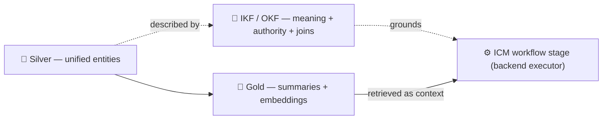

# 📖 Open Knowledge Format — the type system / grounding cortex

**How Imperion OS tells an agent what an entity *means* and which source *wins*.** The
medallion tiers make data *trustworthy*; the OKF semantic layer makes it
*understandable*. This is the canonical deep dive on the OKF bundle: the concept-per-file
contract, the coverage matrix, the medallion → IKF → ICM loop, and OKF's role as the
orchestrator's deterministic **grounding cortex**.

[← Deep dives](README.md) · [← Architecture](../README.md) ·
[Data & automation doctrine](../data-and-automation-doctrine.md) ·
[Medallion deep dive](medallion-architecture.md) ·
[OKF bundle](../../database/semantic-layer/index.md) ·
[Decision records](../../decision-records/README.md)

> **IKF / OKF.** **OKF** (Open Knowledge Format) is Google's vendor-neutral markdown +
> YAML-frontmatter spec for sharing curated knowledge with AI agents. **IKF** (Imperion
> Knowledge Format) is our adoption of it over the silver tier. Governed by
> [ADR-0086](../../decision-records/ADR-0086-okf-semantic-layer-over-silver.md) (the layer)
> and [ADR-0104](../../decision-records/ADR-0104-okf-orchestrator-grounding-cortex.md) (its
> use as the grounding cortex).

---

## 1. The problem OKF solves

A bolt-on RAG system embeds rows and **hopes the model infers meaning from text.** That is
exactly where confident, wrong answers come from: the agent guesses a join path, or guesses
which of three conflicting sources is authoritative. An agent must instead be able to
*read*:

- **What does this entity mean?** (definition)
- **Which source wins when they disagree?** (authority / precedence)
- **How does it join to other entities?** (documented join paths)
- **Does it carry PII?** (handling note)

OKF makes each of these a **version-controlled, human-reviewed contract** rather than an
inference. The same artifact a person reads is what the agent consumes — no translation
layer to drift.

---

## 2. One concept file per silver entity

The bundle lives at
[`docs/database/semantic-layer/`](../../database/semantic-layer/index.md) — **one markdown
file per silver entity** (~89 today and still expanding via the OKF batch issues), plus an
[`index.md`](../../database/semantic-layer/index.md), the
[`coverage-matrix.md`](../../database/semantic-layer/coverage-matrix.md), and
[`AUTHORING.md`](../../database/semantic-layer/AUTHORING.md).

Each concept file is **frontmatter + body** ([ADR-0086](../../decision-records/ADR-0086-okf-semantic-layer-over-silver.md)
conformance):

```yaml
---
type: <archetype>
title: <entity>
description: <one-line meaning — used for relevance>
resource: <silver table/view>
tags: [...]
timestamp: <last reviewed>
---
```

…and a body with five required parts: **definition · source-of-record / authority ·
schema · joins · PII note.** Worked example — `account` documents its precedence rule
(`website > autotask > itglue > apollo`), its join keys, and that it carries no row-level
PII in the file itself.

### Four hard boundaries (ADR-0086)

1. **No row-level data, no PII, no client identifiers, no secrets.** Personal/volatile
   answers resolve against the **live read-only DB**, never a static file.
2. **No code knowledge** — that stays in CLAUDE.md / ADRs / Graphify.
3. **Meaning, not structure** — the ERD + migrations own *structure*; OKF owns *meaning*.
4. **One canon, front-end-owned** — the bundle lives in `ImperionCRM` only (it owns the
   schema); siblings consume it and propose changes here.

---

## 3. The coverage matrix — every object placed

The [coverage matrix](../../database/semantic-layer/coverage-matrix.md) is the master map:
**every silver/bronze/gold object → its implementation archetype → IKF status → the acting
ICM workflow.** It is how the system stays *buildable* (you instantiate one of eight
archetypes, you don't invent) and *explainable* (eight shapes, not ~190 special cases).
The eight archetypes and a worked example each are in the
[doctrine](../data-and-automation-doctrine.md) §3; the authority rule a concept file
documents is determined by its archetype (e.g. archetype A → "authority = the precedence
order"; archetype C → "a change of mind is a new event, never an update").

---

## 4. The medallion → IKF → ICM loop

OKF is the **middle altitude** of the one refinement loop (doctrine §1):



- **Medallion refines DATA** (raw → trustworthy → AI-ready).
- **OKF / IKF refines MEANING** (observed → defined → authoritative).
- **ICM refines ACTION** (drafted → approved → auto).

A workflow stage loads the OKF concept (what the entity means, which source wins, how it
joins), retrieves the gold summary as context, queries the **live DB** for any specific PII
value, drafts an artifact, and parks at a checkpoint. Meaning is read, never guessed.

---

## 5. OKF as the grounding cortex (ADR-0104)

[ADR-0104](../../decision-records/ADR-0104-okf-orchestrator-grounding-cortex.md) makes the
orchestrator's use of OKF **explicit and deterministic**: per workflow stage it grounds on
the relevant concept files (grounding-only — meaning/authority/joins), routes via a
`source_skill` registry (migration 0143), and treats **freshness as correctness**.

**Staleness is a CI failure**, enforced by three freshness gates:

1. **Same-repo docs-gate** — a PR that changes a silver table with a concept file must
   update that file in the same PR (issue #535; escape hatch
   `semantic-layer-not-affected`).
2. **Cross-repo `okf-sync`** — sibling work that changes a silver entity's shape, authority,
   or joins must update the matching concept file + matrix row (system CLAUDE.md §11).
3. **On-prem reconciliation** — the enrichment agent re-checks the map against the schema
   over time (LocalPipeline #175).

> **A stale semantic layer lies with confidence.** The grounding cortex is only as good as
> its freshness gates; that machinery is **load-bearing, not optional** (doctrine §8).

---

## 6. What this buys an agent

- **Retrieval you can trust, not vibes** — the agent reads the authority rule and join path
  from a contract instead of inferring them from embedded text.
- **A PII firewall** — the curated meaning layer is PII-free by design, so it can be shared,
  vectorized, and reasoned over safely; personal values stay in the live DB.
- **A map that cannot silently drift** — three gates turn schema/meaning divergence into a
  red build.

Next: how OKF, the medallion, ICM/MWP, and the borrowed memory patterns compose into one
system — [how it all fits together](how-it-all-fits-together.md).

---

## Governing decisions

[ADR-0086 OKF semantic layer](../../decision-records/ADR-0086-okf-semantic-layer-over-silver.md) ·
[ADR-0104 OKF grounding cortex](../../decision-records/ADR-0104-okf-orchestrator-grounding-cortex.md).
External: *Introducing the Open Knowledge Format* — Sam McVeety & Amir Hormati, Google
Cloud,
<https://cloud.google.com/blog/products/data-analytics/how-the-open-knowledge-format-can-improve-data-sharing>.
Bundle: [semantic-layer index](../../database/semantic-layer/index.md) ·
[coverage matrix](../../database/semantic-layer/coverage-matrix.md).
