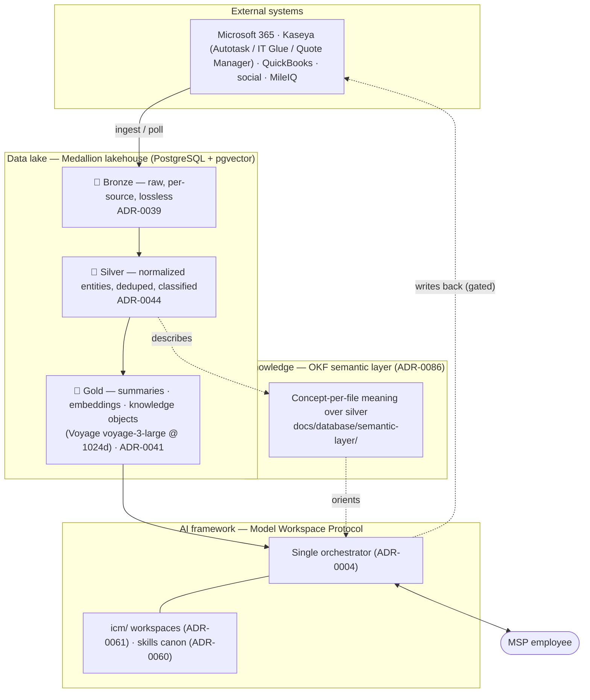

# 🏛️ System architecture — three layers, three open standards

How a fact travels through Imperion: from a raw record in someone else's system, to
something an agent can reason over, to an answer in front of an employee. This doc is
the **one place** that ties the three layers together. It narrates and diagrams; it
does **not** restate the decisions — each layer's authority lives in its ADRs, linked
inline.

[← Architecture](README.md) · [← Documentation library](../README.md)

Imperion bets on three emerging open standards, one per layer (the same three named on
the public [/story](../../public/story/index.html) page, "Betting on the frontier"):

| Layer | What it holds | Open standard it bets on |
| --- | --- | --- |
| **Data lake** | every fact, raw → normalized → AI-ready | **Medallion lakehouse** (bronze · silver · gold) |
| **AI framework** | how agents are shaped and run | **Model Workspace Protocol** (filesystem-as-agentic-architecture) |
| **Knowledge** | the curated *meaning* over the data | **Open Knowledge Format** (OKF — markdown + YAML, concept-per-file) |

---

## In one picture

**Read it as motion:** external systems flow **down** into bronze; the lake refines
upward to gold; the OKF layer *describes* silver in human terms; the orchestrator reads
gold (and is *oriented* by OKF) to answer the employee — and, only through gated
processes, writes back to the source systems. The web app is the authoritative
interface (ADR-0018); everything shares one store, **PostgreSQL + pgvector**.

---

## Layer 1 — Data lake (Medallion lakehouse)

Every external fact lands once and is refined in place across three tiers. The tiers are
not folders — they are tables in one Postgres, with the schema owned solely by this repo
(ADR-0042).

| Tier | Contract | Example | Authority |
| --- | --- | --- | --- |
| 🥉 **Bronze** | raw source payload, **one physical table per (source, entity)**, lossless `raw_payload`, no transforms | `autotask_contacts`, `website_time_entry`, `qbo_purchases` | [ADR-0039](../decision-records/ADR-0039-per-source-bronze-tables.md) |
| 🥈 **Silver** | normalized + deduped + classified entities, read by the app | `contact`, `time_record`, `expense_item`, `opportunity` | [ADR-0044](../decision-records/ADR-0044-silver-contracts-tickets.md) |
| 🥇 **Gold** | AI-ready: summaries, **embeddings**, knowledge objects | `knowledge_object` + `knowledge_embedding` | [ADR-0041](../decision-records/ADR-0041-gold-knowledge-vector-store.md) |

- **The vector contract is pinned:** Voyage `voyage-3-large` @ 1024 dims, one vector
  space — re-adding a provider is a new ADR ([ADR-0041](../decision-records/ADR-0041-gold-knowledge-vector-store.md)).
- **Who fills each tier:** the pipeline merges bronze→silver; the on-prem local pipeline
  does all vectorization (silver→gold). The front end only *reads* (ADR-0042).
- **Where to look deeper:** the [database README](../database/README.md) (tier overview)
  and the [data model + ERD](../database/data-model.md) (entities, embedding/chunking/
  retention design).

## Layer 2 — AI framework (Model Workspace Protocol)

Imperion shapes agents as **files on disk**, not code — a workspace's `CONTEXT.md`,
stage Inputs, and conventions *are* the agent. That filesystem-as-agentic-architecture
shape is what the Model Workspace Protocol formalizes, and it is exactly how Imperion's
`icm/` business-process automations are built.

- **One orchestrator, many internal sub-agents.** The employee talks to a single
  orchestrator that routes, selects tools, enforces permissions, and returns the answer;
  sub-agents (CRM, Sales, Proposal, Onboarding, Autotask, Reporting…) never face the
  user. [ADR-0004](../decision-records/ADR-0004-single-orchestrator-agent-model.md).
- **Business processes are workspaces.** MSP workflows live under `icm/` as a workspace
  factory, executed by the backend orchestrator with a per-workflow autonomy dial
  (draft → auto). [ADR-0061](../decision-records/ADR-0061-icm-business-process-automation.md);
  overview in [docs/agents/icm.md](../agents/icm.md).
- **Capabilities are versioned skills.** Cross-repo agent skills are one canon in the
  in-repo `imperion` plugin marketplace — one skill per micro-PR, no drift.
  [ADR-0060](../decision-records/ADR-0060-agent-skills-canon-plugin.md).
- **Where to look deeper:** the [agents README](../agents/README.md).

## Layer 3 — Knowledge (Open Knowledge Format)

Gold makes data *machine-retrievable*; OKF makes the silver tier *humanly meaningful*.
The OKF layer is a set of markdown-plus-frontmatter files, **one concept per file**,
cross-linked — the curated meaning that sits above the code graph (Graphify) and the raw
schema, telling an agent (or a person) what each silver entity *means*, not just its
columns.

- **What it is:** a semantic layer over silver — adopted as a standard in
  [ADR-0086](../decision-records/ADR-0086-okf-semantic-layer-over-silver.md); pilot
  bundle at [docs/database/semantic-layer/](../database/semantic-layer/index.md)
  (`time_record`, `expense_item`, `opportunity`).
- **Four conformance rules (from ADR-0086):** (1) **not** a Graphify replacement — it
  computes nothing, holds no data; (2) PII is **never** static in a file — it is read
  live from the read-only `postgres` MCP at query time; (3) staleness is owned by
  pipeline ops (CI gate now, enrichment agent later), not hand-maintenance; (4) **no**
  code/architecture knowledge — that stays in CLAUDE.md / ADRs / Graphify.
- **How it relates to gold:** OKF *describes* silver for orientation; gold *embeds* it
  for retrieval. The roadmap vectorizes the OKF bundle into gold once it expands past the
  pilot (tracked in the local-pipeline repo).

---

## Why three standards, not one framework

Each layer has a different job and a different failure mode, so each bets on the standard
purpose-built for it: the **lakehouse** keeps raw and refined data in one queryable store
without lock-in; the **workspace protocol** keeps agent behavior in version-controlled,
reviewable files instead of opaque code; **OKF** keeps meaning portable and human-editable
instead of buried in prompts. They compose — data flows up the lake, OKF describes it,
the workspace-shaped orchestrator consumes it — but they evolve independently, each under
its own ADRs.

## Governing decisions (single source of truth)

Data lake: [ADR-0039](../decision-records/ADR-0039-per-source-bronze-tables.md) ·
[ADR-0044](../decision-records/ADR-0044-silver-contracts-tickets.md) ·
[ADR-0041](../decision-records/ADR-0041-gold-knowledge-vector-store.md) — AI framework:
[ADR-0004](../decision-records/ADR-0004-single-orchestrator-agent-model.md) ·
[ADR-0061](../decision-records/ADR-0061-icm-business-process-automation.md) ·
[ADR-0060](../decision-records/ADR-0060-agent-skills-canon-plugin.md) — Knowledge:
[ADR-0086](../decision-records/ADR-0086-okf-semantic-layer-over-silver.md) — Boundary:
[ADR-0042](../decision-records/ADR-0042-division-of-labor-reads-direct-processes-backend.md) (four-repo division of labor) ·
[ADR-0018](../decision-records/ADR-0018-gui-only-frontend-external-functions.md) (GUI-only front end).
