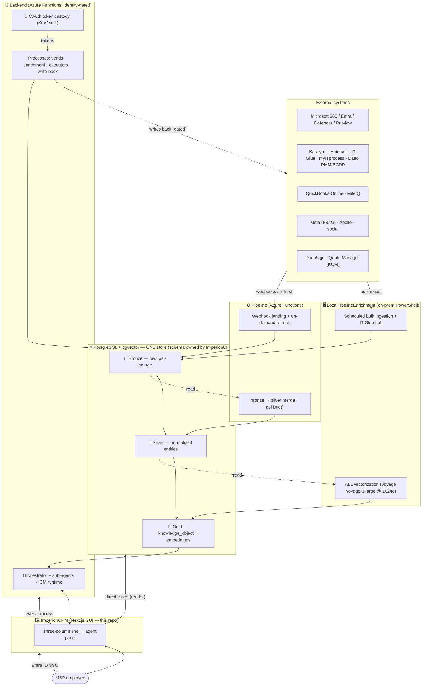
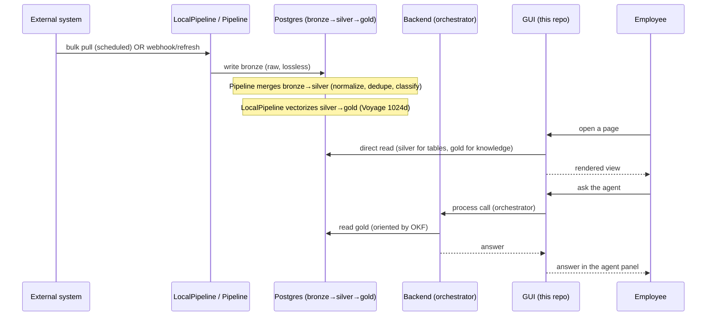
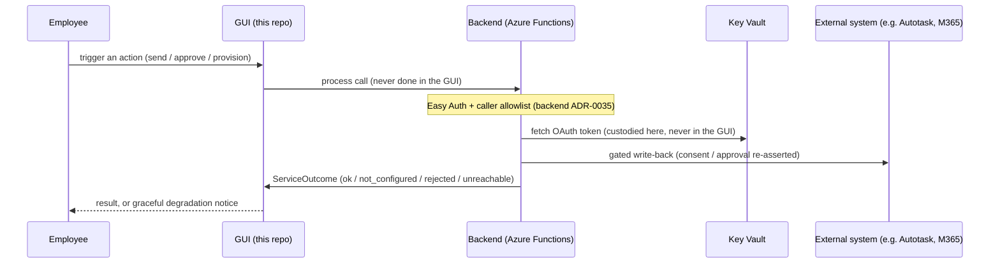
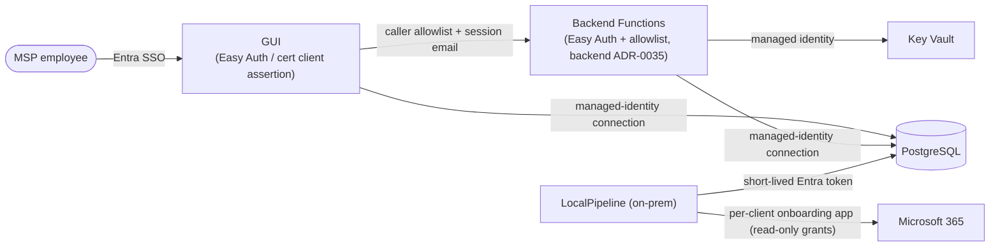

# 🌐 System of systems — the four repositories as one platform

Imperion CRM is **one product** built from **four repositories**. This is the one doc
that explains them *together*: who owns what, how a fact crosses repo boundaries on its
way from an external system to an answer on screen, where identity is enforced, and which
repo is the single source of truth for each shared concern.

It is the cross-repo companion to the two repo-internal architecture docs:
[system-architecture](system-architecture.md) narrates the **three data layers** (bronze ·
silver · gold) and the three open standards; [application-boundary](application-boundary.md)
narrates **what lives inside this GUI repo** vs. an external function. This doc sits *above*
both — it is the map of the whole estate.

> The binding contract is the **system-level `CLAUDE.md`** (the parent folder of all four
> repos). This doc renders that contract as prose + diagrams; where they ever differ, the
> system-level `CLAUDE.md` wins. Governing decision: **[ADR-0042](../decision-records/ADR-0042-division-of-labor-reads-direct-processes-backend.md)** (four-repo division of labor, settled 2026-06-09).

[← Architecture](README.md) · [← Documentation library](../README.md)

---

## The four repositories at a glance

| Repo | Role | Runtime | Owns (single source of truth) |
| --- | --- | --- | --- |
| **`ImperionCRM`** (this repo) | **GUI.** Next.js front end. Direct DB *reads* for rendering are fine; every *process* calls the backend. | Azure App Service (Next.js) | **Database schema & migrations** · the **OKF semantic layer** · the **skills canon** · the **unified security standard** |
| **`ImperionCRM_Backend`** | **All processes.** Azure Functions, identity-gated (Easy Auth + caller allowlist). | Azure Functions (same App Service Plan) | Orchestrator runtime · agent settings · board sessions · **OAuth token custody** (Key Vault) |
| **`ImperionCRM_Pipeline`** | **Live data.** Webhooks, bronze→silver merge, on-demand refresh. | Azure Functions | Poll-cadence handling (`pollDue()`) |
| **`ImperionCRM_LocalPipelineEnrichment`** | **Heavy lifting.** On-prem PowerShell: scheduled bulk ingestion, IT Glue hub, **ALL vectorization**. | On-prem PowerShell (scheduled tasks) | Security-posture bronze + citation views |

Three rules make the split safe:

1. **One store, one schema owner.** All four repos share a single **PostgreSQL + pgvector**
   database. Only this repo owns the schema; siblings are *consumers*. A schema change is
   proposed **here**, never in a sibling ([ADR-0042](../decision-records/ADR-0042-division-of-labor-reads-direct-processes-backend.md)).
2. **The GUI holds no integration secret and no AI key.** Provider keys and OAuth tokens
   live with the backend / on-prem pipeline (Key Vault), never in the front end
   ([ADR-0018](../decision-records/ADR-0018-gui-only-frontend-external-functions.md), ADR-0043).
3. **Global counters are claimed at merge, not at authoring.** Migration numbers and ADR
   numbers are renumbered to the next free slot just before squash-merge, because concurrent
   branches cannot reserve them (system-level `CLAUDE.md` §10.3).

---

## In one picture — the estate



**Read it as motion.** External systems flow **down**: the on-prem pipeline does scheduled
bulk ingestion into **bronze** and is the *only* place vectorization happens (silver→gold);
the Azure pipeline lands webhooks/refresh into bronze and merges **bronze→silver**. The GUI
**reads** the store directly to render, and routes **every process** to the backend, which
runs the orchestrator and the executors and — only through gated paths — **writes back** to
the source systems. One database underneath all of it.

---

## How a fact crosses repo boundaries

The same fact is touched by up to three repos before an employee sees it. Two representative
journeys:

### Inbound — a new fact becomes an answer



### Outbound — a process that writes back



The GUI's side of the outbound seam is documented in
[application-boundary](application-boundary.md#the-call-guard-seam-190): every process call
folds into one `ServiceOutcome` taxonomy, and an unconfigured backend degrades gracefully
rather than failing the page — so the GUI can ship ahead of the backends.

---

## The boundary rule, stated once

```text
Does the work read data to render a screen?
        │
        ├─ Yes → the GUI does it directly, via the repository data layer
        │        (src/lib/data → PostgreSQL). This is allowed and expected.
        │
        └─ No (it sends, enriches, orchestrates, writes back, or touches a secret)
                 → it is a PROCESS. The GUI calls the Backend; the work runs there.
```

This is [ADR-0018](../decision-records/ADR-0018-gui-only-frontend-external-functions.md) /
[ADR-0042](../decision-records/ADR-0042-division-of-labor-reads-direct-processes-backend.md).
The reasons: keep the internet-facing tier small and low-privilege, let workloads scale and
deploy independently, and concentrate integration secrets behind Key Vault.

---

## Identity across the estate

Entra ID is the **sole identity provider** everywhere — no third-party IdP without an ADR
(ADR-0002). The trust boundary differs by repo:



- **GUI → Backend** is identity-gated: the backend accepts only allow-listed callers and
  resolves the acting user from the session email (`resolveActingUser()`), so every backend
  process is scoped and audited to a real `app_user` (backend ADR-0035/0036/0037/0039).
- **No secret in the GUI.** OAuth tokens are custodied by the backend in Key Vault; the
  on-prem pipeline authenticates to M365 via a **per-client onboarding app** with read-only
  grants (M365 integration ADR-0018), superseding GDAP.
- **Database access is managed-identity**, not passwords; the read-only `postgres` MCP used
  for schema checks mints a short-lived Entra token at session start (system-level
  `CLAUDE.md` §8).

The shared baseline every repo conforms to (do not fork or restate it) is
[unified-security-standard](../security/unified-security-standard.md).

---

## Canon ownership — where each shared concern lives

Some concerns are shared by all four repos but must have **exactly one home** to avoid
drift. All four live in **this repo**:

| Concern | Canonical home (this repo) | Rule |
| --- | --- | --- |
| **Database schema & migrations** | `db/migrations/` | Siblings consume; propose changes here ([ADR-0042](../decision-records/ADR-0042-division-of-labor-reads-direct-processes-backend.md)). |
| **OKF semantic layer** (meaning of silver) | [`docs/database/semantic-layer/`](../database/semantic-layer/index.md) | Any repo changing a silver entity's shape / authority / joins updates the concept file + `coverage-matrix.md` row — in the same PR here, or via a filed issue here from a sibling ([ADR-0086](../decision-records/ADR-0086-okf-semantic-layer-over-silver.md)). |
| **Agent skills** | [`plugins/imperion-skills/`](../agents/skills.md) | One canon, in-repo `imperion` marketplace; one skill per micro-PR ([ADR-0060](../decision-records/ADR-0060-agent-skills-canon-plugin.md)). |
| **Security baseline** | [`docs/security/unified-security-standard.md`](../security/unified-security-standard.md) | Every repo conforms; never forked or restated. |
| **AI stack contract** | [ADR-0041](../decision-records/ADR-0041-gold-knowledge-vector-store.md) + ADR-0043 | Claude (Haiku/Sonnet) + Voyage `voyage-3-large` @ 1024d, one vector space; re-adding a provider is a new ADR. |

---

## Where to go next, per repo

| Repo | Start here |
| --- | --- |
| **ImperionCRM** (GUI) | [Documentation library](../README.md) · [system-architecture](system-architecture.md) (three layers) · [application-boundary](application-boundary.md) (this repo's internals) |
| **Backend** | [ImperionCRM_Backend README](https://github.com/markdconnelly/ImperionCRM_Backend/blob/main/README.md) — orchestrator, executors, token custody |
| **Pipeline** | [ImperionCRM_Pipeline README](https://github.com/markdconnelly/ImperionCRM_Pipeline/blob/main/README.md) — webhooks, bronze→silver merge, on-demand refresh |
| **LocalPipeline** | [ImperionCRM_LocalPipelineEnrichment README](https://github.com/markdconnelly/ImperionCRM_LocalPipelineEnrichment/blob/main/README.md) — bulk ingestion, IT Glue hub, vectorization |

## Governing decisions

[ADR-0042 four-repo division of labor](../decision-records/ADR-0042-division-of-labor-reads-direct-processes-backend.md) ·
[ADR-0018 GUI-only front end](../decision-records/ADR-0018-gui-only-frontend-external-functions.md) ·
[ADR-0002 Entra as sole IdP](../decision-records/ADR-0002-entra-id-as-sole-idp.md) ·
[ADR-0041 gold vector contract](../decision-records/ADR-0041-gold-knowledge-vector-store.md) ·
[ADR-0086 OKF semantic layer](../decision-records/ADR-0086-okf-semantic-layer-over-silver.md) ·
[ADR-0060 skills canon](../decision-records/ADR-0060-agent-skills-canon-plugin.md) — plus the
sibling baselines: backend ADR-0035 (identity-gated functions), pipeline ADR-0011 (on-demand
refresh) / ADR-0008 (poll cadence).
