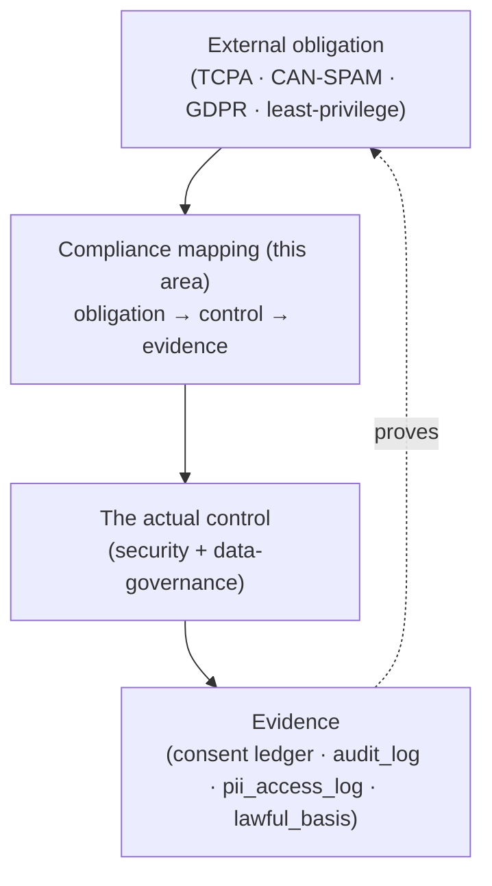

# 📋 Compliance

Where **Imperion Business Manager**'s controls map to external obligations, and where the
evidence lives. Compliance here is a **mapping layer**, not a second set of controls: the
*substance* lives in [security](../security/README.md) and
[data-governance](../data-governance/README.md); this area answers "**which control
satisfies which obligation, and how would we prove it?**"

[← Documentation library](../README.md) ·
[Security](../security/README.md) ·
[Data governance](../data-governance/README.md) ·
[Logging & monitoring](../security/logging-and-monitoring.md)

> **Context.** Imperion Business Manager is an **internal, single-tenant** platform for
> one MSP (Imperion employees only) — not a multi-tenant SaaS sold to third parties. So
> the obligations in scope are the ones that come from **how the business operates**
> (outreach, profiling, employee data, access control), not from a SaaS-vendor
> certification program. Formal attestations (e.g. SOC 2) are not in scope today; the
> control mappings below are built so that, if that changes, the evidence is already
> there.

---

## How the layers fit together

The chain that makes a claim defensible: an **obligation** points to a **control**, the
control produces **evidence**, and the evidence is queryable after the fact.

---

## Obligations in scope → control → evidence

| Obligation | Driver | Control (where it's enforced) | Evidence |
| --- | --- | --- | --- |
| **Outreach** (email / SMS / calls) | TCPA · CAN-SPAM · GDPR | Outbound is **blocked unless `current_consent` for that channel is `opt_in`** — checked at draft *and* re-asserted at execution ([data-governance](../data-governance/README.md), ADR-0014). Inbound opt-in is captured on the public [`/opt-in` page](./public-opt-in-and-sms-consent.md) (the ACS toll-free SMS verification artifact). | `consent_event` append-only ledger; send records in `audit_log`; opt-in proof on the bronze `lead_capture_event`. |
| **Profiling & enrichment** | GDPR lawful basis | Every enriched fact carries a **`lawful_basis`** (`consent \| legitimate_interest \| contract \| public_data`) + source (ADR-0025). | `contact_enrichment.lawful_basis` / `source` / `observed_at` / `expires_at`. |
| **Ad targeting** | Consent | An **`ad_targeting`** consent gate filters non-consenting audience members rather than silently dropping them (ADR-0026). | `consent_event` (`ad_targeting`); audience-launch records. |
| **Access & least privilege** | Least-privilege / insider risk | **Five-role RBAC** + a **fail-closed write-capability gate** on every mutating action, defaulting to the most-restricted role ([ADR-0095](../decision-records/ADR-0095-authorization-rbac-consolidated.md), from ADR-0016/0030/0045). | `audit_log`; the role × capability stress-test grid in CI. |
| **PII handling** | GDPR / data-protection | PII columns are **flagged and access-logged**; raw third-party payloads are access-controlled bronze ([data-governance](../data-governance/README.md), ADR-0095 from ADR-0016). | `pii_access_log`; bronze access controls. |
| **Secret custody** | Baseline security | **Key Vault is the only secret store**; nothing secret in repo/DB/logs ([secrets-management](../security/secrets-management.md)). | Key Vault audit; "Never commit secrets" enforced in review/CI. |
| **Auditability / non-repudiation** | Across the above | **"Audit everything that acts"** — append-only ledgers ([logging-and-monitoring](../security/logging-and-monitoring.md)). | `audit_log`, `consent_event`, `pii_access_log` (all append-only). |

> Every "control" cell above is **referenced, never restated** — the binding definitions
> live in the [unified-security-standard](../security/unified-security-standard.md), the
> cited ADRs, and [data-governance](../data-governance/README.md).

---

## Why "consent is a hard gate" is the headline control

The single control that does the most compliance work is the **consent gate**: no code
path can route around it (system CLAUDE.md §2;
[unified-security-standard](../security/unified-security-standard.md) §4). It is enforced
**twice** — once when a message is drafted, again when it is executed — and the ledger
behind it is **append-only**, so a contact's history of opt-ins/opt-outs is a complete,
tamper-evident record. That is exactly the evidence TCPA / CAN-SPAM / GDPR outreach
obligations ask for.

---

## What belongs here (to expand)

- **Control-to-framework matrices** — if a formal framework (SOC 2 / ISO 27001) ever
  comes into scope, map each criterion to the control + evidence already listed above.
- **Audit-evidence playbooks** — the exact queries that *produce* the evidence (e.g.
  "show every send to contact X and the consent that authorized it").
- **Data-handling attestations** — the data-processing / retention statements the
  business needs, drawn from [data-governance](../data-governance/README.md).
- **Retention compliance** — per-jurisdiction retention + `expires_at`-driven purge are
  tracked as future work in [data-governance](../data-governance/README.md) (ADR-0025/0026).

---

## See also

[Public opt-in & SMS consent](./public-opt-in-and-sms-consent.md) ·
[data-governance](../data-governance/README.md) ·
[security](../security/README.md) ·
[logging-and-monitoring](../security/logging-and-monitoring.md) ·
[ADR-0095 Authorization & RBAC](../decision-records/ADR-0095-authorization-rbac-consolidated.md) ·
[ADR-0014 consent ledger](../decision-records/ADR-0014-consent-ledger-communications.md) ·
[ADR-0025 lawful basis](../decision-records/ADR-0025-contact-360-enrichment-and-lawful-basis.md) ·
[ADR-0026 ad consent](../decision-records/ADR-0026-demand-gen-audiences-and-ad-consent.md)
