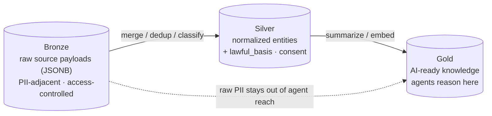
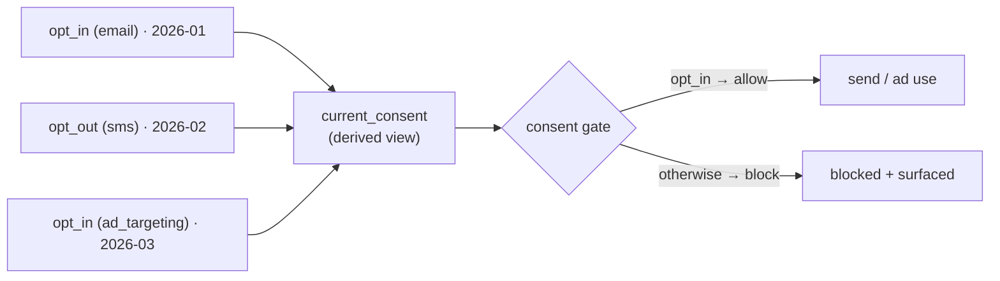

# 🗂️ Data Governance

How **Imperion Business Manager** decides *what data it may hold, why it may hold it, who
may see it, and when it must go.* Where [security](../security/README.md) is about
*protecting* data and [compliance](../compliance/README.md) is about *mapping* controls
to obligations, data governance is about the **data itself** — its classification,
lawful basis, consent, and lifecycle.

[← Documentation library](../README.md) ·
[Security](../security/README.md) ·
[Compliance](../compliance/README.md) ·
[Database & schema](../database/README.md) ·
[Semantic layer (OKF)](../database/semantic-layer/index.md)

> **Why this matters here.** The platform assembles a contact **"360" dossier** and runs
> **outbound + ad programs** against it. Holding and using that data is exactly the kind
> of activity that carries legal and ethical obligations — so governance is wired into
> the **data layer**, not bolted on. The binding rules are in
> [unified-security-standard](../security/unified-security-standard.md) §4; this page
> explains how they show up in the data model.

---

## The medallion lineage (where governed data sits)

Data flows bronze → silver → gold (CLAUDE.md §4). Governance attaches at every tier:

The governance rule that rides this lineage:

> **Agents reason over the gold layer, not raw bronze.** Bronze raw payloads are
> PII-adjacent and access-controlled; large artifacts go to object storage via `blob_ref`,
> not the row ([unified-security-standard](../security/unified-security-standard.md) §4).

---

## Lawful basis & consent (the two governing controls)

Holding and using contact data is governed by two controls, both enforced **in the data
layer** (so no feature can quietly bypass them):

### 1. Lawful basis per fact (ADR-0025)

Every `contact_enrichment` row carries a **`lawful_basis`**
(`consent | legitimate_interest | contract | public_data`) and a `source` /
`source_connection_id`, so **why we hold each fact is auditable**. `observed_at` and an
optional `expires_at` bound its lifetime.

### 2. Append-only consent ledger (ADR-0014)

`consent_event` records **every** opt-in / opt-out per contact × channel
(`email | sms | call_recording | data_enrichment | ad_targeting`) with timestamp,
source, and proof. It is **never updated or deleted** — a change of mind is a *new
event*. Current state is the derived `current_consent` view.

### The gates (enforced in the data layer)

- **Outbound email/SMS is blocked** unless `current_consent` for that channel is
  `opt_in` (`consent.canSend`) — checked at draft **and re-asserted at execution**.
- **Ad targeting** of an audience member is blocked unless `ad_targeting` is `opt_in`
  (`consent.canUseForAds`); `campaigns.launchAudience` **filters non-consenting members
  and surfaces them** rather than silently dropping them (ADR-0026).

---

## Classification & PII

| Class | Examples | Handling |
| --- | --- | --- |
| **PII / PII-adjacent** | Contacts, enrichment facts, social identities, raw bronze payloads, consent records | **Flagged + access audit-logged** (`pii_access_log`); reads restricted server-side (ADR-0095, from ADR-0016). |
| **Comp-sensitive** | Pay rate, mileage rate, labour-cost analytics | Restricted to **finance∨admin**; never employee/agent/client-facing ([authorization-model](../security/authorization-model.md)). |
| **Revenue** | MRR / money figures | **Redacted server-side before render** for sole-`support` users (ADR-0095). |
| **Raw third-party payloads** | `*_bronze` JSONB | Access-controlled; large artifacts via `blob_ref`, not the row. |
| **Derived / gold** | Summaries, embeddings | Built from governed silver; the layer agents are allowed to read. |

> **Off-limits everywhere outside the live DB:** no row-level client PII in issues, PRs,
> docs, commits, or **the OKF semantic layer** — aggregate or redact (system CLAUDE.md
> §8/§11). Personal or volatile answers resolve against the read-only DB, never against a
> doc.

---

## Lifecycle & retention

| Stage | Today | Tracked future work |
| --- | --- | --- |
| **Ingest** | Bronze upserts are **idempotent by content hash** — replays are safe. | — |
| **Hold** | `lawful_basis` + `observed_at` + optional `expires_at` bound each fact. | — |
| **Purge** | Manual / out of band. | **`expires_at`-driven automatic purge** of stale enrichment (ADR-0025/0026). |
| **Per-jurisdiction retention** | Not yet differentiated. | Per-jurisdiction retention rules (ADR-0025/0026). |
| **Contact preferences** | Consent captured via the ledger. | A contact-facing **preference center** (ADR-0025/0026). |

---

## The semantic layer is governed separately

The curated *meaning* of the silver tier lives in the **OKF bundle**
([docs/database/semantic-layer/](../database/semantic-layer/index.md), ADR-0086) — one
concept file per silver entity. It is **PII-free by rule** (definitions and join paths,
**never row-level data**), and a docs-gate keeps it in sync when a silver entity's shape,
source-of-record, or join paths change. Governance of *meaning* is that bundle;
governance of *the data* is this page. See system CLAUDE.md §11.

---

## See also

[security](../security/README.md) ·
[compliance](../compliance/README.md) ·
[logging-and-monitoring](../security/logging-and-monitoring.md) ·
[database & schema](../database/README.md) ·
[semantic layer (OKF)](../database/semantic-layer/index.md) ·
[ADR-0014 consent ledger](../decision-records/ADR-0014-consent-ledger-communications.md) ·
[ADR-0025 lawful basis](../decision-records/ADR-0025-contact-360-enrichment-and-lawful-basis.md) ·
[ADR-0026 ad consent](../decision-records/ADR-0026-demand-gen-audiences-and-ad-consent.md) ·
[ADR-0095 Authorization & RBAC](../decision-records/ADR-0095-authorization-rbac-consolidated.md)
