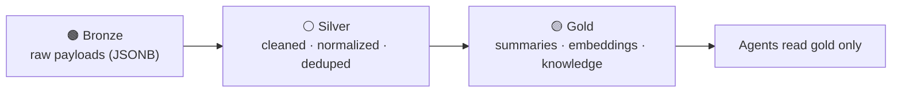

# 🗄️ Database

A single **PostgreSQL 18 + `pgvector`** store serves as the system of record, the
embedding store, and the agent memory layer (ADR-0003).

[← Documentation library](../README.md)

## What's here

| Doc | What it covers |
| --- | --- |
| [**data-model**](data-model.md) | The **ERD** (five diagrams), every entity, the enumerations, and the vector-data design. **Updated on every schema change.** |
| [data-access-layer](data-access-layer.md) | The repository abstraction the app talks to (ADR-0007) and how mock ↔ Postgres are swapped. |

## The staged-enrichment idea

All external data flows through three layers before an agent reasons over it:

## Conventions

- All PKs are `uuid`; every row carries `created_at` / `updated_at` (trigger-maintained).
- **Append-only where it's evidence:** interactions, consent events, and audit logs are
  immutable; current state is *derived* (e.g. the `current_consent` view).
- **External systems are referenced, not duplicated** — only an identity map + short
  cache lives here (ADR-0012).

## Migrations

Raw SQL in [`db/migrations`](../../db/migrations) (ADR-0017), applied in order with an
Entra token — see [`db/README.md`](../../db/README.md). Current range: **0001–0043**
applied in prod. Recent: 0035 poll cadence (ADR-0038); 0036/0037 per-source bronze +
`device` (ADR-0039); 0038–0041 on-prem local-pipeline bronze + related-source citation
views + question/template m2m + IT Glue cleanup; 0042/0043 Dark Web ID + Televy ingestion
(ADR-0040). The company-credentials migration is **0033** — see the
[credential-config database to-do](credential-config-todo.md). 0033 extends
`connection_provider` with `myitprocess`/`televy`/`quotemanager`/`gdap`, adds a `pending`
status, and a per-company-provider unique index (ADR-0036).

Governing decisions:
[ADR-0003 pgvector store](../decision-records/ADR-0003-postgres-pgvector-unified-store.md) ·
[ADR-0011 interaction timeline](../decision-records/ADR-0011-unified-interaction-timeline.md) ·
[ADR-0017 raw SQL migrations](../decision-records/ADR-0017-raw-sql-migrations.md) ·
[ADR-0025 enrichment dossier](../decision-records/ADR-0025-contact-360-enrichment-and-lawful-basis.md)
