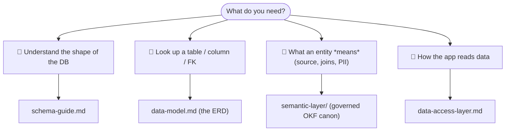
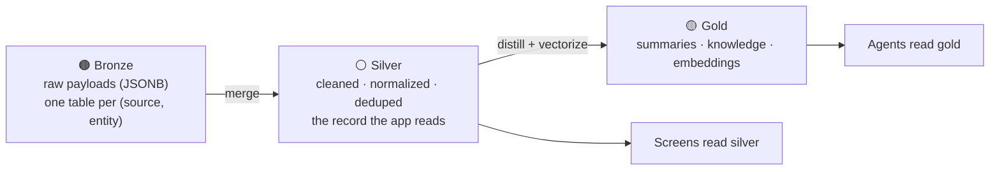

# 🗄️ Database

A single **PostgreSQL 18 + `pgvector`** store is the system of record, the embedding
store, and the agent memory layer for **Imperion Business Manager** (ADR-0003). One
store, three jobs, one version of the truth — relational queries, semantic search, and
agent reasoning all point at the same data.

[← Documentation library](../README.md) ·
[System of systems](../architecture/system-of-systems.md) ·
[Capability overview](../product/imperion-os-overview.md)

---

## Start here

| If you want… | Read |
| --- | --- |
| 🧭 **The narrative** — how the store is organized, the medallion tiers, the conventions, how to navigate, migration discipline | [**schema-guide.md**](schema-guide.md) — *read this first* |
| 🧱 **The structure** — the ERD (five diagrams), every entity, every enum, the vector-data design | [**data-model.md**](data-model.md) — **updated on every schema change** |
| 📖 **The meaning** — per silver entity: definition, source-of-record / authority, join paths, PII note | [**semantic-layer/**](semantic-layer/index.md) — **governed OKF canon** (ADR-0086) |
| 🔌 **How the app reads** — the typed repository abstraction (ADR-0007), mock ↔ Postgres swap | [data-access-layer.md](data-access-layer.md) |
| 🔑 **Company-credential schema status** | [credential-config-todo.md](credential-config-todo.md) |

> **Two kinds of database doc, kept apart on purpose.** The **narrative + ERD**
> (`schema-guide.md` + `data-model.md`) describe *structure*. The **semantic layer**
> (`semantic-layer/`) describes *meaning* and is **governed canon** under
> [ADR-0086](../decision-records/ADR-0086-okf-semantic-layer-over-silver.md) — it has
> its own authoring rules and sync workflow. The narrative links to it; it never
> restates a concept file's content.

---

## The medallion in one picture

All external data climbs three tiers before an agent reasons over it
(`CLAUDE.md` §4, **[ADR-0092](../decision-records/ADR-0092-medallion-data-platform-consolidated.md)**):

The full walk-through of each tier — the per-source physical bronze tables and union
views, the silver merge + precedence, the pinned Voyage 1024-dim gold vector contract —
is in [schema-guide.md §2](schema-guide.md#2-the-medallion-bronze--silver--gold).

---

## Conventions (the rules every table obeys)

- All PKs are `uuid`; every row carries `created_at` / `updated_at` (trigger-maintained);
  soft-delete via `archived_at` where retention requires it.
- **Append-only where it's evidence:** interactions, consent events, agent runs, and
  audit logs are immutable; current state is *derived* (e.g. the `current_consent` view).
- **External systems are referenced, not duplicated** — only an identity map
  (`external_identity`) + a short cache lives here (ADR-0012).
- **The schema is owned here.** This GUI repo is the single source of truth for the
  schema; the three sibling repos consume it. A schema change is proposed **here**, never
  in a sibling (`CLAUDE.md` §1, [ADR-0042](../decision-records/ADR-0042-division-of-labor-reads-direct-processes-backend.md)).
- **Secrets never live in the DB** — a connection stores `keyvault_secret_ref`, never a
  token. The shared baseline is the
  [unified security standard](../security/unified-security-standard.md). **Never commit
  secrets.**

The complete list, plus how to find any entity by structure / meaning / migration, is in
[schema-guide.md §3](schema-guide.md#3-the-conventions-every-table-obeys) and
[§5](schema-guide.md#5-how-to-find-an-entity).

---

## Migrations

Raw SQL in [`db/migrations`](../../db/migrations) (ADR-0017), applied in filename order
with a short-lived Entra token — **nothing secret is stored or printed** (see
[`db/README.md`](../../db/README.md) for the `psql` and `scripts/migrate.mjs` paths).

- One migration per change; never edit an applied file — add a new one.
- The **ERD ships in the same PR** as the migration; if a silver entity's shape, source,
  or joins change, the matching OKF concept file + coverage-matrix row update in the same
  PR too (ADR-0086, enforced by the `semantic-layer` docs-gate, #535).
- **Numbers are claimed at merge, not at authoring** (concurrent branches collide on the
  global counter — `CLAUDE.md` §10.3).

The **repo holds migration files through `0125`**. The *prod-applied range* — and which
recent additive sets remain gated pending credentials / consent — is tracked in
[`CLAUDE.md`](../../CLAUDE.md) §6 and the project memory (the live operational truth).
**Applying a migration to prod is Mark-gated** (`CLAUDE.md` §2). The migration-discipline
narrative is [schema-guide.md §6](schema-guide.md#6-migration-discipline).

---

## Governing decisions

[ADR-0003 pgvector store](../decision-records/ADR-0003-postgres-pgvector-unified-store.md) ·
[ADR-0017 raw SQL migrations](../decision-records/ADR-0017-raw-sql-migrations.md) ·
[ADR-0086 OKF semantic layer](../decision-records/ADR-0086-okf-semantic-layer-over-silver.md) ·
**[ADR-0092 medallion data platform (consolidated dossier)](../decision-records/ADR-0092-medallion-data-platform-consolidated.md)**
