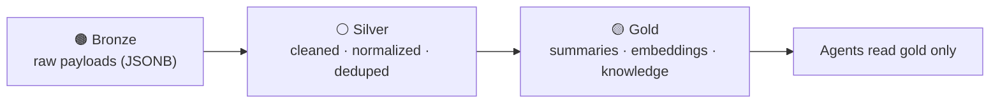

# 🗄️ Database

A single **PostgreSQL 18 + `pgvector`** store serves as the system of record, the
embedding store, and the agent memory layer (ADR-0003).

[← Documentation library](../README.md)

## What's here

| Doc | What it covers |
| --- | --- |
| [**data-model**](data-model.md) | The **ERD** (five diagrams), every entity, the enumerations, and the vector-data design. **Updated on every schema change.** |
| [data-access-layer](data-access-layer.md) | The repository abstraction the app talks to (ADR-0007) and how mock ↔ Postgres are swapped. |
| [**semantic-layer/**](semantic-layer/index.md) | **OKF-format semantic layer** over the silver tier — per-concept business meaning, join paths, and source-of-record rules (ADR-00XX). *Meaning*, not structure or data; PII-free (live DB answers row-level). Pilot: `time_record`, `expense_item`, `opportunity`. |

## The staged-enrichment idea

All external data flows through three layers before an agent reasons over it:

## Conventions

- All PKs are `uuid`; every row carries `created_at` / `updated_at` (trigger-maintained).
- **Append-only where it's evidence:** interactions, consent events, and audit logs are
  immutable; current state is *derived* (e.g. the `current_consent` view).
- **External systems are referenced, not duplicated** — only an identity map + short
  cache lives here (ADR-0012).

## Migrations

Raw SQL in [`db/migrations`](../../db/migrations) (ADR-0017), applied in order with an
Entra token — see [`db/README.md`](../../db/README.md). Current range: **0001–0058**
applied in prod (verified 2026-06-10; 0056 agent core + board, 0057 composer read
grants, 0058 project types as data + project/task columns per ADR-0052).
Recent: 0044/0047/0048/0049/0051/0055 identity
grants (local pipeline, backend functions, pipeline managed identity — 0055 adds the
cloud MI's INSERT/UPDATE on `autotask_tickets` for the live webhook plus the local
pipeline's per-source bronze writes); 0045/0046 gold
`knowledge_object` vector store + drop of the never-populated legacy vector tables
(ADR-0041/ADR-0043); 0050 silver `contract` + `ticket` from Autotask bronze (ADR-0044);
0052 saved list views (ADR-0046); 0053 `device_inventory_all` view (ADR-0047); 0054
`agent_settings` singleton (ADR-0048, backend ADR-0037); 0065 M365 mail/Teams bronze
(`m365_mail_messages`, `m365_teams_chats`, `m365_teams_meetings` — #182, the local
pipeline's communication collectors' landing tables + writer/reader grants); 0066
`board_session` 'awaiting_ciso' status + `paused_at` (#208 — resumable deputy pause,
ADR-0054 §4 / backend #64); 0068 `knowledge_object.status` draft convention + backend
MI INSERT/UPDATE grant (#214 / backend #58 — documentation sub-agent drafts, no
embeddings until human-approved + on-prem publish); 0069 `intune_managed_devices`
bronze + merge-join indexes + grants (#225 / local #75 schema handoff, ADR-0051
decision 6 — feeds the #162 device policy indicator); 0070 `event` +
`event_registration` + `campaign.event_id` + the `event_registration` lead-hook kind
(#228 / #109, ADR-0053 slice A — events as first-class objects); 0071 `campaign_send`
(one schedulable blast: email|sms, audience or event registrants, absolute or
event-relative schedule) + `campaign_platform` 'sms' + `connection_provider` 'acs' +
backend executor grants (#236 / #110, ADR-0053 slice B); 0073 `campaign.workflow_id` +
one-ACTIVE-enrollment-per-(workflow, contact) partial unique index (#112, ADR-0053
slice D — auto-enroll responders/registrants; resolution path enrolls idempotently
and audit-logs `workflow.auto_enroll`); 0074 `ticket.queue` + index (#219, ADR-0046
update — raw Autotask queue_id as text, label lookup deferred; populated by the
cloud pipeline's `mergeTicketSources`); 0076 `defender_incidents` + `defender_alerts`
bronze + `defender_incident_ticket_link` (#256, ADR-0059 — Defender XDR layered with
Autotask per incident; link PK = sync-back idempotency key); 0077 `entra_auth_methods`
bronze (#258, ADR-0051 — per-user MFA registration state from Graph
userRegistrationDetails; feeds the account posture card's MFA coverage badge,
collector = local #140); 0078 `sharepoint_sites` bronze (#255, ADR-0051 join via
`account_tenant` — SharePoint site inventory from Graph /sites, site METADATA only:
Sites.Read.All, no file/drive columns ever — Files.Read.All was pruned; feeds the
drillable SharePoint sites section on the Company 360; collector = local-pipeline
companion issue); 0079 `m365_groups` + `m365_group_members` bronze (#257 — Entra
groups + membership feeding the user object: `member_external_id` joins
`m365_contacts.external_ref` to reach the silver contact; feeds the Directory
groups section on the Contact 360; collector = local #139).
The company-credentials migration is **0033** — see the
[credential-config database to-do](credential-config-todo.md). 0033 extends
`connection_provider` with `myitprocess`/`televy`/`quotemanager`/`gdap`, adds a `pending`
status, and a per-company-provider unique index (ADR-0036).

Governing decisions:
[ADR-0003 pgvector store](../decision-records/ADR-0003-postgres-pgvector-unified-store.md) ·
[ADR-0011 interaction timeline](../decision-records/ADR-0011-unified-interaction-timeline.md) ·
[ADR-0017 raw SQL migrations](../decision-records/ADR-0017-raw-sql-migrations.md) ·
[ADR-0025 enrichment dossier](../decision-records/ADR-0025-contact-360-enrichment-and-lawful-basis.md)
