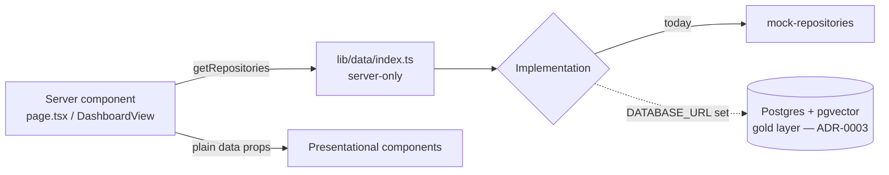

# Data-access layer

How the application reads data. Implements ADR-0007; precedes the PostgreSQL +
pgvector store (ADR-0003).

## What it is
A typed repository abstraction in `src/lib/data`. Callers depend on interfaces,
never on a concrete data source. Today the implementation is mock fixtures;
swapping to Postgres changes one function.

## Structure
| File | Responsibility |
|---|---|
| `repositories.ts` | Async contracts: `DashboardRepository`, `AgentRepository`, `Repositories`. |
| `mock/mock-repositories.ts` | Fixture-backed implementation (wraps `lib/mock-data`). |
| `index.ts` | `getRepositories()` — server-only selection point (mock now; Postgres when `DATABASE_URL` is set). |

## Data flow

## Rules
- Only **server components / route handlers / the orchestrator** call
  `getRepositories()` — it is `server-only` and must not enter client bundles.
- Components are presentational: they receive plain data via props and import no
  data source.
- Repository methods are **async** so they can become real queries unchanged.

## Mapping to the staged pipeline (§4)
Repositories expose **gold** (AI/UI-ready) reads. Bronze/silver live in Postgres;
gold projections are what the UI and agents consume. Row scoping to the signed-in
user's Entra permissions will be enforced inside the implementation.

## Swapping to Postgres (ADR-0003)
1. Add a `postgres/` implementation of the same interfaces (querying gold).
2. In `index.ts`, return it when `process.env.DATABASE_URL` is set.
3. No change to any caller or component.
